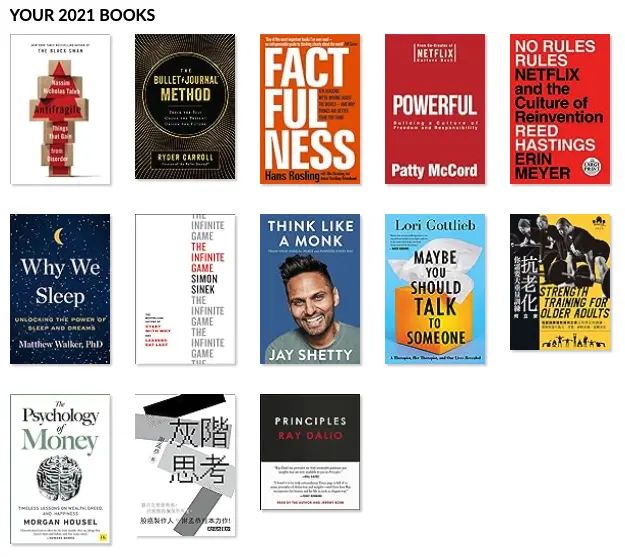

+++
title = "2021 閱讀總回顧"
date = 2021-12-28
updated = 2023-12-20

[taxonomies]
categories = ["年度回顧"]
tags = []

[extra]
image = "books.webp"
+++

# 前言

每年其實都在 [goodreads.com](https://www.goodreads.com) 幫自己設下一年要看 12 本書的挑戰，2019 看了 6 本，2020 看了 7 本，大概都是一半的達成率。但今年終於達標啦！！今年看了 13 本書，是前兩年的總和，也超過了目標 1 本。

活了三十幾年，看書一直不在人生閒暇時間的候選名單內。今年增加了讀書的時間後，深深從書裡面得到蠻多的想法，好像也漸漸完整自己的價值觀，與閱讀真是相見恨晚。

<!-- more -->

# 2021 書單

在這篇想快速的用一句話回顧每一本我在今年看的書中學到最重要的事。

[致富心態](@/reading-notes/the-psychology-of-money-no-one-is-crazy/index.md)：對於自己來說，合理的策略比什麼什麼大師報明牌都還重要。

[抗老化，你需要大重量訓練](@/reading-notes/strength-training-for-older-adults/index.md)：重訓，真的是人生很值得投資的一件事，擁有再多的東西少了健康也達不到自由。

[也許你該找人聊聊](@/reading-notes/maybe-you-should-talk-to-someone/index.md)：不要害怕丟出自己，面對問題才能解決問題。

[僧人心態](@/reading-notes/think-like-a-monk/index.md)：把自己擅長的事 (法) 運用到生活中，影響身邊的人，產生漣漪。

[無限賽局](@/reading-notes/the-infinite-game/index.md)：要持有無限賽局的信念，看淡短期的你死我活。

[零規則](@/reading-notes/no-rules-rules/index.md)：信任和資訊透明可以讓有能力的人發光。

[為什麼要睡覺](@/reading-notes/why-we-sleep/index.md)：睡覺真的很重要很重要很重要。

[子彈思考整理術](@/reading-notes/the-bullet-journal-method/index.md)：不管何時留給自己筆記的空間，反覆操寫、反覆閱讀，與自己對話，提升自己的覺察，找尋對自己最重要的東西。

[給力](@/reading-notes/powerful/index.md)：不適合的組織規章會影響整個公司的生產力，應該用產品思維來架構組織。

[真確](@/reading-notes/factfulness/index.md)：數據不會說話，人才會，對於數據都要多方面的思考與解讀。

[原則](@/reading-notes/principles/index.md)：可以用高層次思考把世界想成一個機器，要有適當的設計者，適當的執行者，反覆地測量結果與改善設計。

[反脆弱](@/reading-notes/antifragile/index.md)：在讓自己不會死的情況下，多方嘗試。

[灰階思考](@/reading-notes/thinking-in-grayscale/index.md)：不要死腦筋的相信某種說法，小規模實驗、調整，找出你自己的投資方法，不然你還是去買 ETF 吧。

*可以發現我寫讀書心得的進度也開始落後了 😅*

# 我的 2021 TOP 5

[僧人心態](@/reading-notes/think-like-a-monk/index.md)：可能跟我本來的價值觀就很像，邊閱讀邊有醍醐灌頂的感覺。

[也許你該找人聊聊](@/reading-notes/maybe-you-should-talk-to-someone/index.md)：提及的層面很多，作者用很棒的故事把一切串連起來，讀得很過癮。

[原則](@/reading-notes/principles/index.md)：對我自己來說，原則一直都是我自己較缺少的部分，書裡用條列式的整理與舉例，反而對我閱讀中可以一次次反思。

[子彈思考整理術](@/reading-notes/the-bullet-journal-method/index.md)：看似是增快做筆記的方法，但實際上是運用更多書寫的過程，反覆拉出可以跟自己對話的空間。對我來說是僧人心態的生活實踐版。

[抗老化，你需要大重量訓練](@/reading-notes/strength-training-for-older-adults/index.md)：對重訓一直沒有太深的想法，就去動一動。但讀了這本書之後直接邁向大重量的路途，也可以說是反脆弱的實踐。

# 後記

許個願望。希望我明年可以看完 24 本書。

# 更多閱讀總回顧
* [2022 閱讀總回顧](@/blog/2022-reading-summary/index.md)
