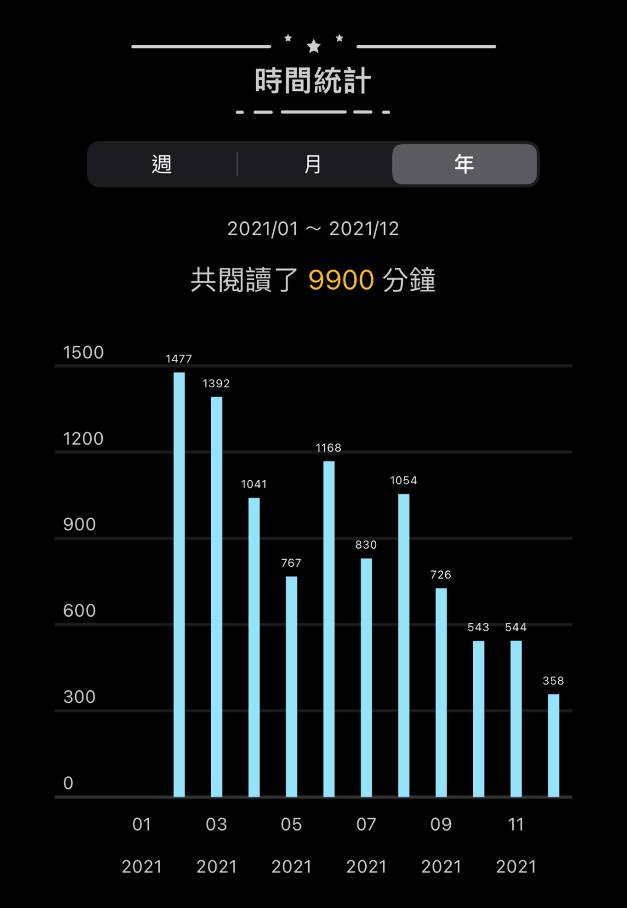
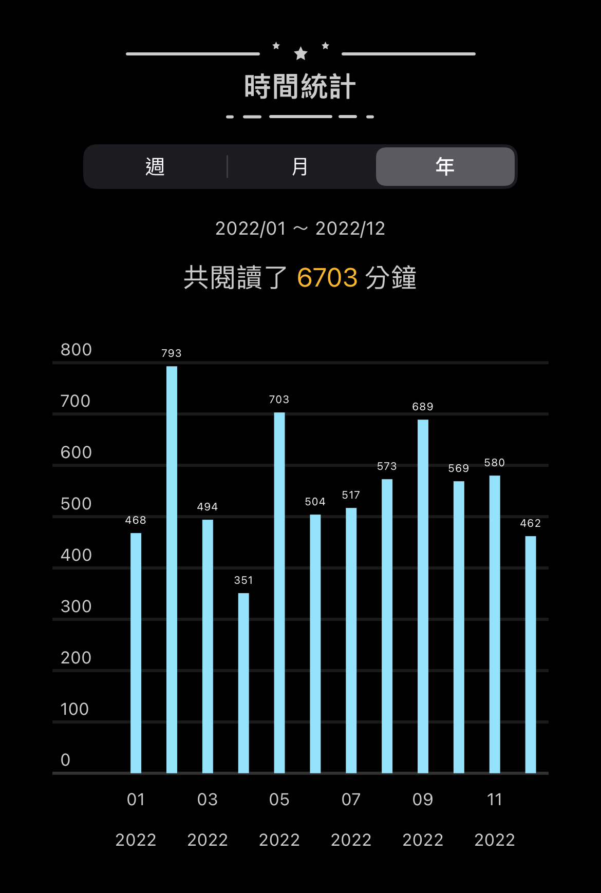

+++
title = "2022 閱讀總回顧"
date = 2023-01-02

[taxonomies]
categories = ["年度回顧"]
tags = []
+++

# 閱讀目標

年初發了一整年要讀 24 本書的宏願，但今年的閱讀與心得寫作都是下滑的狀態，希望 2023 可以更穩定地投資時間在看書和輸出上。

近兩年大部分的閱讀都是在 Readmoo 的電子書上，也很方便的可以看一些統計。

<!-- more -->

## 2021

## 2022

# 2022 書單

用簡短的一句話回顧每一本我在今年看的書中學到最重要的事。

**鋼鐵人馬斯克 Elon Musk**：在網路世代，除了硬實力技術力以外，銷售、商業模式、硬體知識、科學、溝通協調都是創造價值的必須。

**人類大歷史 Sapiens**：人類越高度發展，就越依賴在虛構的世界上，懂得人類是如何透過虛構故事來超越自然的演化是一件重要的事。

**人類大命運 Homo Deus**：世界長什麼樣，端看你的信仰是什麼。是宗教？自由？資本主義？還是數據主義呢？

**長線思維 The Long Game**：感知自己真實的渴望，設定長期目標。在邊仰望著北極星時，也要一步步確認自己的位置與方向是否正確。

**人性的弱點 How to Win Friends and Influence People**：將心比心，以雙贏的角度來取得更大的勝利。

**蛤蟆先生去看心理師 Counselling for Toads**：以第三人稱的視角，觀看心理諮商的一步步過程與成長。

**斯多葛生活哲學 55 個練習 The Little Book of Stoicism**：把哲學轉化成容易記住的短句，時刻銘記於心，運用在生活中。

**逆思維 Think Again**：適時慢下來重新思考跟思考一樣重要。

**美意識**：當遇到超乎理性可解決的問題，是否擁有人生的美感是突破的關鍵。

**最後一次相遇，我們只談喜悅 The Book of Joy**：事物對我們的好壞大都關乎著我們如何看待它，培養喜悅的八大支柱，讓喜悅成為一種特性而不只是一種狀態。

# 我的 2022 Top 5

**人類大歷史 Sapiens**：書中提供了綜觀歷史後特別的解釋，是一本改變我很多觀點的書。

**最後一次相遇，我們只談喜悅 The Book of Joy**：透過達賴喇嘛和屠圖大主教兩位諾貝爾和平獎得主充滿智慧的對話，可以讓人更深刻學會看待事物的方法，去應對生活中的挑戰與情緒。

**逆思維 Think Again**：在追求高效率的現代社會，慢下來好好思考調整方向更是一個大課題，

**斯多葛生活哲學 55 個練習 The Little Book of Stoicism**：一直對斯多葛主義都蠻有興趣，這個現代的版本也相當實用。

**鋼鐵人馬斯克 Elon Musk**：Elon 的遠見對世界帶來很多刺激，他的生命歷程或許能提供你一些想法。

# 反思

除了閱讀時間的減少外，現在沒有很好的工作流可以流暢產出文章也是一個問題，我在 2023 也會投入更多時間改善我的工作流，希望可以有更多且更好的產出。
