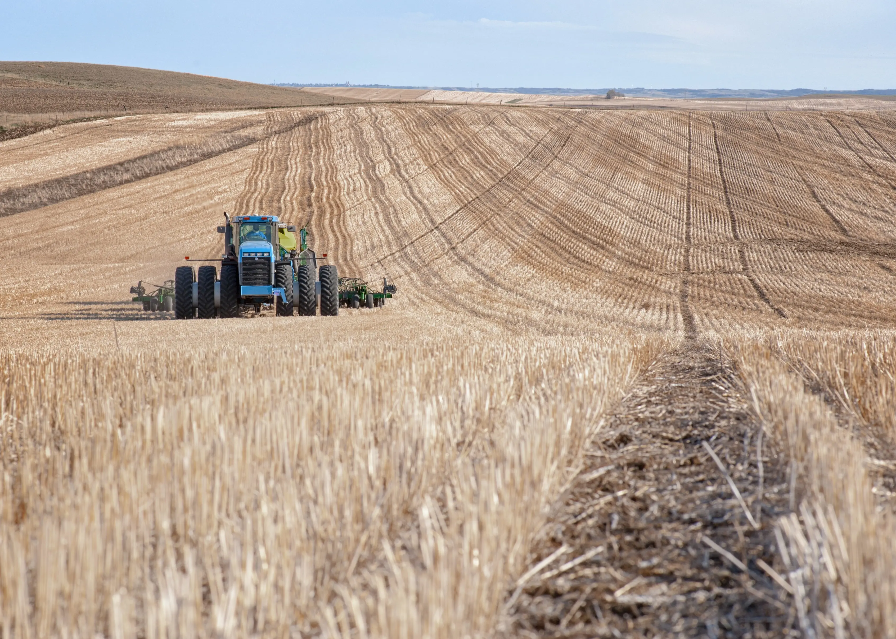

+++
title = "工作十年半後的休耕期"
date = "2023-08-09"
description = "休耕期最重要的目的就是抽回被工作佔據著的時間，可以把時間大量投入在自己感興趣的主題，或是解決長期會以「沒有時間」當作藉口沒辦法完成的事。"

[taxonomies]
categories = ["經驗分享"]
tags = ["Work"]

[extra]
image = "fallow-period.webp"
+++

Photo by <a href="https://unsplash.com/@dhueske?utm_source=unsplash&utm_medium=referral&utm_content=creditCopyText">Darla Hueske</a> on <a href="https://unsplash.com/photos/ocjO6ibpvFE?utm_source=unsplash&utm_medium=referral&utm_content=creditCopyText">Unsplash</a>

# 緣起

最近閱讀了王翰元的 [1% 就好：質疑自己的渴望、gap year](https://hyuanverse.substack.com/p/1gap-year)，覺得好好地把離職的考量跟情緒記錄下來是很棒的事。

大概在 2022 年初就有離職的想法。在大專案告一段落後，蠻多在公司的戰友們紛紛離開了公司。每個人的原因都不太一樣，出國進修、尋找更好的工作機會、追逐出國工作的夢想等等。在大家追逐更遠大的目標時，更覺得自己好像花太少心思在自己的職涯上。

我一直都不是個有野心的人，在職涯和生活上都是，對未來沒有長遠的規劃。與之相隨最大的優點大概是保有開放心態，對於不同的想法或機會不排斥，運氣上也不算太差，在工作上逐漸做了規模越來越大的專案，也遇到了很多很棒的同事。但一方面也覺得自己沒有長遠穩定的價值觀，當短期不順遂或發現新的瓶頸時，沒有明確的北極星照耀著前方的道路，短期目標也容易因為不同的刺激就分散到不同的主題上。

當時也覺得在公司好像找不到長期的願景，在職涯上也達到一個瓶頸。但當時適逢組織大變動，有很多的新同事加入，就下定決心多花一年的時間把團隊帶到更好的狀態再離職。

一年的時間飛逝，也照著自己的計畫提出了離職申請。短期的無業在經濟上對我來說不算太大的壓力。家人雖然會擔心，但也給我蠻大的自由空間。

「犧牲一年的工程師黃金時期，會不會難以回到職場？」雖然會有少許的擔憂，但我相信只要有能力、能創造價值，就不會是太困難的問題。

<!-- more -->

# 目的

休耕期最重要的目的就是抽回被工作佔據著的時間，可以把時間大量投入在自己感興趣的主題，或是**解決長期會以「沒有時間」當作藉口沒辦法完成的事**。

長期一直沒有解決的問題與解法：
* **沒有明確的價值觀**：想找到能讓自己信服的北極星。
  * 2023/03：~~希望能透過大量閱讀來增進更多不同領域的知識，提升自己對事物的認知，對生活做更正確的解讀與反應。~~
  * 2023/08：希望做更主題性的閱讀，明確學習可以解決自己問題的知識，並運用在生活上。
* **英文能力不足造成低效率的溝通**：在工作時，雖然在英語會議上最後還是能達成某種程度的結論，但溝通不良造成較大的時間成本支出與誤解。在工作這幾年，雖然斷斷續續都有花一點時間學習英文，但其實沒有明顯的成長。
  * 想知道投入更多時間，能不能有所突破。
  * 想知道是自己能力不足，該找一個能避開此弱點的事情做；還是其實自己有能力但是努力不夠。
* **想在技術上有更深層的理解**：從工作中雖然可以培養對技術的經驗，但往往沒有足夠的時間做深入的研究與考量。
  * 在工作一段時間後，重新回顧理論和最新的知識可以補足工作上的知識缺口。

# 停歇期的時間運用（持續更新）

## 1.5 個月的出國準備期

在離職前，唯一對未來的計畫就是預定了五月開始為期三個月的語言學校。但原本計畫在 2023 年初就離職，但因為各種緣故，最後實際到三月中才離開公司。對於五月就要出國，一方面充滿期待，一方面也蠻擔心的。這段時間主要花在準備未來的生活改變和增加閱讀時間。這段時間也適逢生成式人工智慧的爆發，也短期焦慮跟風學習了新的知識。

## 3 個月的英國語言學校

到英國倫敦讀了 3 個月的語言學校，未來會再補上一篇文章分享過程的想法與所得。

# Gap Year vs. Fallow Period

插入一個額外的小話題，在台灣我們比較常用 Gap year 來表達休息一段時間去做不同的事，在英國語言學校學到 Fallow period 這個字。

ChatGpt 比較兩者的差異是：
> In essence, while both terms suggest a break or pause, "gap year" is more specific to education and often involves active pursuits like travel or work. In contrast, **"fallow period" emphasizes rest, recovery, and preparation for future productivity**, and can be applied to various contexts beyond education.

對我來說這段時間像是給自己一段空白去思考更多事情，去更自由地投入自己感興趣、想學的領域。透過這段「休耕期」，讓自己的未來有更明確的動力去追逐下一個目標。所以覺得用 Fallow Period 這個字相對更合適一些。
