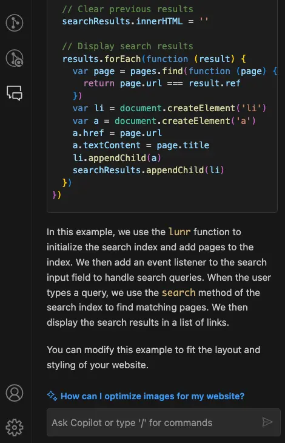

+++
title = "Github Copilot 短期心得"
date = "2023-10-31"

[taxonomies]
categories = ["心得"]
tags = ["Programming", "Github Copilot"]
+++

Github Copilot 耳聞許久，但一直沒有合適的專案去嘗試使用。最近趁著學習完 Rust，想找一個比較實際一點的專案練練手，就在 [Hacktoberfest](https://hacktoberfest.com/) 找了一個新手友善的開源專案，搭配著 Github Copilot 嘗試看看。

<!-- more -->

感受到很明顯的好處在於對語法還沒有太高掌握度的情況下，Github Copliot 輕易地就可以幫你產生大概的程式碼，使用者只需要審視生出來的程式碼做相對應的微調。相較於透過 Prompt 描述需求在 ChatGPT 寫程式碼，Github Copliot 因為直接在 code base 裡運作，有更多的視野，產生出來的結果也跟當前的專案風格比較一致。不管先寫註解產生程式碼，和寫完程式碼後產生註解也都蠻方便的，特別是 Rust 的 Doc comments 就很適合透過 Github Copilot 來產生。

但使用場景還是偏向在小範圍的更改，如果想要做到比較大範圍的重構或是較大的功能性改寫，就還是蠻靠使用者個人的程式設計能力。在這次找的開源專案 [Ockam](https://github.com/build-trust) 透過跟維護者討教也學習到了不少，這就是單純靠 Github Copilot 得不到的部分。

另外在使用過程中也剛好遇到 Github Copilot Chat 開放使用，是在 Vscode 裡面直接有個對話視窗直接詢問問題，但即便有多了一些 code base 的資訊，真正可以回答到很精確的答案的情況還是很有限，多半就是給一些很通用的方向。

一個額外的收穫是，中間過程中有調整部落格文章的命名方法，改動的過程中，Github Copliot 直接幫我套用新的命名方法，在當下的處理快了很多。所以只要是重複性較高、且更改範圍不要太大的情景都會蠻有幫助的。
