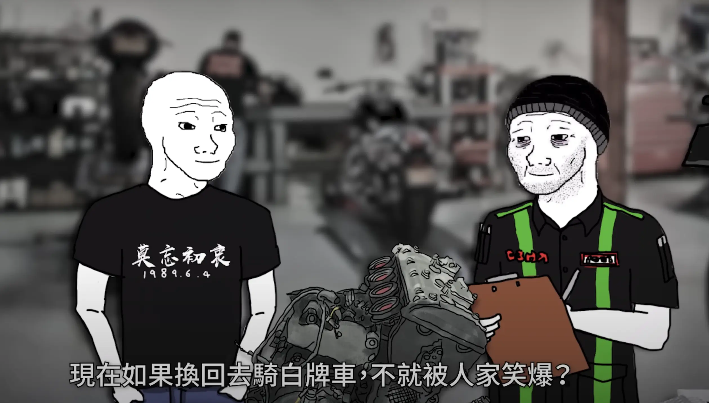
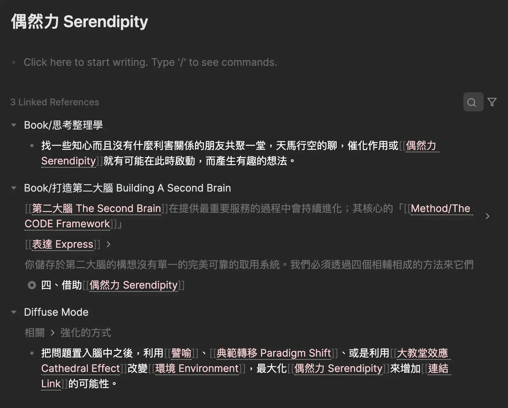
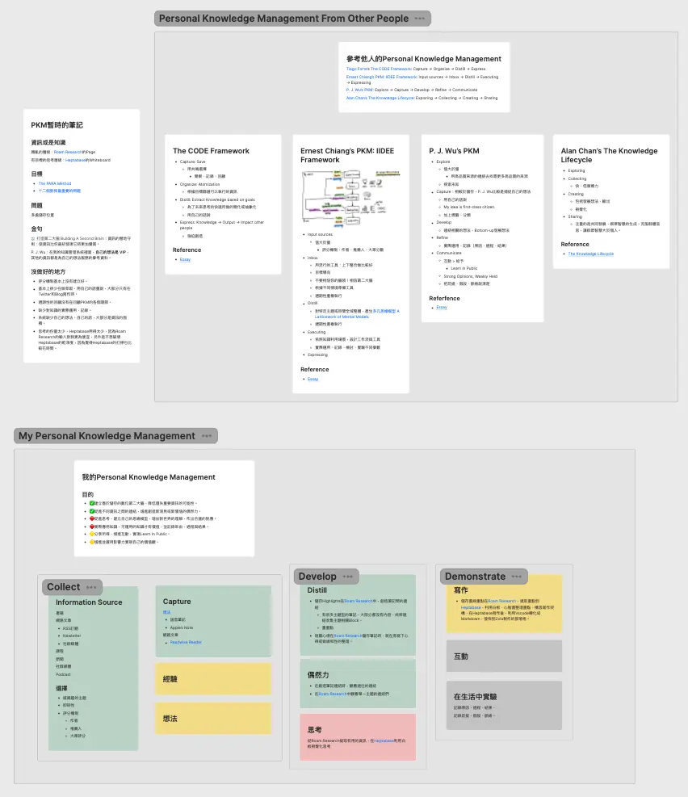

+++
title = "我的 2023 個人知識管理系統 Personal Knowledge Management (PKM)"
date = "2023-12-19"
description = "了解如何建立個人知識管理系統 (PKM)，善用數位第二大腦在 2023 年整理和管理知識，促進思考和創造互動。"

[taxonomies]
categories = [ "生產力工具",]
tags = ["productivity", "system"]

[extra]
image = "og-image.webp"

+++

前言
==

最近看了《[何雅瑄的 2023 知識生產流程](https://medium.com/@yaxuanhe2020/2023-%E7%9F%A5%E8%AD%98%E7%94%9F%E7%94%A2%E6%B5%81%E7%A8%8B-96dc3fb271e7)》，讓我想到約莫半年前，在讀完《[Ernest Chiang 的 Ernest PKM 個人知識系統 工作流程](https://www.ernestchiang.com/zh/posts/2023/ernest-pkm-workflow/)》和《[吳秉儒的我的個人知識管理系統](https://pinchlime.com/blog/my-personal-knowledge-management-system-2023/)》後，也想著整理自己的分享一篇文章。不過因為自己的系統雜亂無章，內心一直抗拒分享這件事，甚至就沒去整理自己的方法，在心裡放了一陣子後便作罷。

這次衝著年末想做一個我的個人知識管理系統在 2023 的快照，雖然很不完美，留個紀錄可以當作未來改變的對照。

<!-- more -->

什麼是個人知識管理系統？
============

> 指個人對知識的搜集、分類、存儲、索引等一系列過程。通過這個過程實現對個人行動更好的指引。
>
> —— Wikipedia《[個人知識管理](https://zh.wikipedia.org/zh-tw/%E4%B8%AA%E4%BA%BA%E7%9F%A5%E8%AF%86%E7%AE%A1%E7%90%86)》

每個人學習的專業領域、生活的經歷都有所不同，如果在生活中，有個整理與你個人相關知識的方法能幫助到你的工作和生活，你就值得建立屬於你的個人知識管理系統。

常見的實現方式是建立筆記系統或是第二大腦，前一陣子也有發表《[打造第二大腦 Building A Second Brain](@/reading-notes/building-a-second-brain/index.md)》的筆記，你可以閱讀這篇文章大略了解什麼是第二大腦。

我建立個人知識管理系統的目的
==============

截圖自《<a href="https://www.youtube.com/watch?v=xMbOOc7iH1I">山道猴子的一生（下集）</a>》

不管做什麼事，先把目的列出來都是最重要的一件事，勿忘初衷。

-   建立善於儲存的數位第二大腦，降低遺失重要資訊的可能性。

-   促進不同資訊之間的連結，增進創造新洞見或新價值的偶然力。

-   促進思考，建立自己的思維模型，增加對世界的理解，作出合適的對應。

-   實際應用知識，可運用的知識才有價值，並記錄來由、過程與結果。

-   分享所得，增進互動，實現 Learn in Public。

-   增進並運用影響力實現自己的價值觀。

從他人的個人知識管理系統學習
==============

最近整理《[思考整理學](@/reading-notes/thinking-organization/index.md)》的筆記，最後作者外山滋比古寫下這句話：

> 接觸其他人的思考方式，倒是能有效的意識到自己是以何種方式思考。

在理解別人怎麼做一件事的方式後，對於意識到自己是怎麼做的有幫助。

這次在整理之前，先再次閱讀了一些我很喜歡的個人知識管理系統相關文章：

-   [Tiago Forte's The CODE Framework](https://fortelabs.com/blog/basboverview/): Capture → Organize → Distill → Express

-   [Ernest Chiang's PKM: IIDEE Framework](https://www.ernestchiang.com/zh/posts/2023/ernest-pkm-workflow/): Input Sources → Inbox → Distill → Executing → Expressing

-   [P. J. Wu's PKM](https://pinchlime.com/blog/my-personal-knowledge-management-system-2023/): Explore → Capture → Develop → Refine → Communicate

-   [Alan Chan's The Knowledge Lifecycle](https://sheracaolity.ghost.io/my-vision-heptabase/): Exploring → Collecting → Creating → Sharing

每個人的流程上都有一些差異，主要在於關注的點不同。閱讀每個人每個步驟做法的原因，幫助我在思考、比較自己的做法的時候有很大的幫助。推薦大家感興趣的話也可以閱讀這些文章。

我的個人知識管理系統
==========

最後思考我自己的流程，簡單分為三個步驟：Collect → Develop → Demonstrate

收集 Collect
----------

收集階段的重點：

-   收集高品質的資訊

-   捕捉自己稍縱即逝的想法

-   記錄經驗，保留個人重要的生活歷程

### 收集高品質的資訊

資訊的價值與個人的目的有關。對我來說，閱讀資訊的目的有這些：

-   學習專業知識

-   獲得有即時性的資訊

-   探索新領域

-   語言學習

高品質的內容可以讓我們做更有效率的學習，好好利用有限的時間，從如大海般的資訊中，避開雜訊、選擇對你有用的訊號。

我會累積經驗數據利用這些資料對資訊做評分：

-   作者

-   推薦人

-   大眾評分

平常在社群媒體中觀看到高品質的推薦，我就會特別標記下來，更新評分記錄、訂閱優質的資訊來源。

#### 我的資訊來源

##### 書籍：專業知識、探索

閱讀書籍可以透過作者所設計的架構有結構化地學習，不管是有目的性地學習，甚至新領域的探索都是很好的來源。我主要是看非小說類的書籍，不過也逐漸理解透過故事給讀者的洞見可以比直接闡述理念來得有影響力，或許未來有時間也會穿插看點文學類的作品。

在書籍上我主要是參考 [goodreads](https://www.goodreads.com/) 的評分加上推薦人的分數。此外，相較於新書，能躲過時間的遺忘而留下來的經典也會特別受到我的關注。

##### 網路文章：探索、專業知識、即時性

大量且多樣的網路文章，不管在探索或是延伸知識上都可以提供大量內容，甚至也有很多厲害的作者，提供新資訊的解析。

在發現潛在的好文章時，我都是直接加進 [Readwise Reader](https://readwise.io/read)，RSS 和 Newspaper 的訂閱也是，後續再根據自己的目的決定要看哪些文章。

我有穩定閱讀的來源是：

-   [Pin 起來](https://pinchlime.com/blog/let-chatgpt-act-as-a-midjourney-prompt-generator/)：吳秉儒的部落格。起初發現關注的主題相近，後續不管在寫作風格上或是對於知識的實踐，都是我景仰的模範。

-   [Sheracaolity](https://sheracaolity.ghost.io/ness-labs-interview/)：Heptabase 創辦人詹雨安的部落格。對很多主題的想法都很透徹也表述得很清晰。

-   [Herman's blog](https://herman.bearblog.dev/)：Bear 的開發者。發文頻率不高，但連續閱讀幾篇都很喜歡。

-   Wisereads Newsletter：Readwise Reader 的電子報，會定期推薦大多人有畫線的文章。我以前就蠻喜歡 [Glasp](https://glasp.co/) 的概念，可以得知別人在閱讀及畫線的內容，也是很好的參考。

-   [Hacker Newsletter](https://hackernewsletter.com/)：程式相關的電子報，可以發掘一些最近、有趣的消息。

其他像是 [Paul Graham](http://www.paulgraham.com/) 和 [Wait But Why](https://waitbutwhy.com/) 也很喜歡，但只看過少數的文章，還沒有機會閱讀更多。

##### 線上課程、Youtube：專業知識、探索

除了書籍的結構性外，影音的輔助在特定種類的學習上更有幫助。

我大多是在專業上有想聚焦的學習才會用到，主要從 [coursera](https://www.coursera.org/) 和 [edx](https://www.edx.org/) 探索課程，不過上課頻率不高。

操作類的學習也會嘗試在 [Youtube](https://youtube.com) 搜尋影片。

##### 新聞：即時性、語言學習、探索

新聞就是用來接收即時性的國內外消息，主要想知道趨勢和國際情勢改變。

國內新聞是靠手機上的中央社 App，會有重要新聞的標題推播，等有空的時候才會瀏覽。

國際新聞主要是訂閱 [Semafor](https://www.semafor.com/) 和 [News Minmalist](https://www.newsminimalist.com/)，分別是由真人與 AI 選輯的每日新聞摘要，最近也當作英文閱讀學習來源之一。看了一陣子後，覺得對世界上發生的事、國家間的關係也有初級的了解，覺得蠻好的。

##### 社群媒體：即時性、探索

主要是看 X（Twitter），平台演算法的結果跟我感興趣的主題比較相近，但沒有花太多時間，大部分是短暫休閒的時候觀看，收集別人推薦的資訊。

##### Podcast：即時性、探索

主要在做其他事、不在電腦前的狀態聽，但大多數這樣的時刻專心度會比較低，一段內容聽過就忘了，很難有效的吸收。

偶爾遇到有好內容英文的 Podcast，會看看是否有影片版，坐在電腦前好好仔細聆聽做筆記。

### 捕捉自己稍縱即逝的想法

有時想法總是一閃過就忘了，在隨身可取得的裝置上，建立可以快速記錄的方式還蠻重要。

如果可以手機打字，我會暫存在 Apple Note 上，等有時間再處理；不能打字的時候，我是利用 Apple Watch，在錶面快速開啟語音錄音，講出當時的想法。

### 記錄經驗，保留個人重要的生活歷程

個人經驗的累積是個人獨特性的來源之一，把知識的實踐記錄下來也是幫助自己調整方法、學習很重要的來源。

目前這點是在我的系統中沒做好的部分，目前的想法是在筆記軟體裡可以設計紀錄的 Template，讓自己更容易記錄經驗。

發展 Develop
----------

發展階段的重點：

-   萃取知識的精華

-   增加偶然力

-   促進思考

### 萃取知識的精華

目前我的書籍閱讀大多是用電子書，我用的 Kindle 和 Readmoo 都有支援把劃線傳進 Readwise 裡。我會從 Readwise 再把這些資訊導出到筆記軟體 Roam Research 和 Heptabase 中。

我目前比較低層級、偏雜亂的資訊是存在 Roam Research 裡，我會在 Roam Research 裡做大量的筆記連結，另外也會用 Highlight 來標注特別重要的內容。

需要改進的是我沒有習慣性地用自己的話描述、總結從內容學習到的部分。在產生連結時有可能去綁定一些「用自己的話」為主題的筆記，或是遇到比較有感的內容會寫自己的心得或是整理摘要，但只有對相對少量的內容才有做到這個程度。所以整體而言，我的 Roam Research 裡有比較多他人產生的內容，而不是我自己的內容。

李秉儒的文章有一句我很喜歡的句子：

> 在我的知識管理系統裡面，**自己的想法是 VIP**，其他的資訊都是為自己的想法服務的參考資料。

現在主要是在思考、整理筆記的時候才會比較大量產生自己的想法，或許增加思考的時間是一個可能的選項。

### 增加偶然力

前面提到我在 Roam Research 做了大量的連結，所以各個主題都會存有所有我看過的內容的反向連結，在單主題的研究時可以瀏覽所有看過的內容。偶爾連結跨越在不同書籍、網路文章裡沒有想過的共同性或差異性，可以促發一些新的想像。

Roam Research 的反向連結範例

另外在創造連結時，偶爾當下也會跨越時空連結到以前相關的片段，碰撞出額外的收穫。

這些是我在使用 Roam Research 做筆記時一直都很享受的偶然力爆發瞬間。

### 促進思考

在 Alan Chan 的文章中提到：

> 思考、創作環節的原則是「視覺」。人的思維架構通常都是在視覺化後才得以明瞭，在空間中移動和重組資訊更是輔助思考的重要程序。

這提到了我在 Roam Research 上遇到思考障礙的問題，雖然收集了很多資訊，但在思考層面上並沒有這麼流暢，當然可以開側邊欄做跨多個筆記的聯想，但相對還是沒有白板功能來的好用。此外，在思考完後，可以修改或產生新的筆記記錄結果，蛋如果是很複雜的主題，在 Roam Research 上 也沒有好方法去儲存思考的脈絡。

Heptabase 的白板的視覺化是蠻好的方式去促進思考，我目前會把一些想要思考的內容從 Roam Research 搬遷到 Heptabase 來思考。

思考個人知識管理系統的 Heptabase 白板

不過 Heptabase 的卡片管理對我來說比較難以清潔，像是可以允許有同樣標題的卡片、刪除卡片在相關的卡片會留下指向不存在卡片的連結...等等。

所以我目前的策略是維持兩套筆記系統：

-   Roam Research：充滿資訊與連結、好整理、難思考

-   Heptabase：充滿思考脈絡、難清潔

雖然會有筆記重複、更新同步的問題，但兩個筆記軟體各司其職下，目前算是還可以接受的妥協。

演示 Demonstrate
--------------

*最後選了 Demonstrate 代表最後一個階段，除了利用知識做產出外，也想強調實踐知識的部分。*

演示階段的重點：

-   實踐知識、在生活中實驗

-   知識產出

-   創造互動

在這個階段，我目前除了有做閱讀筆記的寫作外，其他部分都還做得不太好。以下的想法來自於參考其他人架構後的發想，寫下未來期望的樣子。

### 實踐知識、在生活中實驗

喜歡 Ernest 的 Executing 階段提及到要「依照知識利用場景，設計工作流和工具」。實踐知識一直是我覺得很重要但努力過少的部分，我希望之後可以投入更多心力去利用知識設計方法解決生活中的問題或達成目標。

Ernest 跟吳秉儒也都提到紀錄的重要性，不管是想做一件事的原因、過程、結果，或是做一個實驗的前提、假設、脈絡，這些結果對於自己後續去檢討改進都是珍貴的資源。如果能夠把這些內容好好表達，甚至能幫助在相似狀況的他人。

### 知識產出

目前都是用 Heptabase 在整理閱讀筆記的撰寫，與思考的流程類似，只是會額外用白板和心智圖去構思寫作架構，後續是把完成的文章用 [VSCode](https://code.visualstudio.com/) 轉化成 Markdown，最後發佈在用 [Zola](https://www.getzola.org/) 製作的部落格，也就是你現在看到的網站。

不過整個創作流程上還不到通順的程度，寫作文章消耗的時間跟精力蠻多的，會常常讓自己失去動力。後續要投入更多實驗心態，去覺察更多目前問題的所在、調整方法、記錄、改進流程。

### 創造互動

最後，也希望在知識探索的過程中，完整自己的價值觀、建立有共同興趣的社群，可以透過與他人的互動更提升知識的價值，達到 Learn in Public。

後記
==

這次利用 Roam Research 提取個人知識管理系統相關的文章和筆記，再用 Heptabase 整理比較，最後整理出自己目前的版本。整個過程其實還蠻愉悅的，也寫下自己目前最長的一篇文章，希望大家會喜歡。

也預祝大家新年快樂，一起迎接、計畫新的一年。
