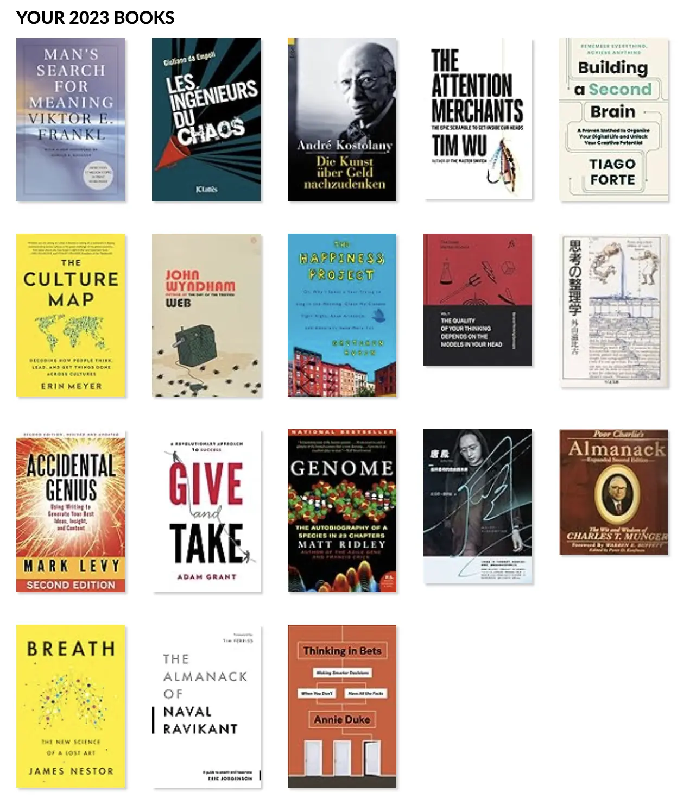

+++
title = "2023 閱讀總回顧"
date = 2023-12-29
updated = 2024-12-09
description = "2023 年閱讀總回顧，設定目標 12 本，實際完成 18 本，精選推薦書單，快來看我學到的重要知識點和總結！"

[taxonomies]
categories = [ "年度回顧",]
tags = []

[extra]
image = "books.webp"

+++

閱讀目標
====

2022 年對自己能保持閱讀動能過度自信，設定了 24 本的高標，最終只完成接近一個月一本的記錄。

2023 年恢復到比較合適的一年閱讀 12 本書目標，最終是達成了 18 本。

<!-- more -->

2023 書單
=======

用簡短的一句話回顧每一本我在 2023 看的書學到最重要的一件事，也可以點擊連結觀看我完整的閱讀筆記。

* [高勝算決策](@/reading-notes/thinking-in-bets/index.md)：要用下賭注的心態——分析、下注、歸因——去看待決策。

* [快樂實現自主富有](@/reading-notes/the-almanack-of-naval-ravikant/index.md)：追求獨特知識、將其規模化、實現自由。

* [3.3 秒的呼吸奧秘](@/reading-notes/breath/index.md)：呼吸慢一點就對了。

* [窮查理的普遍知識](@/reading-notes/poor-charlies-almanack/index.md)：建立跨領域的多元思維模型增加對世界的理解。

* [唐鳳](@/reading-notes/andrey-tang/index.md)：用科技實現理念，用溝通突破歧見。

* [23 對染色體](@/reading-notes/genome/index.md)：理解人體的基本密碼，並接受個體差異性，不管對自己或他人。

* [給予](@/reading-notes/give-and-take/index.md)：做有效的給予，讓世界變得更好。

* [自由書寫術](@/reading-notes/accidental-genius/index.md)：放開對自己的言論審查，我手寫我腦。

* [思考整理學](@/reading-notes/thinking-organization/index.md)：成為能獨立思考的飛機人。

* [思考的框架](@/reading-notes/the-great-mental-models/index.md)：最常用的思維模型就在這。

* [過得還不錯的一年](@/reading-notes/the-happiness-project/index.md)：珍惜你所擁有的，理解你沒辦法擁有任何你想要的。

* [文化地圖](@/reading-notes/the-culture-map/index.md)：文化會影響你如何行為與解讀他人的行為，透過瞭解世界各國的文化也能反思自己所在的文化。

* [打造第二大腦](@/reading-notes/building-a-second-brain/index.md)：不是為了打造而打造工具，是因為能幫助完成你的目標而打造適合的工具。

* [注意力商人](@/reading-notes/the-attention-merchants/index.md)：了解你的注意力是怎麼被販售的，把握珍貴的注意力。

* [一個投機者的告白](@/reading-notes/die-kunst-uber-geldnachzudenken/index.md)：價值是人，價格是人牽著的瘋狗。

* [政客、權謀、小丑](@/reading-notes/les-ingenieurs-du-chaos/index.md)：從真實世界發生的事了解混沌工程師是如何操弄人民、破壞民主制度。

* [活出意義來](@/reading-notes/mans-search-for-meaning/index.md)：生命的意義不是自我實現的追尋，要透過感受。

我的 2023 TOP 5
=============

以下是我在 2023 最推薦的五本書以及我推薦的原因：

* [注意力商人](@/reading-notes/the-attention-merchants/index.md)：是否能獲取消費者的注意力一直都是商業上可否成功的重要因素之一，從早期的報紙、廣播、電視，到網路、社群媒體、短影音，攫取我們注意力的強度越來越強也越全面。了解注意力商人在注意力市場是如何運營，有助於我們正確地看待自己珍貴的注意力。

* [快樂實現自主富有](@/reading-notes/the-almanack-of-naval-ravikant/index.md)：是一個收納 Naval Ravikant 名言的集錦，有很多一針見血的概念與看法，一定能從中找到來帶給你洞見的那句。

* [自由書寫術](@/reading-notes/accidental-genius/index.md)：相較於輸出，我一直以來比較習慣於閱讀和聆聽等輸入類的活動，透過低摩擦力、低修飾的自由書寫術，是一個很好的方式去整理和輸出自己的想法。

* [窮查理的普遍知識](@/reading-notes/poor-charlies-almanack/index.md)：很遺憾查理蒙格在 2023 年離開了我們，但我們可以透過他的書、他說過的話，與他的智慧對話。

* [活出意義來](@/reading-notes/mans-search-for-meaning/index.md)：創造「意義治療法」的 Viktor E. Frankl 在經歷第二次世界大戰的集中營後，對人生的意義有強烈的認知。透過閱讀此書，顛覆我自己對人生意義的看法。

# 更多閱讀總回顧
* [2021 閱讀總回顧](@/blog/2021-reading-summary/index.md)
* [2022 閱讀總回顧](@/blog/2022-reading-summary/index.md)
* [2024 閱讀總回顧](@/blog/2024-reading-summary/index.md)
* [2025 閱讀總回顧](@/blog/2025-reading-summary/index.md)
