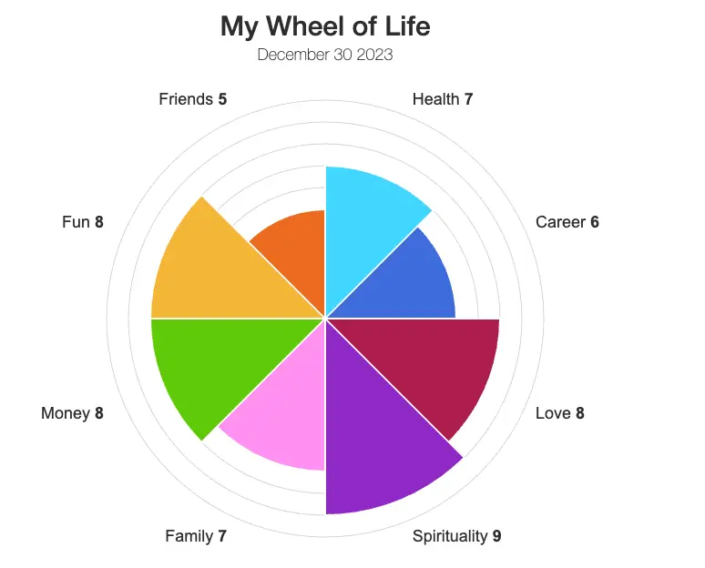

+++
title = "2023 年度回顧：裸辭、英國語言學校、自我對話"
date = "2023-12-30"

[taxonomies]
categories = ["年度回顧"]
tags = []

[extra]
image = "wheel-of-life.webp"
+++

年度回顧的意義？
========

最近剛讀 David Heinemeier Hansson 的 [Commit to competence in this coming year](https://world.hey.com/dhh/commit-to-competence-in-this-coming-year-feb7d7c5)，一開頭就提到新年新希望通常是不切實際的空想。因為要想辦法空出工作外的時間來執行甚至培養一個新的習慣，不如在確定值得投入的日常工作中投入更多精力，不要滿足於只是完成工作，而是要在工作中追求美感。

都對也都錯。如果只是許願一下，的確沒有什麼用。但利用這個時間回顧一整年的表現，反思造成一年前的期望與當下現實差距的原因，為下一個年度做長期計畫的調整，會比空想出願望實際許多。

> 假如你不自我反思，並且心想：「哇，一年前的我還真蠢。」那麼你這一年來肯定沒學到多少。
>
> —— Ray Dalio

<!-- more -->

我做年度回顧的方法
=========

每一年的年初，我會在 Roam Research 開一個年度頁面，把自己對自己的期望逐點寫下，有可能是可量化的目標——「想要閱讀 12 本書」，也有可能是質化的敘述——「面對自己的情緒，好好消化它」。在年末之際會重新回顧每一項期望，並給予自己每一項期望「達成或成效不錯」、「有做但可以更好」、「沒做到」的評價。

對於「沒做到」的部分會額外分析原因，與一年前許願的自己對話。在過往的回顧，大概可以分成這些原因：

-   期望過高但執行不足，沒有投入足夠的資源。

-   摩擦力過大或任務顆粒度過大，沒有找到好的方式開始執行。

-   喪失信念，失去執行的動機。

-   生活方向和想法改變，已不符合當前目標。

> 勝有不可思議之勝，敗無不可思議之敗。
>
> —— 松浦靜山

每一次反思都讓我們覺察到理想與現實的差距，進而可以做長期方向上的修正，使我們更接近長期想成為的自己。

做完上一年的年度回顧之後，就可以開始思考「根據現在的狀況，我期待下一年的我成為怎麼樣的我或是達成什麼目標」。也要定期回顧這些目標，把它們放入每週或每月的計畫中。

今年新增的項目
-------

在今年年末的時候，讀了 NESS LABS 的 [Year in Review](https://nesslahttps://nesslabs.com/year-in-reviewbs.com/year-in-review)，提供了一個供年度回顧的範本。基本上透過把生活切分成九個面向和三個問題，可以分開檢視自己「各個面向做得如何，是不是有某個面相特別缺乏」，像是[生命之輪 Wheel of Life](https://wheeloflife.noomii.com/) 的概念。

分類來做檢視也可以讓當下要檢視的範圍縮小，可以專注在特定的問題上，對反思相當有幫助。今年年末做更有細節的回顧讓我更感激平時寫日記的習慣，能穿越時空感受到過去一年美好與掙扎。

我的 2023 年度回顧
============

從整體來看，我在 2023 年年初寫下了 33 項對自己未來一年的期望，完成了 14 項、有 12 項還可以加強、有 7 項完全失敗。今年大部分的失敗都可以歸因於「生活方向和想法改變，已不符合當前目標」。從三月離職之後，看重的事物不斷地改變，因此有計畫與執行上不同的地方。但當中也有良好的習慣沒有信念跟能量好好堅持下去，例如重訓、冥想。

在此想推薦 Zoe 的【How to Keep Up the High Energy】，相較於時間管理或是任務管理，能量管理對我來說更加重要，要讓自己能不斷地往前，需要在目標、休閒、健康上取得一個平衡。

{{ youtube(id="kUM7FBP6Lj4") }}

------------

以下借 NESS LABS 的九個面向和三個問題，分別簡單地總結過去一年。

Health & Fitness
----------------

年中因為出國生活變動比較大，有一陣子都沒有好好運動，在年終漸漸找回上舞蹈課和零散的重量訓練的節奏；在健康方面，最後幾個月陷入長期蕁麻疹的問題，目前還在吃藥調整中。希望可以維持至少現在運動的強度，並逐步減少去運動的摩擦力。

Work & Business
---------------

三月離開了工作好幾年的環境，感謝同事幫忙接下後續的工作。離職之後大多都在探索自己感興趣的領域，打算想清楚想從工作得到的部分後，尋覓自己的下一站。

Friends & Community
-------------------

離開工作職場，短暫出國進入學校的環境，有覺得自己需要更主動去促進人際關係，也期望自己可以投入更多時間參與自己有興趣的社群。

Personal Life & Family
----------------------

年初和伴侶一起搬入新家共同生活，生活得很融洽。感激我們彼此磨合得很好，彼此當對方的後盾。家中的設計也越來越好，感謝伴侶的付出。

年中去了三個月的英國語言學校學習也探索在國外的生活，雖然短暫，但對我是很有意義的一段旅程。感謝當地的朋友們和新認識的同學們。

Learning & Knowledge
--------------------

閱讀一直是我學習的第一選擇，可以參考我的 [2023 閱讀總回顧](@/blog/2023-reading-summary/index.md)看看我今年最推薦的五本書。今年也投入更多時間在學習，從生成式 AI、英國語言學校、投資、Rust 到區塊鏈。但我學習的問題一直都出在實踐的力道不夠，期望自己在 2024 可以有更多實踐和實驗的行動。

Travel & Culture
----------------

去年有個比較大的感觸，發現自己不太在意出國「玩樂」，而是希望能得到更多文化接觸，或是與對自己重要的人去旅遊比較重要。希望做更多有意識的旅行，而不是跟風的旅行。

今年覺得最棒的是去花蓮[多羅滿](https://www.turumoan.com.tw/tw/plan_list.php)由廖鴻基老師領團的賞鯨團，運氣很好有海豚跟船產生的水流一起前行，真的好可愛。另外今年也跟伴侶一起第一次嘗試了越式洗髮、無光晚餐、北美館台北雙年展，每個都很推薦，都是很棒的活動體驗。

Hobbies & Creativity
--------------------

今年的改變主要在開始養成閱讀國際新聞和更穩定地寫日記。一開始閱讀國際新聞是為了當作練習常見英文字的管道，加上當時覺得用 ChatGpt 來做英文評分與摘錄的 [News Minimalists](https://www.newsminimalist.com/) 很酷，年底也看了其他人的推薦訂閱了 [Semafor](https://www.semafor.com/) 當作真人摘錄的管道。大概持續閱讀了半年多，覺得對世界局勢、當前世界關注的重點、發生的問題都會有更多的認識。認識世界，也能更了解自己的國家處在什麼樣的位子，讓我更珍惜台灣現在的樣子。

從 2020 年開始用 Roam Research 後，就閱讀了很多大神分享寫日記的好處，但一直都斷斷續續地寫。今年一整年都有蠻穩定在寫，並且從十二月開始用自由書寫的方式。有覺得自己在一次一次的自由書寫練習中，提取記憶有越來越順暢，之後還會嘗試更長一段時間來看看有沒有什麼其他的感受。在整理一整年回顧的過程，走過了每個月的筆記，從筆記中重拾了許多美好。

Emotions & Spirituality
-----------------------

年初上了正念課程後，發覺自己的情緒相較於其他人原本就比較平靜，但還是很享受這樣的練習。但隨著出國等生活上的改變，伴隨回國後對時間運用的焦慮，好像沒辦法好好靜下心來冥想，對於自己有點迷茫，冥想時也很多雜念。年末有試著改變計劃，偶爾換地點工作，嘗試比較有方法論的探索自我，例如：認真做完 Tim Urban 的[The Yearning Octopus](https://waitbutwhy.com/2018/04/picking-career.html)，在年末有漸漸拾回自己的節奏和能量。

Money & Finances
----------------

離職後過著無給薪的生活，壓力沒有想像中的大，感謝沒什麼負債也還沒有家庭壓力幸運的我。一方面消耗自己過往的積蓄，一方面多花點時間學習投資與觀察市場，一方面也思考著金錢對我的意義。我算是物欲比較低的人，好像不需要真的擁有大量的金錢，在金錢足夠供應生活下，做自己覺得有意義的事似乎比較快樂。

Proudest Accomplishments
------------------------

今年最大的成就或許算是有勇氣在 35 歲裸辭？在中國有所謂程序員的 35 歲危機，體力下降、家庭責任上升、技術學習瓶頸、升職瓶頸等等。這個現象某種程度上為真，如果沒辦法持續增進自己能夠提供的價值，而又因為老化或忙於家庭責任早成戰力的下降，如果沒有做到角色的轉化，為什麼能期待自己在市場的價值能夠無限的成長？在工作過程中，也有看到很多資深的同事，可以提供從經驗累積而成、難以用新鮮的肝換取的特殊智慧，應該思考的是如何轉換自己的經驗成為價值，而不能只是單純販賣時間。

Biggest Challenges
------------------

雖然毅然決然的辭職，但除了決定要去英國念語言學校體驗國外生活外，沒有給自己其他的大目標。在沒目標下，最難的挑戰其實是面對自己，面對自己的不安和焦慮、面對自己的期望與現實的落差、面對人生意義的探索，得到可以配置自己時間的自由，但也要承擔時間利用的成效。「該投入在什麼事情上？我可以投注多少時間？這真的是我想要做的事嗎？」過程中產生蠻多的迷惘，也得到來自社會的關心與壓力😜。透過閱讀、轉換生活方式，從八九月的焦慮慢慢到年底有越來越好的傾向，有覺得在思考上得到更多的收穫，希望可以累積飽滿的能量迎向下一站。

Goals for Next Year
-------------------

2024 對自己的期望：
* 找到工作的下一站：找到工作對我的意義，探索我喜歡的工作樣貌。
* 實踐知識：根據目的設計工具流，用實驗心態探索，投入更多在自己有興趣的領域。
* 強化輸出：有更多閱讀外的寫作，做更有效的表達和呈現。
* 拓展關係：更主動發展好的人際關係，在自己可接受的範圍內給予更多。
