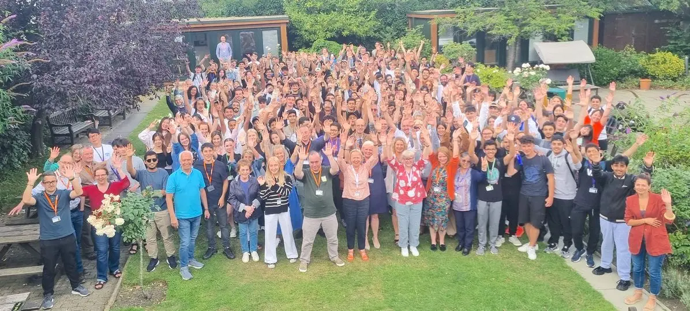
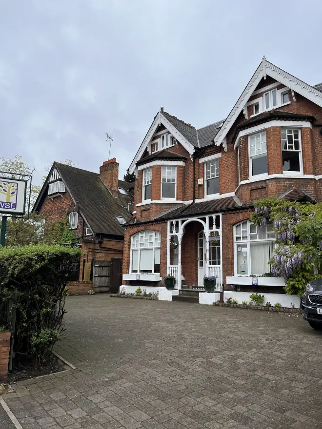
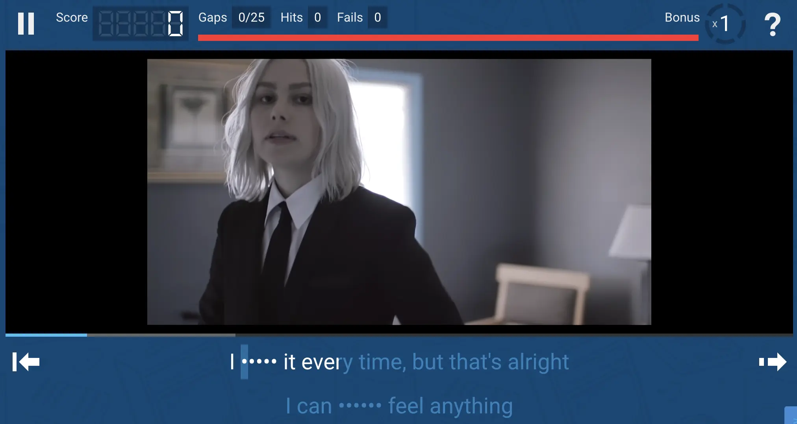
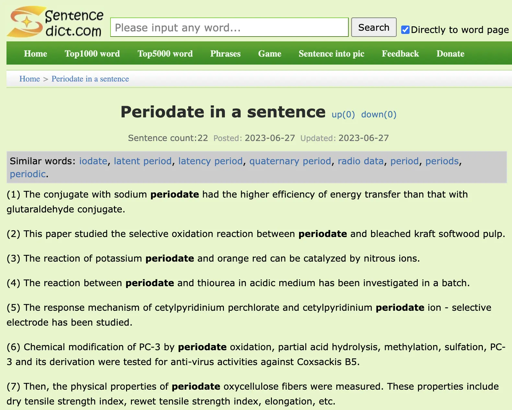

+++
title = "三個月的英國倫敦語言學校經驗分享"
date = 2023-08-23
description = "分享在英國倫敦三個月語言學校的經歷，探討學習英語的進步與挑戰。了解如何通過沉浸式學習提升口說能力，並提供實用英語學習資源與心得。"

[taxonomies]
categories = [ "經驗分享",]
tags = [ "language-acquisition", "england",]

[extra]
image = "wimbledon-school-of-english.webp"

+++

目的
================

英文是我一直想加強的課題，以往偶爾會用下班零碎的時間學習。但在沒有穩定地長期投入時間的狀況下，英文一直沒有太顯著的提升。但幸運的是，在資訊業工作有蠻多英文閱讀的機會，養成了就算有不認識的詞彙，也不妨礙理解大致內容的能力。但口說方面就相對沒有自信，在工作上的英文會議，常常因為英文能力不夠好而產生了額外的溝通成本。

在離職後，第一個想做的計畫就是嘗試投入更多時間在英文學習上，想要弄清楚「假如投入更多的時間，英文能力是否能夠再提升？」就算結果不好，能知道自己英文能力的上限，減少對自己錯誤的期待，也是很有用的收穫。

代辦
================

雖然現在網路上的資訊就蠻豐富的，但還是蠻推薦可以找個代辦。代辦都是從學校方收費，所以不需要額外的費用，他們經手各種遊學事務，有學校選擇或是申辦流程上的問題，可以從他們得到蠻多有用的資訊。

這次找了 [米凱爾英國遊學代辦](https://www.mikayeelukstudy.url.tw/)，主要考量點是代辦本身就在英國，如果臨時有什麼事，感覺多一個人可以詢問會安心許多，很感謝 Doris 提前寄給我英國的 Sim 卡，在出發前就把網路跟行前準備都完成了。Doris 今年在端午節也準備了粽子，身在他鄉還能吃到粽子是一件很感動的事，可惜在端午節剛好有其他的安排沒機會和 Doris 聚聚。

學校
================

在跟代辦討論之前，在學校的選擇上，主要是透過 [自助家遊學網](https://study-diy.com.tw/) 研究，資訊真的很豐富。主要是看倫敦的學校，但光倫敦學校的數量就超多。主要是透過他人的評論來鎖定常被推薦的學校，再評估學費、位置、學生國籍分佈等等，找尋合適的目標再和代辦討論其差異。

最後是選擇在偏郊區的 Wimbledon School of English，教學的評價很高，也考量在郊區或許可以排除一些市區的娛樂吸引，更專注在學習上。學費跟住宿價位上，其實跟在倫敦市中心的一級學校差不多，不過在 Wimbledon 的住宿是在離學校相對近的學生宿舍，只要走路十分鐘就能到學校；相較於市中心的學校，相同價位下，會是在比較遠、需要通勤的寄宿家庭。節省通勤時間也是最後選擇的考量之一。

Wimbledon School of English 的學生最主要是來自韓國、瑞士、沙烏地阿拉伯和日本，台灣和中國的學生很少，目的是想大量減少講中文的狀況。學校大多數是上 General English 的學生，少數是特別的考試專班或成人班。我上的是 General English，每班同學大概是 12 到 16 人。

如果沒有額外加課的話，學校的課堂在一三五是從 9:15 上到 15:45，二四是從 9:15 上到 12:55。學校也會額外提供一些旅遊、運動、社交的活動可以參加。

課程主要分成兩種課程。會有主要老師（First Teacher）根據教科書教學，每週是一個章節，會針對一個主題，例如電影、犯罪...等做相關單字的教學，也會搭配兩個文法句型，透過閱讀和對話練習來實際使用。每天的第二堂課是由輔助老師（Second Teacher）針對教學內容作補充，提供更多的練習，形式不限。如果自己有需要突破的地方，透過輔助老師的幫忙來加強是很好的選擇。在二四下午也可以額外加課來加強不同的部分。

學校不像想像中的校園，是兩棟房子聯合起來的空間，包含了教室、辦公室、交誼廳、甚至還有一個花園。

生活
================

在 Wimbledon 的生活還蠻方便的，有很多的超市和商店。交通上也很方便，學校離 Wimbledon Station 很近，除了市區地鐵外，也有多條不同的鐵路，十分方便，用信用卡就可以搭遍倫敦的交通工具。

在倫敦生活，幾乎都用不到現金，城市的支付電子化很完整，連街頭藝人打賞都可以刷卡。怕信用卡感應有問題可以提前申請刷卡的 pin 碼。

唯一在英國不能適應的，就是物價。所有的價格都是台灣的 2 到 3 倍，在餐廳吃一餐隨便就會超過 600 元，拿在台灣賺的錢在英國生活顯得格外的貧窮。在超市購物自炊真的可以省很多錢，食材價位只比台灣貴一點點。不過種類跟台灣的相差很大，探險購物、嘗試新料理是每週有趣的休閒活動。

另外在 Wimbledon 的年度盛事就是溫布頓網球公開賽，如果有計畫觀看現場的比賽，可以參考我之前寫的 [2023 溫布頓網球現場排票心得](@/blog/2023-wimbledon-tennis/index.md)。

英文學習心得
================

## 辨識自己的問題

每個人在學習的階段都不同，最重要的第一步就是辨識自己的問題。不同等級會有不同的關卡，有些需要花時間累積、有些可以透過老師提點快速補強。要找尋最適合自己的方法去突破困境，要記得老師是可以幫助你主動學習的資源，而不只是教材的教學者。

## 不畏懼說話

在這裡遇到蠻多亞洲朋友，普遍會比較害怕說話。但身處在這樣的環境裡，不敢發言就會喪失大量學習的機會。出國轉換環境以外，轉換心態也是很重要的一件事。認清自己是外國人的身份，努力學習、努力嘗試使用第二外語，不要害怕說錯。我們遇到外國人嘗試說中文時，也會更有包容心地嘗試理解。

## 知道自己的目的是什麼

如果已經有報名考試，或是有進一步留學的打算，學習的目的就很明確。但如果沒有，在倫敦的娛樂誘惑下，很容易就會迷失自己的方向。認清自己的目的，就算來休閒度假、交朋友，都比不明確的目的好很多。

## 語言學校的缺點

進入語言學校時，會有簡單的測驗來決定分班，但教學的難度其實是根據同學的等級浮動。如果你的同學能力都偏高，上課速度就會比較快，老師也會教比較多東西；如果偏低，則會花比較多時間等待大部分的學生完成。可以申請更改等級，不過通常會需要幾週時間的等待，在有限的時間等待就是很昂貴的代價。跟老師反應，讓老師知道你的狀態與你的期待是很重要的事。

此外，學校教師的品質也會有差異。有很用心的老師，會一直觀察學生，給予最適當的幫助；也有遇過混時間、只想把教材帶過的老師。要有效的學習，都需要主動跟老師或學校有更多的溝通。

「主動」在語言學校的學習真的會大大影響收穫的多寡。

## 收穫

整體而言，經過三個月的課程，不敢說英文有多大幅度的進步，但至少更有勇氣說英文。也開始對英文更有興趣，接觸越來越多詞彙與文法之後，在看影片或文章時，也能注意更多新學習的部分，就更有興趣探索更多。

如果沒有真的要長期生活在國外，好像不需要活用到複雜的相似詞彙，但如果可以一步步地補足自己有興趣、想發展的領域的相關英文，在聽說讀寫上都能增進效率，讓自己的視野更廣闊，能探索更多機會。學習語言就是一輩子的事。

## 英國老師提供的資源

最後提供在課堂上老師介紹、我也覺得還蠻實用的資源：

1.  [Lyrics Training](https://lyricstraining.com)：透過聽歌來學英文。當我們不以學習為目的聽歌時，我們常常忽略歌詞的細節，主要注重在旋律。透過對歌詞加強學習，可以重新認識你喜歡的歌，也可以練習聽力與增加詞彙。

2.  [Sentence Dict](https://sentencedict.com/)：學習單字時，如果不知道怎麼用，就不算真正學會。透過這個網站，可以看一個單字如何在句子中被使用。可以找尋與你生活經驗相關的句子朗讀來加強記憶，也可以試著模仿來造句。

3.  [YouGlish](https://youglish.com/)：跟 Sentence Dict 類似，透過從 Youtube 找尋有相關單字的影片，可以直接「聽」的一個字怎麼被使用。甚至可以用美國、英國、澳洲腔作為搜尋條件。

