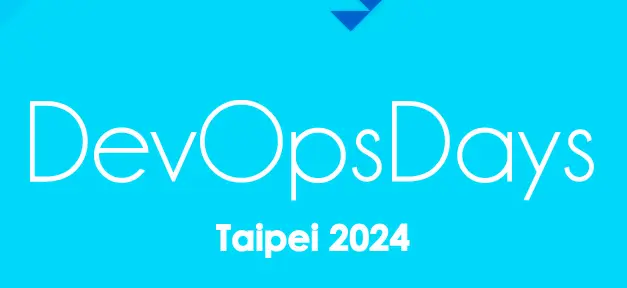
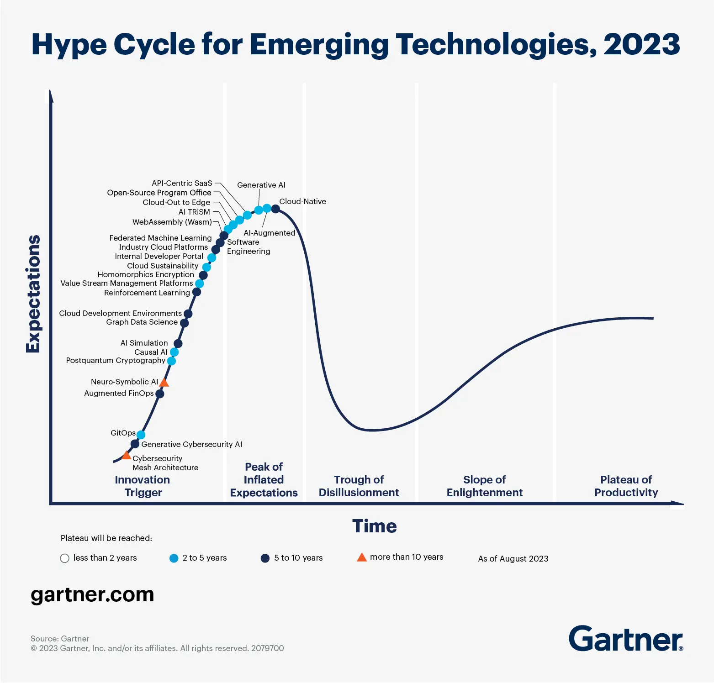
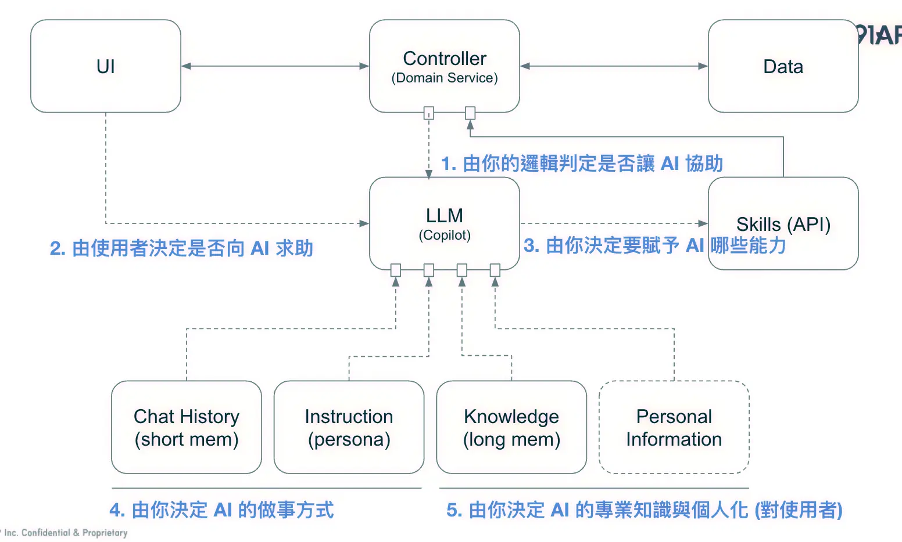
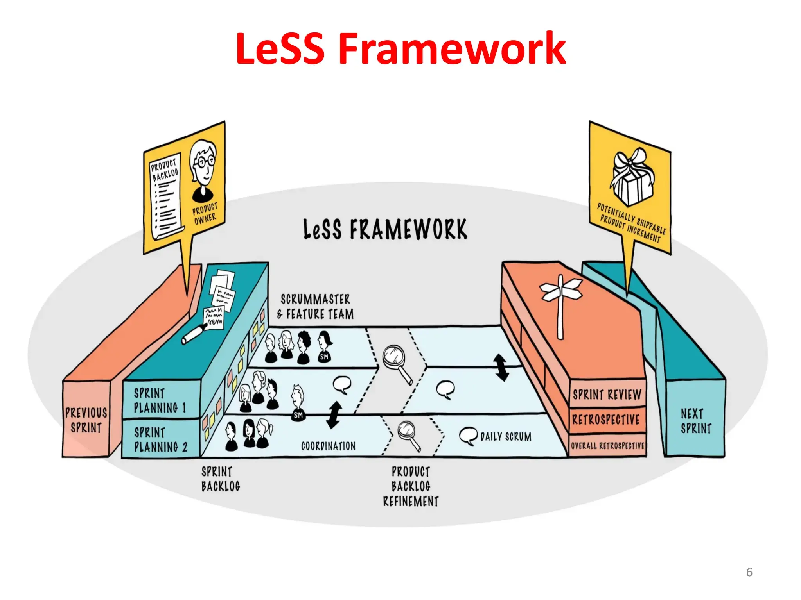
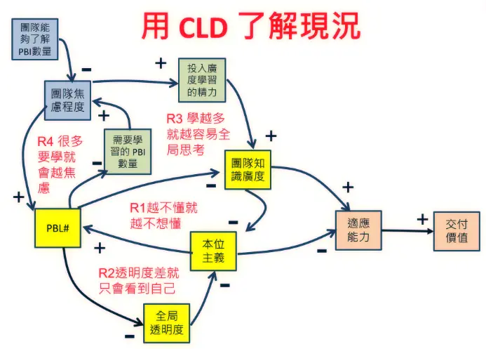

+++
title = "DevOpsDays Taipei 2024 心得"
date = 2024-07-27

[taxonomies]
categories = ["心得"]
tags = ["devops"]

[extra]
image = "devopsdays.webp"
+++

今年和前同事揪團一起參加了 DevOpsDays Taipei 2024，關注一下 DevOps 領域的發展。

這是我第一次參加這個活動，一共有兩天的[議程](https://devopsdays.tw/2024/agenda)，中間也穿插一些工作坊形式的 Session。活動從早上九點半到五點，兩天的經驗都是大概九點到就登記不到工作坊了，只能排候補名額，不過有蠻高的機率能夠候補到，工作坊還蠻常加開額外的旁聽席。

以今年的演講和工作坊看來，DevOps 比較熱門的話題是在 GitOps 和 Platform Engineering，當然也有一些在 Generative AI 上的協作運用。

先分享一張在某場演講看到的圖，Gartner 的觸角真的很廣，影響大家發展的方向🤣。當場還跟 Claude 一起研究這張圖要怎麼看，簡單來說這樣的曲線就是一項技術會經歷的不同階段，點的位置是目前科技所在的位置，點的顏色是未來幾年後會達到成熟的狀態（最後一階段）。

取自 Gartner

# 分享我最喜歡的三個議程

> 聽主辦方說之後會上傳錄影檔，不過剛剛搜尋 2023 的影片好像很少。如果沒有上傳的話大家就只好看投影片通靈一下。

## 從 API First 到 AI First - 安德魯 Andrew Wu

> [投影片](https://docs.google.com/presentation/d/10o1VN0Q-97eTwYN_N-UP8pzLlxrxSBJbfXCcq0mTEDk/edit#slide=id.g274de07fa95_1_484)

本來這個時間安排要去參加工作坊，不過在兩個工作坊間有半小時的空檔，找了間會議室坐下來，不小心遇到我這兩天最喜歡的一場演講。

在生成式 AI [湧現](https://zh.wikipedia.org/zh-tw/%E6%B6%8C%E7%8E%B0)後，可以用 AI 改善很多不同的流程，這個演講針對的是「**把 AI 融入你的服務之中**」。

過往要產生好用的使用者介面，往往仰賴的是設計師對產品價值及對使用者的了解，加上自己的經驗來設計介面，提供適合使用者的資訊內容與呈現方式。有了生成式 AI 的聊天介面後，透過大型語言模型對語意的理解，提供對話方式也成為一種新的使用者介面。

在這個演講，Andrew 主要使用的是 [OpenAI ChatGPT 的 GPTs](https://openai.com/index/introducing-gpts/)，利用 GPTs 背後能夠設定 Prompt 和 [Function Calling](https://platform.openai.com/docs/guides/function-calling) 的功能，提供一個電商的聊天客服介面，在[投影片](https://docs.google.com/presentation/d/10o1VN0Q-97eTwYN_N-UP8pzLlxrxSBJbfXCcq0mTEDk/edit#slide=id.g274de07fa95_1_484)裡面可以找得到他的 Demo 影片。

覺得蠻有洞見的是，他從兩年前的 [API First 主題](https://columns.chicken-house.net/2022/10/26/apifirst/)，強調好的 API 設計是提供商業價值與長遠的擴充性不可或缺的部分，到了這兩年生成式 AI 的大幅發展，他將其疊加在 API First 的概念上，好的 API 設定提供了符合商業價值的功能定義，而生成式 AI 是用大量通則資訊訓練而成的，所以如果你的 API 設計上越符合真實世界的**行為**，AI 就能用得更好。

> 物件導向技術，就是模擬世界，加以處理。
>
> ——世紀末軟體革命

在他的 Demo 中，他的 API 提供了列出商品、加入購物車、結算購物車金額等等一般電商平台會有的功能，在加入 AI 之後，AI 會利用這些功能的組合提供額外的功能，像便利商店店員會刷刷看有沒有折扣，或是根據你的預算和情境推薦商品組合等等。甚至可以利用 ChatGPT 的其他特性，比如記憶功能，可以用使用者過往的購買紀錄與情境偏好，做更準確的推薦；甚至直接用聊天過程的資訊，能對當次的購買流程做顧客滿意度的質化分析，在原本已經做好的 API 上疊加 AI 產生更多價值。

這樣子的運用融合了「**以程式撰寫邏輯、強調精確性的 API**」和「**有語意理解能力，可以透過對話處理不明確需求的 AI**」，一方面 AI 補足了 API 欠缺的彈性，另一方面 API 使 AI 的不精確性受到控制，而這一方面也仰賴 API 的設計與實作，必須要能防止 AI 錯誤的使用方式，在 AI 產生[幻覺](https://zh.wikipedia.org/zh-tw/%E5%B9%BB%E8%A7%89_(%E4%BA%BA%E5%B7%A5%E6%99%BA%E8%83%BD))時限制它只能做「設計範圍內」的行為。

不過最後也有提及在效率上，AI 的處理成本和回應時間目前都會比直接使用 API 來得慢很多，所以還是要思考使用情境，在最適合的時機用最適合的技術。另外也要思考自己的服務適合直接用 100% AI 的 Agent Mode，還是混合現有功能的 Copilot Mode。

Copilot Mode，取自投影片

## 基於 OpenFeature 的 Feature Toggle 系統實踐 - 許郁彬 Yubin Hsu

- [投影片](https://docs.google.com/presentation/d/1raYRbpXdzdzmvgdjAD6X5d-V8YQ0Wya_vfh251-rdDE)
- [Lab Github Repo](https://github.com/yubinTW/openfeature-lab)

這是一個介紹 [OpenFeature](https://openfeature.dev/) 框架的工作坊。程式在開發過程中，總是會出現需求不明確、需要更多真實數據，或是有風險、需要先小量測試的功能，而 Feature Toggle 是面對這類需求很常見的實作方式。在 OpenFeature 框架中，將這個需求標準化，並將其所需的元件模組化，在實作 Feature Toggle 時能更有彈性的作法，也對於 CI/CD 的部分提供更高的彈性。

這個工作坊讓我最印象深刻的是進行 Lab 的流暢性，講者利用 [Github Codespace](https://github.com/features/codespaces) 建立一致化實驗環境，Lab 的設計也很棒，可以讓參與者透過範例在沒什麼經驗的情況下就能操作去體驗 OpenFeature 效果。如果想大概了解 OpenFeature，推薦大家可以點選上面的連結試玩看看。

## 以系統思考來討論 LeSS 如何處理多頭馬車 - 敏捷三叔公 David Ko

- [投影片](https://www.slideshare.net/slideshow/devopsdays-taipei-2024-less/270188848)

在第二天的最後一個議程選擇參加跟 [Agile](https://zh.wikipedia.org/zh-tw/%E6%95%8F%E6%8D%B7%E8%BD%AF%E4%BB%B6%E5%BC%80%E5%8F%91) 相關的工作坊，也是幸運有備取上。

在參加之前對於 LeSS Framework 完全沒有概念，不過現場大部分參與者也是😅。Less Framework 是把 Scrum 運行在更大範圍、多團隊狀況的架構，讓多團隊能夠有一致的方向去完成共有的目標，減少不同團隊之間的拉扯。

工作坊中蠻有趣的是用 [Causal Loop Diagram (CLD)](https://en.wikipedia.org/wiki/Causal_loop_diagram) 去做事實間因果關係的推導，藉由比較各項可量化的變數，去尋找其中的因果環，建立大家對不同變數關係的共識。接著對這樣的關係做定義，有了很多條定義之後，就能用來討論組織如何去應對這些問題。在這個過程最大的目的是討論，嘗試讓團隊成員對於事實的因果提出看法來交流。

很有印象點的是，在討論出這些問題之後，可以回到 LeSS Framework，這個框架提供了可以解決這些問題的實驗與原則，讓團隊更有方向去嘗試不同的作法。

在課堂上提到的例子是：「*當想要建立有極高的適應能力、全能的團隊，擁有能交付價值的能力同時，也會造成團隊成員因為要學習太多而造成焦慮提升*」感覺跟之前在工作上遭遇的情況很像。在工作坊有詢問大家怎麼解決這個問題，參與者大多提出可以增加分享的會議，或是寫更詳細的文件，讓生成式 AI + [RAG](https://www.promptingguide.ai/techniques/rag) 做聊天機器人輔助學習等等。LeSS 框架提供一些有實驗過的選擇，例如讓新手寫 [Acceptance Criteria](https://resources.scrumalliance.org/Article/need-know-acceptance-criteria)、跑 Pair Programming、幫別人做 Demo、以市集展示取代 Demo 會議等方法。感覺這樣的誇架有機會能為困境注入一股活水。

# 後記

其實我蠻少參加社群的活動，因為覺得自己不擅長做陌生交流，很難用短暫的時間拓展人脈。不過參與這樣的活動能讓自己做一些不同的探索，也有機會聽到很棒的演講或是參與很棒的工作坊，算是參與社群活動的兩難（喂）。

如果後續有看到錄影釋出後會再補上。
