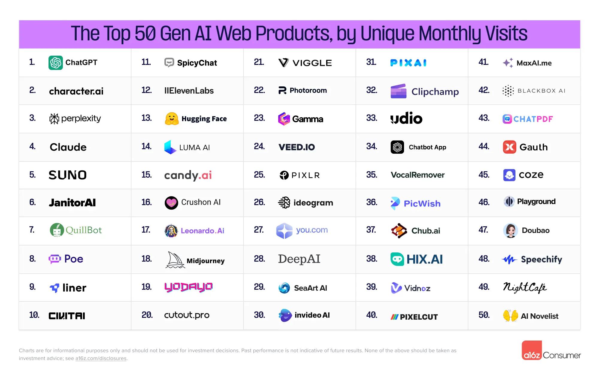
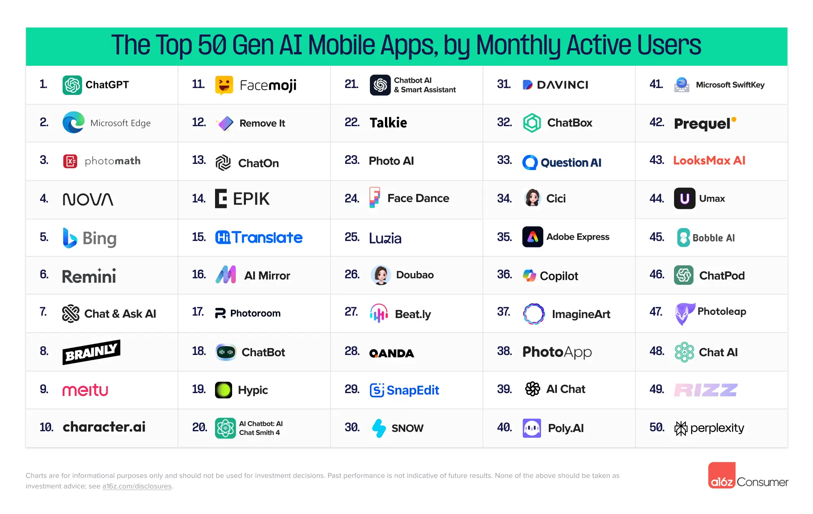

+++
title = "a16z 公布的 2024 上半年前五十大生成式 AI 用戶端網頁應用及手機應用"
date = 2024-09-01

[taxonomies]
categories = ["清單"]
tags = ["generative-ai"]
+++

a16z 最近公佈了每六個月發行一次的《[生成式 AI 用戶端前五十大網頁及手機應用](https://a16z.com/100-gen-ai-apps-3/)》。生成式 AI 的發展動態還是持續驚人的成長，對使用者來說，不一定要追逐技術的最新發展，但在應用層面上，如果找到能改善你目前工作流程的 AI 工具，所帶來的價值可能會超乎你的想像。

文章中也提供蠻多的趨勢分析，最讓我驚訝的是在百大的名單中，開發 Tiktok 的公司字節跳動（ByteDance）就佔了 6 個，而針對約會軟體的照片優化和聊天輔助應用的出現也是蠻有趣的趨勢。

不過要了解 100 個應用還是蠻花時間的，這篇文章意旨在提供大家一個簡短的描述，讓大家比較容易找到可能符合自己的應用。不過這篇也是使用生成式 AI 整理而成，如果發現描述有誤，也可以在底下留言，我會盡快修正這些錯誤。

# 生成式 AI 前五十大用戶端網頁應用

取自 a16z.com

1. ChatGPT: 強大的 AI 對話系統，可回答問題、協助寫作和編程。
2. character.ai: 創建和與 AI 角色互動的平台，支持多樣化對話。
3. perplexity: AI 驅動的搜索引擎，提供準確、最新的問答服務。
4. Claude: 高級 AI 助手，擅長分析、寫作和複雜任務處理。
5. SUNO: AI 音樂創作工具，幫助用戶輕鬆製作原創音樂。
6. JanitorAI: AI 角色創建和對話平台，專注於角色扮演和故事創作。
7. QuillBot: AI 寫作助手，提供改寫、語法檢查和翻譯等功能。
8. Poe: 整合多個 AI 模型的聊天平台，方便用戶比較不同 AI 的回答。
9.  liner: AI 驅動的研究助手，幫助用戶高效閱讀和整理在線信息。
10. CIVITAI: AI 藝術和模型共享平台，專注於生成式 AI 創作。
11. SpicyChat: AI 驅動的匿名聊天平台，提供有趣、刺激的對話體驗。
12. 11ElevenLabs: 先進的 AI 語音合成技術，可生成自然、富有表現力的語音。
13. Hugging Face: AI 模型和應用的開源平台，提供各種 NLP 工具和資源。
14. LUMA AI: 3D 內容創作平台，利用 AI 技術簡化 3D 建模和渲染過程。
15. candy.ai: AI 驅動的虛擬伴侶和聊天機器人創建平台。
16. Crushon AI: AI 驅動的約會助手，幫助用戶改善社交和戀愛技巧。
17. Leonardo.AI: 強大的 AI 圖像生成工具，適用於藝術創作和設計。
18. Midjourney: 高質量 AI 圖像生成服務，以其獨特的藝術風格聞名。
19. YODAYO: AI 驅動的音樂創作平台，幫助用戶製作專業級音樂。
20. cutout.pro: 多功能 AI 設計工具，提供圖像編輯、背景去除等服務。
21. VIGGLE: AI 驅動的視頻編輯工具，簡化視頻創作和剪輯過程。
22. Photoroom: AI 圖像編輯應用，專注於背景移除和替換功能。
23. Gamma: AI 驅動的演示文稿創建工具，幫助用戶快速製作專業簡報。
24. VEED.IO: 在線視頻編輯平台，整合 AI 功能簡化視頻製作流程。
25. PIXLR: AI 增強的在線圖像編輯工具，提供豐富的編輯和設計功能。
26. ideogram: AI 文本到圖像生成工具，將文字描述轉化為視覺藝術。
27. you.com: AI 驅動的搜索引擎，提供個性化和對話式搜索體驗。
28. DeepAI: 多功能 AI 工具平台，提供各種 AI 應用如圖像生成、風格轉換等。
29. SeaArt AI: AI 藝術創作平台，專注於生成獨特的數字藝術作品。
30. invideo AI: AI 視頻創作工具，幫助用戶快速製作專業品質的視頻內容。
31. PIXAI: AI 驅動的動漫和插畫生成工具，專注於創作獨特的動漫風格圖像。
32. Clipchamp: 微軟旗下的線上影片編輯工具，整合 AI 功能簡化影片製作。
33. ydio: AI 驅動的音訊處理平臺，提供語音轉文字、音訊編輯等功能。
34. Chatbot App: 可客製化的 AI 聊天機器人平臺，用於客戶服務和互動。
35. VocalRemover: AI 音訊處理工具，專門用於從音樂中分離人聲和樂器。
36. PicWish: AI 圖像編輯工具，提供背景移除、圖像增強等功能。
37. Chub.ai: AI 角色創建和互動平臺，專注於個人化 AI 夥伴體驗。
38. HIX.AI: 全能型 AI 寫作助手，幫助使用者創作各種類型的內容。
39. Vidnoz: AI 影片創作平臺，自動將文字轉換為影片內容。
40. PIXELCUT: 面向電商的 AI 產品圖片編輯工具，簡化產品攝影過程。
41. MaxAI.me: 多功能 AI 助手，整合各種 AI 工具，提供全方位的智能服務。
42. BLACKBOX AI: 專為程式設計師設計的 AI 編碼助手，提高開發效率。
43. CHATPDF: AI 驅動的 PDF 文件分析工具，能快速回答文件相關問題。
44. Gauth: AI 驅動的身份驗證和安全解決方案，提升線上身份保護。
45. coze: 企業級 AI 對話平臺，協助企業建立客製化 AI 應用。
46. Playground: AI 實驗平臺，讓使用者探索和測試各種 AI 模型。
47. Doubao: AI 驅動的中文內容創作助手，專注於中文寫作優化。
48. Speechify: AI 語音合成工具，將文字轉換為自然流暢的語音。
49. NightCafe: AI 藝術創作平臺，讓使用者輕鬆生成獨特的藝術作品。
50. AI Novelist: 專門用於小說創作的 AI 寫作助手，協助作家構建情節和角色。

# 生成式 AI 前五十大用戶端手機應用

取自 a16z.com

1. ChatGPT: 強大的 AI 對話系統，可回答問題、協助寫作和解決問題。
1. Microsoft Edge: 微軟的 AI 增強瀏覽器，提供智慧搜索和內容摘要功能。
1. photomath: 數學問題解答應用，利用 AI 識別並解決各類數學題。
1. NOVA: AI 驅動的個人助理應用，提供日程管理和智慧提醒服務。
1. Bing: 微軟的 AI 搜索引擎應用，提供智慧搜索和對話式查詢功能。
1. Remini: AI 照片增強工具，可修復和改善舊照片和低質量圖像。
1. Chat & Ask AI: AI 聊天和問答應用，提供多樣化的對話和資訊查詢服務。
1. BRAINLY: 學習社區平台，結合 AI 為學生提供家庭作業幫助和答疑。
1. meitu: AI 驅動的圖像編輯工具，提供智慧美顏和照片編輯功能。
1. character.ai: AI 角色扮演和對話平台，讓用戶與各種 AI 角色互動。
1. Facemoji: AI 驅動的表情符號和頭像生成器，創建個性化表情。
1. Remove It: AI 背景移除工具，快速清理照片背景。
1. ChatOn: AI 聊天機器人平台，提供多功能對話和資訊查詢服務。
1. EPIK: AI 驅動的數字化身創建工具，生成個性化虛擬形象。
1. Hi Translate: AI 翻譯應用，提供即時語音和文字翻譯功能。
1. AI Mirror: 智慧鏡像應用，使用 AI 技術進行虛擬試妝和美容模擬。
1. Photoroom: AI 圖像編輯工具，專注於背景移除和替換功能。
1. ChatBot: 可定制的 AI 聊天機器人應用，用於個人助理和資訊查詢。
1. Hypic: AI 圖像增強工具，提供智慧修圖和濾鏡效果。
1. AI Chatbot.AI Chat Smith 4: 進階 AI 聊天機器人，提供深度對話和任務協助。
1. Chatbot AI & Smart Assistant: 多功能 AI 助理，提供智慧對話和日常任務協助。
1. Talkie: AI 語音合成應用，將文字轉換為自然流暢的語音。
1. Photo AI: AI 驅動的照片編輯工具，提供智慧美化和風格轉換功能。
1. Face Dance: AI 人臉動畫應用，將靜態照片轉為有趣的動態表情。
1. Luzia: AI 視覺助手，協助視障人士識別物體和閱讀文字。
1. Doubao: 中文 AI 寫作助手，專注於中文內容創作和優化。
1. Beat.ly: AI 音樂創作工具，幫助用戶製作原創音樂和節拍。
1. QANDA: AI 驅動的學習助手，提供即時題目解答和學習指導。
1. SnapEdit: AI 照片編輯應用，提供智慧修圖和創意濾鏡效果。
1. SNOW: AI 美顏相機應用，提供實時美顏效果和有趣的 AR 濾鏡。
1. DAVINCI: AI 藝術創作工具，將文字描述轉換為獨特的視覺藝術作品。
1. ChatBox: 多功能 AI 聊天平台，整合多種 AI 模型供用戶選擇使用。
1. Question AI: AI 驅動的問答系統，提供準確、深入的資訊回答。
1. Cici: 個人 AI 助理應用，提供日程管理、提醒和智慧建議。
1. Adobe Express: Adobe 的 AI 增強創意工具，簡化設計和內容創作過程。
1. Copilot: AI 編程助手，協助開發者提高編碼效率和質量。
1. ImagineArt: AI 藝術生成工具，讓用戶輕鬆創作各種風格的藝術作品。
1. PhotoApp: 全方位 AI 照片編輯應用，提供智慧修圖和創意設計功能。
1. AI Chat: 通用 AI 聊天應用，提供廣泛的對話和資訊查詢服務。
1. Poly.AI: 多語言 AI 對話系統，專注於自然語言處理和理解。
1. Microsoft SwiftKey: 微軟的 AI 驅動智慧鍵盤，提供準確的文字預測和自動更正。
1. Prequel: AI 照片和影片編輯工具，提供獨特的濾鏡和特效。
1. LooksMax AI: AI 驅動的個人形象優化應用，提供穿搭和美容建議。
1. Umax: AI 增強的多媒體編輯工具，簡化影片和圖片製作過程。
1. Bobble AI: AI 驅動的智慧鍵盤和內容推薦引擎，個性化用戶輸入體驗。
1. ChatPod: 便攜式 AI 聊天助手，提供隨時隨地的智慧對話服務。
1. Photoleap: 專業級 AI 照片編輯應用，提供高級修圖和創意合成功能。
1. Chat AI: 另一款通用 AI 聊天應用，專注於自然對話和任務協助。
1. RIZZ: AI 驅動的社交技能提升應用，幫助用戶改善溝通和互動能力。
1. perplexity: AI 驅動的知識探索引擎，提供深度資訊搜索和分析。
