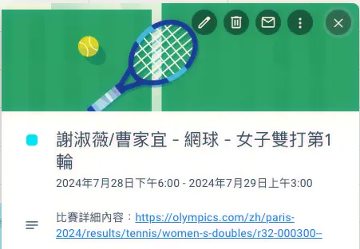
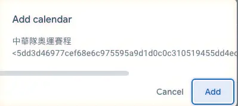
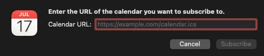
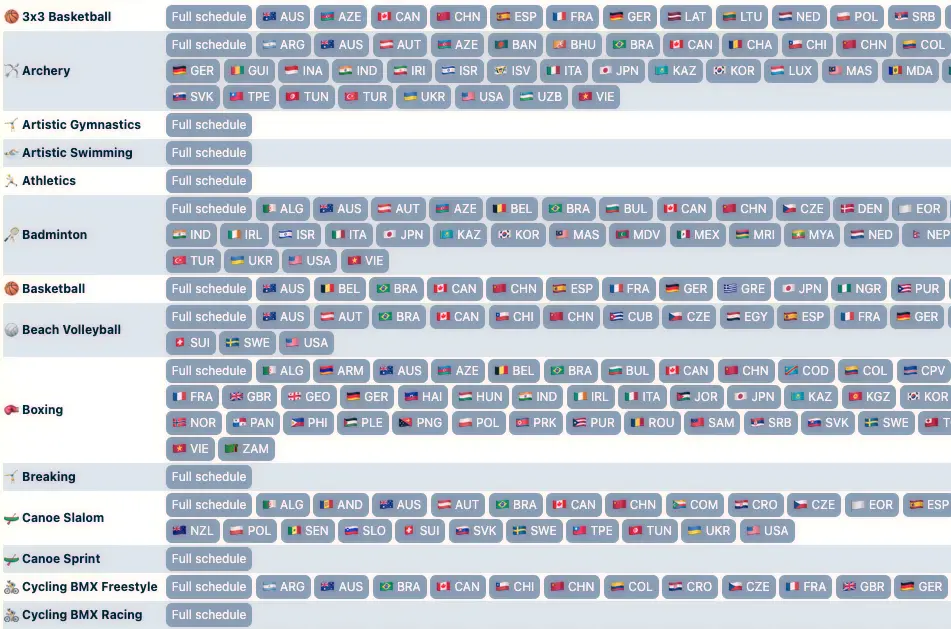

+++
title = "2024 巴黎奧運台灣隊賽程 Google 行事曆"
date = 2024-07-28
updated = 2024-07-30

[taxonomies]
categories = []
tags = []

[extra]
image = "google-calendar-event.webp"
+++

# 台灣隊奧運賽程

<iframe src="https://calendar.google.com/calendar/embed?src=5dd3d46977cef68e6c975595a9d1d0c0c310519455dd4ec2d6601cb7b8f6d779%40group.calendar.google.com&ctz=Asia%2FTaipei" style="border: 0" width="800" height="600" frameborder="0" scrolling="no"></iframe>

# 動機

四年一度的奧運來了，當然要來觀看賽事支持台灣隊。因為不想錯過比賽，我嘗試在網路上搜尋了台灣賽事的行事曆，只找到每日更新的網頁，其實 Google 搜尋也可以直接顯示賽程，但都不太符合我的需求。

>「如果沒有，何不自己做一個？」

和同事 [Claude](https://claude.ai/) 和 [ChatGPT](https://chat.openai.com/) 快速討論了一下作法，就利用奧運官方網站的資料，產生一個「有台灣隊的所有賽程且會不斷更新」的 Google 行事曆，這樣就可以在自己的行事曆裡鎖定比賽不錯過。

奧運官方網站只提供英文或是簡體中文的賽程，最後是拿了簡體中文，再利用 [opencc-python](https://github.com/yichen0831/opencc-python) 做簡體轉繁體。另外官方網站也只有選手的英文名字，不容易一眼就轉換回中文名，最後找了中文選手名單搭配官方英文選手名，請同事 [ChatGPT](https://chat.openai.com/) 人工做一個對應表，在程式中就可以用這個表作轉換。

最後的行事曆活動長這樣子，在標題可以看到比賽選手的名字、運動項目和競賽輪次，敘述裡會放上這場比賽的官網詳細數據連結。如果用 Google 行事曆還會看到，Google 行事曆自動為這些活動加了圖片。



最後接上 Github Actions 每三十分鐘跑一次就大功告成啦，就可以得到這個不停自動更新賽程的行事曆。

# 如何加到自己的行事曆

## 加到 Google 行事曆

如果你是用 Google 行事曆，你可以直接點擊[這個連結](https://calendar.google.com/calendar/u/0?cid=NWRkM2Q0Njk3N2NlZjY4ZTZjOTc1NTk1YTlkMWQwYzBjMzEwNTE5NDU1ZGQ0ZWMyZDY2MDFjYjdiOGY2ZDc3OUBncm91cC5jYWxlbmRhci5nb29nbGUuY29t)，會跳出你是否要把這個行事曆加到你的 Google 行事曆中的詢問，只要確認後就完成訂閱。



## 加到其他行事曆 {#add-to-other-calendar}

如果是用其他的日曆，大多也都會提供訂閱日曆的功能。

### Macbook Calendar {#macbook-calendar}

以下用 Mac 的行事曆為例，點選 `File > New Calendar Subscription...`，就會出現以下畫面可以輸入網址：



只要填入以下這個網址就能導入 [iCalendar 檔案（.ics）](https://zh.wikipedia.org/zh-tw/ICalendar)，自動更新台灣隊奧運賽程。
```
https://calendar.google.com/calendar/ical/5dd3d46977cef68e6c975595a9d1d0c0c310519455dd4ec2d6601cb7b8f6d779%40group.calendar.google.com/public/basic.ics
```

### iPhone Calendar {#iphone-calendar}
剛好遇到朋友不知道怎麼用手機訂閱，以下提供一個 iPhone 操作流程：
1. 打開行事曆，選擇最下方的 **Calendars**。
{{ image(path="iphone-calendar.webp", height=800) }}
2. 點選 **Add Subscription Calendar**。
{{ image(path="iphone-add-subscription-calendar.webp", height=360) }}
3. 在[本頁 iCalendar 檔的程式碼區塊](#macbook-calendar)按下 **Copy**。
{{ image(path="copy-ics.webp", height=600) }}
4. 貼在 SUBSCRIPTION URL 點選 **Subscribe** 即完成訂閱！
{{ image(path="iphone-subscribe.webp", height=480) }}

---

# 同場加映：[Paris 2024 Summer Olympic Games calendars](https://fabrice404.github.io/olympics-calendar/)


<p class="image-caption">網站截圖</p>

昨天分享這個行事曆時，女友的朋友提到有其他[提供奧運賽程的行事曆的網站](https://fabrice404.github.io/olympics-calendar/)。發現是用蠻類似的作法，也是從官方網站抓取賽程。不同的是，他會根據比賽項目和國家分別產生不同的 iCalendar 檔案（.ics），如果你要訂閱個別比賽項目或國家就很合適，我自己也用了這個網站訂閱了日本排球、籃球和美國籃球的行事曆。

網站最上面有提供如何使用的描述，跟上述[加到其他行事曆](#add-to-other-calendar)的步驟類似，要注意是要點擊右鍵複製連結，如果點擊左鍵會直接下載 iCalendar 檔案（.ics），直接匯入那個檔案的話只能把 iCalendar 檔案裡面目前的比賽匯入行事曆，沒辦法拿到後續更新的內容。

預祝大家瘋奧運順利！

---

# 7/29 更新

發現有些運動項目官網的資料會缺少參賽選手，造成在行事曆上缺少賽程，目前發現的項目有：
* 體操
* 田徑
* 跆拳道
* 游泳
* 高爾夫
* 輕艇靜水
* 霹靂舞

目前已人為補上體操和游泳的賽程，其他項目會在賽前一天觀察一下資料，如果資料上有問題，會再人為補上。

# 7/30 更新
[增加 iPhone Calendar 的行事曆訂閱操作步驟](#iphone-calendar)
