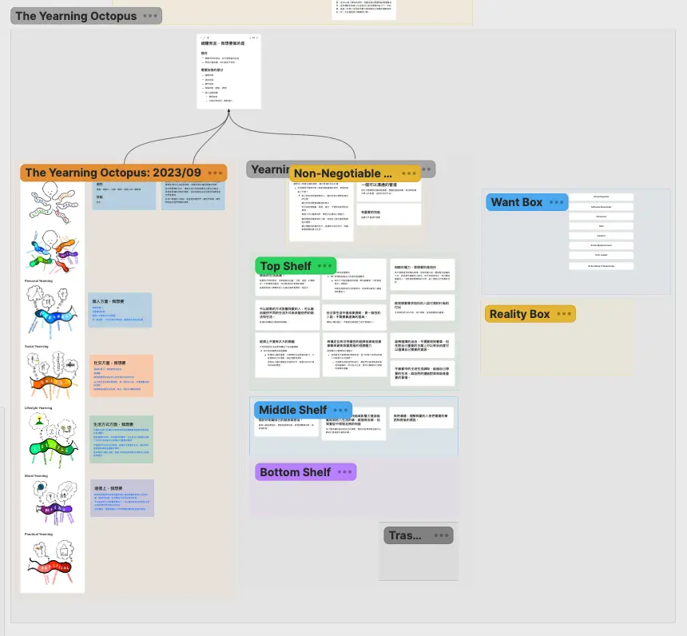

+++
title = "2024 個人目標管理"
date = 2024-07-31
description = "探索人生和個人目標管理的最佳方法，通過深度工作和策略思維，發現如何利用艾森豪矩陣和時間箱等工具提升效率。"

[taxonomies]
categories = [ "經驗分享",]
tags = []

[extra]
image = "yearning-octopus.webp"

+++

# 前言
去年三月裸辭後，給自己一年的時間去探索想做的事，其中比較大的計畫是 [去英國讀語言學校待了三個月](@/blog/2023-wimbledon-language-school/index.md)。剩下的時間一部份思考人生和工作的意義；一部份用於感興趣領域的探索和學習；也有一段時間接案，邊學習邊賺點生活費。

沒有工作時的時間自由度很高，但也蠻常焦慮好像沒有一些實質的成果。這段時間也看了一些關於時間管理、能量管理、目標管理類的文章。

有從中獲得一些洞見的內容有這些：
* 《[How to Pick a Career (That Actually Fits You)](@/wisdom/articles/picking-career/index.md)》
* 《[Use Strategic Thinking to Create the Life You Want](https://hbr.org/2023/12/use-strategic-thinking-to-create-the-life-you-want/)》
* 《[自由工作者保持動力的方法](@/wisdom/articles/how-i-stay-motivative-as-a-solo-creator/index.md)》
* 《[How to Keep Up the High Energy?](@/wisdom/videos/how-to-keep-up-the-high-energy/index.md)》
* 《[Top Author's Time Management trick Changes Everything.](https://youtu.be/0q7lW8OJ59U)》
* 《[How to Decide What to Work on Next?](https://nesslabs.com/decide-what-to-work-on-next)》

今年四月到六月間，閱讀了 Cal Newport 的《[深度工作力 Deep Work](https://www.goodreads.com/book/show/25744928-deep-work)》和上了 [Y Combinator 的 Startup School](https://startupschool.org)，此時才比較確定自己的想法，也改變我對個人目標的想法：

> 投入時間做深度的事，不斷累積自己；讓自己在感興趣領域的前沿，發現世界需要的缺口，做自己覺得重要的事。

# 目標探索的方法

## 嚮往的章魚（The Yearning Octopus）
在去年九月的時候，有認真在 [Heptabase](@/blog/heptabase/index.md) 裡用《[How to Pick a Career (That Actually Fits You)](https://waitbutwhy.com/2018/04/picking-career.html)》裡的 The Yearning Octopus 方法大範圍地盤點自己想做的事與現實的差距，排列出優先次序，建立出自己的嚮往階級（Yearning Hierarchy）。

## 將策略思維（Strategic Thinking）運用在人生上
在今年初時則是閱讀到《[Use Strategic Thinking to Create the Life You Want](https://hbr.org/2023/12/use-strategic-thinking-to-create-the-life-you-want/)》，提到公司都會運用策略思維來盤點現況、決定下一步的走向，何不把這個方法也運用在我們的人生上？

這個框架提供了很多問題，能夠幫忙釐清對美好生活的定義、生活的目的及願景，提供方法製作目前的生活投資組合，接著能將你的投資組合與大眾的人生滿意度調查報告做比較，思考要如何更改配置才能往自己定義的美好生活更進一步，最後進行分析拆解出可行的計畫。

這兩個框架我都蠻喜歡的，能夠幫助你把整個人生思考的大問題，拆解成很多階段，並在每個階段提供問題清單或是方法，每次專注在個別的小問題上。最後再收斂為有優先次序的目標和任務。當然走完整個框架需要花一些時間，有時光反思一個問題就蠻花時間，建議可以幾年做一次，或是在人生有比較大的迷惘時盤點一下。

# 執行面的方法

## 艾森豪矩陣（Eisenhower Matrix）

前面兩個框架的涉及的層面比較大，會碰觸到人生的思考。當人生比較明確或穩定時，在日常生活中還是有很多想做的事情，這時我會用艾森豪矩陣來做評估，輕量又實用。

把想要做的事放在二維座標軸上，橫軸是緊急程度，縱軸是重要程度。

接著，我們就可以把這些事分成：

* **第一象限——緊急且重要**：第一優先
* **第二象限——重要但不緊急**：排程加入行事曆
* **第三象限——不緊急也不重要**：從清單中刪掉，如果這件事緊急或重要會自己再出現
* **第四象限——緊急但不重要**：想辦法自動化或指派給別人做

除了將每個卡片以視覺化的方式擺放，也可以用表格的方式做，像 [Heptabase](@/blog/heptabase/index.md) 或是 [Notion](https://notion.so/) 都有表格功能，利用 Sort 和 Filter 功能可以對這些事依據重要程度和緊急程度做明確的呈現。

## 時間箱（Timeboxing）

在閱讀《深度工作力》後，對我影響最大的想法就是「用實際投入在深度工作的時間來衡量自己的成果」。只要長期將時間投入在深度工作上，即使是長期才能看到結果的項目，也能拿來當作衡量指標。於是目標就變成「最大化投入在深度工作的時間」，而時間箱是我目前覺得對我來說最有效的方法。

時間箱唯一的重點就是在行事曆上做好每個工作時間段的規劃。在每天開始工作時，根據時間區段長度和當前的能量狀態，從剛剛排序好 Eisonhower Matrix 的結果中，安排適合的工作。

這個安排是有彈性的安排，當遇到不預期的事件時可以調整，例如臨時的討論、超時的會議或一些意外。不過當排定好的行程受影響時，必須要回到行事曆上修正，這個「刻意修正」的動作提供一個反思的空間去思考這樣子的意外合不合理，過多的修改代表個人專注的時間過於容易被破壞，是長久必須解決的潛在問題。

這個方法也可以做額外的延伸，比如搭配 [番茄鐘](https://zh.wikipedia.org/zh-tw/%E7%95%AA%E8%8C%84%E5%B7%A5%E4%BD%9C%E6%B3%95)，或在安排時預估完成任務的時間，能得到更多資訊做調整。
