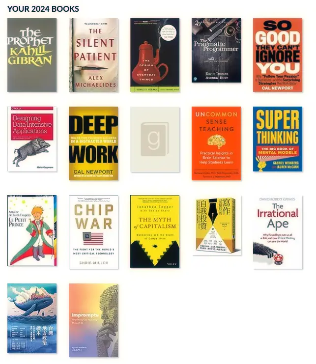

+++
title = "2024 閱讀總回顧"
date = 2024-12-15
description = "探索 2024 年的閱讀旅程，從思維模型到設計心理學，見證作者的成長與挑戰，提前達成閱讀目標，推薦的書籍與深刻見解邀您開卷。"

[taxonomies]
categories = [ "年度回顧",]
tags = []

[extra]
image = "books.webp"

+++

# 閱讀目標

前一年設定要閱讀 24 本書，後來只完成 18 本。今年取一個折衷的目標，就抓在 16 本書。

雖然在 9 月中就提前達成目標了，不過後續的閱讀也就停滯了，最終只完成 17 本。

一部份原因是剛好卡在兩本對我來說相對困難的書，分別是《40% 的工作沒意義，為什麼還搶著做？》與《多元宇宙》，要主動閱讀的能量需求較高；另外是生活進行中的事務變多了，八月開始了一份兼職工作也錄了一季的 Podcast 節目。

<blockquote class="twitter-tweet">
今年提前在九月完成了年初訂的年度閱讀目標  🤓🤓🤓🤓🤓<a href="https://twitter.com/hashtag/2024%E6%89%93%E9%96%8B%E6%9B%B8?src=hash&amp;ref_src=twsrc%5Etfw">#2024 打開書</a> <a href="https://t.co/lFKmOAvTOk">pic.twitter.com/lFKmOAvTOk</a>
&mdash; Mick 👨‍💻 (@mick_taiwan) <a href="https://twitter.com/mick_taiwan/status/1835951742074466488?ref_src=twsrc%5Etfw">September 17, 2024</a></blockquote> 

# 2024 書單

跟過往不同的是，除了看非文學類的工具書外，也稍微涉獵了一點小說，分別閱讀了經典小品《小王子》與推理驚悚小說《緘默的病人》。相較於非文學類的工具書，文學類作品有更豐富的畫面感。在密集的閱讀時，「想像力」帶來的深沉式體驗相當美好。

也花了點時間回防了專業的電腦科學領域，閱讀了《Designing Data-Intensive Applications》與《The Pragmatic Programmer》。雖然也有花時間做了一些筆記，但好像不知道怎麼摘要書中的內容才好。推薦大家可以直接閱讀，這兩本書都相當棒！

此外，在去年底今年初也閱讀了當時 Reid Hoffman 與 ChatGPT 對談共寫的《Impromptu: Amplifying Our Humanity Through AI》。但現在覺得與 AI 對談這種事的最大受益者還是個人😆，建議大家可以自己與生成式 AI 對談就好。

最終，是分享今年看的工具書們，按慣例也總結從中學到最重要的一件事：

* 《[台灣政治地方讀本](@/reading-notes/a-reader-on-local-politics-in-taiwan/index.md)》：政治行為的背後有眾多的考量，要有正確的認知才能有正確的解讀。「不冷漠、嘗試理解與溝通」是重要的第一步。
* 《[反智（The Irrational Ape）](@/reading-notes/the-irrational-ape/index.md)》：用批判性思維補足人性直覺的不足，看破他人想蒙蔽你的手法。
* 《[寫作，是最好的自我投資](@/reading-notes/writing-is-the-best-self-investment/index.md)》：若想成為有流量的寫作者，你必須要有策略性的經營與寫作方法。
* 《[競爭已死（The Myth of Capitalism）](@/reading-notes/the-myth-of-capitalism/index.md)》：競爭是資本主義最重要的動能，但未受管制的寡占巨獸會扼殺一切，最終受害的是消費者。
* 《[晶片戰爭（Chip War）](@/reading-notes/chip-war/index.md)》：晶片對於台灣或世界都是重要的資產，增進理解絕對是值得的投資。
* 《**超級思維（Super Thinking）**》：思維模型大補帖，介紹在不同情境下可以使用的思維模型。
* 《**大腦喜歡這樣學．強效教學版（Uncommon Sense Teaching）**》：藉由認知科學的知識，讓學習與教學都更有效率。
* 《**深度學習的技術**》：用「記、懂、網、拓、活」來分別不同的學習階段，並介紹強化各階段學習的方法。
* 《**深度工作力（Deep Work）**》：將時間投入到專注的深度事物上，拒絕被動地吸收碎片化的資訊。
* 《**深度職場力（So Good They Can't Ignore You）**》：不該單純用熱情思維來選擇工作。培養能力，讓自己擁有職涯資本，得到自主性，選擇你喜歡的工作。
* 《**設計心理學（The Design of Everyday Things）**》：透過了解設計的原理，一方面在創造事物時能考慮更多使用者面向的需求，一方面也能在使用到設計不良的產品時，能覺察並嘗試建立思維做更好的使用。
* 《**先知（The Prophet）**》：用詩體的形式，藉由先知與人們的對話，探討人類的各大課題。

# 2024 我最喜歡的五本書及推薦的原因

* 《**超級思維（Super Thinking）**》：我一直都蠻喜歡思維模型類的書籍。有好的思維模型，對於生活的理解才會越正確。這本書在每個章節，透過選擇一個情境，介紹超級多的思維模型。或許一開始看會被過多的資訊量嚇到，但如果你想對思考與思維模型有興趣，這本書絕對相當超值。*（下半年的寫作目前也卡在這本書的筆記整理，暫時難產中😅。）*
* 《**設計心理學（The Design of Everyday Things）**》：雖然我是後端工程師，比較少有機會能接觸直面使用者的產品設計（網頁、App 等），但這本書讓我對設計有了更多面向的理解。設計也與我感興趣的認知科學息息相關，不良的設計甚至使人產生習得性無助（Learned Helplessness）。如何讓事物更易懂、更能讓他人產生正確的認知框架，在生活方方面面都能應用設計思維來改善。
* 《**The Pragmatic Programmer**》：在電腦科學的技術書中，是比較偏概念性的書籍，推薦給所有工程師閱讀。在職涯的不同階段閱讀，都能有不同的收穫。
* 《[反智（The Irrational Ape）](@/reading-notes/the-irrational-ape/index.md)》：是介紹批判性思維的一本書。在現代社會中，擁有批判性思維是越來越重要的技能。現代資訊雖然越來越豐富，但也越來越難以認知事實的真相。網路充斥著不完整的資訊、假消息、片面的說辭，加上演算法築成深厚的網路同溫層，讓我們更難接觸不同的觀點。如何對這些資訊進行更深層的思考而不被他人操弄，你必須了解批判性思維的細節。
* 《**深度工作力（Deep Work）**》：雖然在閱讀的過程中，會一直覺得作者強迫賣「深度工作很重要」的觀念給你，但某方面他的確影響了我對時間運用及事務優先順序的方式。現在，對我來說「投入了多少時間在深度工作上？」是一個重要的生活指標。長期投入時間做深度工作上，我覺得對於長期的人生絕對有重大正面的幫助。

# 更多閱讀總回顧
* [2021 閱讀總回顧](@/blog/2021-reading-summary/index.md)
* [2022 閱讀總回顧](@/blog/2022-reading-summary/index.md)
* [2023 閱讀總回顧](@/blog/2023-reading-summary/index.md)
