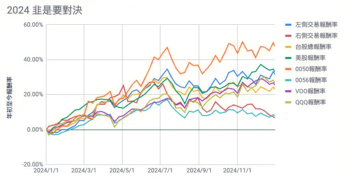

+++
title = "2024 年度回顧：漂浮在工作之海"
date = 2024-12-31
description = "2024 年度回顧，探索自我與職涯的界限。從裸辭到自由接案，尋找意義與價值，並投入 AI 領域，成為有彈性的隨需服務者。"

[taxonomies]
categories = [ "年度回顧",]
tags = []

+++

2023 年 3 月從上一份工作裸辭，給了自己一年的時間去探尋自我。

除了短暫圓了自己想 [在國外生活的夢](@/blog/2023-wimbledon-language-school/index.md) 外，多半的時間都處在迷茫人生意義，以及試圖從學習發掘意義的途中。

就這樣也到了自己設下的期限，說來諷刺，今年雖然沒有工作很多，但回顧今年時，卻發現用工作這個主題來回顧今年，似乎是最適合的。

> 我們在這個月的 Podcast 節目「[布米所以](https://solink.soundon.fm/episode/24912b79-2987-4935-9600-6fd4a0e2499e)」中也做了 2024 年的回顧，喜歡用聽的方式聽這些內容也可以聽看看。

# 工作只為了賺錢嗎？

2023 年 8 月從英國回來後，把大部分時間投入學習，一方面研究投資，一方面學習區塊鏈相關的技術，試圖為自己的下一份工作尋找一些新的可能性。

3 月到了自己設的期限，應該去找工作時卻很掙扎。

> 「我現在可以自由掌握自己的時間、學習想學的東西，一份奪走我一週 40 小時的全職工作，到底能提供我什麼價值？」

在探尋自我的這一年，思考了很多意義上的問題，發現世俗框架下定義的美好與成功，不一定對每個人都有同等的意義。對我自己而言，能在生活中得到平靜，好好花時間在自己在意的人事物上就很足夠了。

倘若工作只為了賺錢，一年應該要賺到一定份量的錢，假若有能力一年賺到超額的錢，是否應該用多餘的錢買回時間？*（這幾天剛好也看到網友推薦《[把時間買回來](https://www.books.com.tw/products/0010999721)》這本書，應該之後也會拜讀一下。）*

# 決定投入更多時間在 AI 上

還在掙扎職涯的下一步時，機會就找上門了。有前同事開了公司，有一些案子需要外包協助，而自由接案者形式也是我一直想嘗試的選項。

與專業的前同事合作很愉快，有明確的目標、按工作時數計費、工作時間自由，這場及時雨也讓我好像不需要那麼急著找全職工作。但美好的自由度伴隨著不確定性，案源不穩定，大概合作一個多月結案後又暫時回到待業的狀態。

但這短期工作的錢加上 2024 上半年強烈的牛市，好像讓我的生活多了一些餘裕，再度回到自學的節奏，線上上了 Y Combinator 的 Startup School，教了蠻多創業的細節，不過當中影響我最大的是要反思「什麼是你感興趣的領域或產品？什麼是你能力的強項？」持續投入時間在這些地方，讓自己走到技術或領域的前沿，你就更容易看到機會。這也與我今年年中讀 Cal Newport 的《深度工作力（Deep Work）》相互呼應。

除了上課外，也嘗試參與社群激發一些想法，今年也參加了 g0v 和 DevOpsDays 的活動。但要從社群活動中找到能投入的事也蠻看機緣的，但知道大家在意什麼、在做什麼不同的事，可以從與大家的相對位置發現自己的定位，但短暫幾次的社群活動並沒有讓我找到能投入的想法。

但相對清晰的想法是發現自己的技能相對適合大型應用，是適合大公司的形狀，但做一些快速驗證的應用就沒什麼優勢，另外也覺得如果能增強對中文的處理能讓自己更有機會做一些可以幫助社會的應用，於是花了點時間研究自然語言處理（Natural Language Processing），但研究了一陣子就發現這幾年的研究都轉向了大語言模型（Large Language Models），最後就決定想投入更多心力在 AI 相關的應用上。

# 成為有彈性的隨需服務（On-Demand Service）

在因緣際會下，女友公司的老闆剛好在 AI 領域做新創，缺少後端的工程師，就用自己的開發經驗換取機會，理解更多商業上對 AI 的需求。

但團隊蠻小的，除了後端開發外，也包了部署和雲端的開發，這樣的人力限制也大幅增加與 AI 的合作，除了直接的產生程式碼外，在技術的探索與選型、快速製作原型上也很有幫助。唯一的負面大概是能探索的可能性太多，如果沒掌控好，大量的資訊會讓人蠻有壓力的。要好好控制每次專注的問題範圍，盡量讓自己充滿彈性，快速迭代修正，是在 AI 時代能夠更穩健前進的重點。

2024 特別的點可能算沒有找到一個「穩定」的工作，而讓自己成為了一種「隨需服務」，或許對長期職涯不一定是好的分岔，但誰知道呢？希望自己能變成一個有彈性、能在不確定中好好生存的人，至少暫時還想再試一下。

# 分項展望

最後還是借 NESS LABS 的《[Year in Review](https://nesslabs.com/year-in-review)》做分項的展望。

## Health & Fitness

希望明年能好好調養身體、保持清晰的頭腦、好好覺察自己身體和心理的狀態、保持健康。

## Work & Business

希望能夠在不確定性中維持好的狀態，多花時間做對自己重要的事，跟 AI 一起探索自己能力的邊界。

## Friends & Community

不一定要建立關係，但要好好真誠待人，結交值得的人。

## Personal Life & Family

多花時間在家人身上，做一些中長期生活的規劃。

## Learning & Knowledge

今年雖然有 [完成自己的閱讀目標](@/blog/2024-reading-summary/index.md)，不過明顯下半年沒有好好堅持閱讀習慣，希望明年能好好找回閱讀的節奏，能閱讀 18 本書。

希望增加深度投入的時間，把《[準備與過度準備](@/wisdom/articles/overpreparation/index.md)》中學到的「現在做的事是否能促成行動？」隨時掛在心上。

## Travel & Culture

對外語堅持維持最低的學習狀態，在國外旅遊時能好好交流、體驗文化。

## Hobbies & Creativity

保留探索的時間做創意的發揮。持續投入在能帶給自己開心的活動上，但不要過度沈迷。

## Emotional & Spirituality

希望能克服心理的恐懼，好好迎接生命的挑戰。

## Money & Finances

希望維持現在每週記錄損益的習慣，並且持續增加投資相關的知識。

## Proudest Accomplishments

今年最大的成就或許是讓自己的職涯走一條相對非正統的路線，也有蠻多非預期的變動，但發現自己在不穩定的狀態中，反而能不畏懼損失。希望自己接下來也能好好地持續探索。

## Biggest Challenges

最困難的或許是這樣的狀態並不符合社會的期待，在這樣的探索中，也希望自己能越來越穩健，不要讓周圍的人擔心。

## Goals for Next Year

總結 2025 年對自己的期望：
- 保持身心健康，持續覺察自我的狀態。
- 建立能支持自己的系統，在狀態不好時能重拾動力。
- 幫自己設定一些短期實驗，挑戰困難的事。
- 與 AI 一起探索自己能力的邊界。
