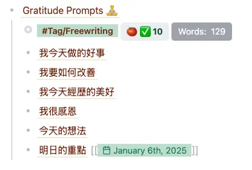

+++
title = "參與 Ali Abdaal 舉辦的 2025 Productivity Spark 心得筆記"
date = 2025-01-08
description = "參加 Ali Abdaal 的 2025 Productivity Spark，探索如何透過 Vision + Action 實現個人生產力目標，運用模板與提示詞建立長期系統，提升效率與專注！"

[taxonomies]
categories = [ "心得",]
tags = [ "productivity", "system",]

+++

# 前言

今年對自己其中一個的期望是「**建立能支持自己的系統，在狀態不好時能重拾動力。**」

在相對自由的工作狀態中，如何能常保動力是一個蠻困難的問題，而我的假設是「**若我能建立一個系統、一個流程，就能在不需要那麼多意志力下，也能維持一定的表現。**」

建立一個好的系統能夠帶來長期的優勢，於是趁著新年一開始比較有動力的時候，把它當作今年的第一個目標。

# 我現有的系統

我其實一直都蠻喜歡生產力、知識流、工作流等等的主題，也熟知反思的重要性。

除了在知識管理上曾經梳理過自己的 [個人知識管理系統](@/blog/2023-personal-knowledge-management/index.md) 外，在其他方面也有建立一些小習慣，例如：

- 會在每週的開始執行「每週計劃」的模板，觀看未來一週的行事曆，梳理這週要完成的事。
- 會在每天晚上執行「每日反思」的模板，寫下今天值得記錄的事情、心得或情緒。
- 會在每週的結束回顧這週每日的反思，記錄這週的時間運用。

雖然這些習慣能幫我留下很多記錄，讓我未來可以查閱，例如在年度回顧時，能拾回很多美好的回憶片段，但這些習慣並沒有讓我能真正達成什麼中長期的目標，使用的模板也往往是某個時間點拼湊出來的版本，不一定每個設定好的提示詞都還有其價值。

例如在我的「每日反思」模板，一開始是參考感恩日記的路線，回想一整天的好事、可以改善的方向、經歷的美好以及要感恩的對象。但後來接觸到「[自由書寫](@/reading-notes/accidental-genius/index.md)」的概念，覺得自己應該要進行更多的自由書寫。最後發現自己只會寫自由書寫的欄位，但也沒有讓模板更新去符合最新的狀態。

所以，我看似有一個系統，但沒有與我真正契合，沒有真正解決我生活上的問題。

# 2025 Productivity Spark

之前偶爾也會看 [Ali Abdaal](https://www.youtube.com/@aliabdaal) 的影片。但今年年初定下要建立系統的目標後，發現他的影片非常符合我想解決的問題，也發現他將在 1/4、1/5 舉辦 2025 Productivity Spark 的線上活動，於是就報名了。

整體的活動主軸是他對於成功的公式：

> Success = Vision + Action

這裡的成功不限定於某種特定的成功，可以轉換定義成任何你想追尋的東西。今年大部分的活動主軸都在 Vision 上，因為不管能達到多高的生產力，只要方向錯誤就不是有效的生產力。

整體活動穿插了很多練習，以下分享兩個我比較喜歡的練習。

## 寫下你的喪禮祭文

雖然我們可以理解 Vision 的重要性，但要找到自己的北極星（North Star），並不是一件容易的事。與其努力在找到北極星上，不如找到一些「方向」，讓我們可以朝著這些方向前進、探索並調整。

而「寫下你的喪禮祭文」這個練習，能對於你重視的價值觀提供一些方向。

> 想像你健康地活到了 100 歲，在各種方面都達到你想達到的成就，安詳在 100 歲的時候辭世。你最親密的家人、親友、同事們都來參加你的喪禮，他們會怎麼描述你的一生？
>
> 提示詞：
> - （你）是一個 ... 的人
> - 他畢生致力於 ...
> - 那些與他最親密的人都會記得他是 ...
> - 在他的專業領域上，他 ...
> - 他的付出對於 ... 有著深遠的影響，因為 ...
> - 他總是讓周圍的人得到啟發，因為 ...
> - 他的人生故事可以告訴我們 ...
> - 如果他今天還健在，他會提醒我們 ...

雖然是個有點奇怪的練習，但透過提示詞的輔助，想像從他人的觀點來看你的一生，會寫下蠻多對自己重要的價值觀，因為你希望別人是這樣理解你的。

建議可以空出一段獨處時間，放一些輕音樂，讓自己靜下心做這個練習。

## 季度任務（Quarterly Quests）

季度任務的概念是「人們往往會在年初時許下一年的願望，但一年很長，很容易有藉口延後這些我們想要做的事。」而一個季度，90 天，是一個相對合適的時間長度，可以完成一定品質的任務，又不會因為時間太長而無法聚焦。

Ali Abdaal 建議可以在生活和工作上各設定一個主要任務，搭配少數幾個次要任務。

在主要任務上，可以利用以下的提示詞讓自己對於這個任務的選擇更加堅定：

> 我的（生活／工作）的主要任務是 ...
>
> 這是對我來說這一季最重要的事，因為 ...
>
> 為了能完成這個任務，我承諾在這一季結束之前，我會完成 ... （客觀可衡量的成果）
>
> 我對這個任務感到興奮和有吸引力，因為 ...
>
> 為了確保我能達成這個任務，我將會 ...

給個範例：

> 我的生活主要任務是要多閱讀。
>
> 這是對我來說這一季最重要的事情，因為我所知道的成功人士們都有閱讀的習慣。
>
> 為了能完成這個任務，我承諾在這一季結束之前，我會完成 5 本書的閱讀。
>
> 我對這個任務感到興奮和有吸引力，因為我知道閱讀能增長我的視野，並且能讓我更了解自己。
>
> 為了確保我能達成這個任務，我將會每天閱讀 30 分鐘，並且在每本書閱讀到一半時，我就會決定下一本書要讀什麼。

我覺得季度任務很好的地方是，可以從很多目標裡去挑選一個目前對自己來說最重要的，而且寫下這些提示詞，也會更清楚為什麼自己想要做這件事，如果沒辦法清楚完成這些提示詞，也是一個很好的思考點，去重新思考自己真正想要的是什麼。

# 結語

以前從沒覺得**模板**跟**提示詞**的重要性有這麼高，但在這幾次練習有深深感受到它們所帶來的好處。

透過設定好的**模板**，可以讓我們重複地、快速地利用它減少很多不必要的思考，專注於執行。但對於模板的更新也要抱有長期的心態，當使用模板產生疑慮時，就應該排定時間去重構它，讓它保持對我們最有幫助的狀態。

而**提示詞**能讓我們縮減需要思考的範圍，促進輸出，或強迫我們從不同角度去思考，也是很強的工具。

而最近看了 Ali Abdaal 的 6 Habits to Make 2025 Your Best Year Yet 也覺得蠻喜歡的，可以跟季度任務搭配使用。

{{ youtube(id="W2afI0n8pUk") }}

在每週計劃時回顧季度任務的狀態來定焦這週的目標，而在每日的早晨流程中再利用回顧這週目標的狀態來定焦這天的目標，是相當強悍的組合，也是我目前在測試的系統。有興趣的話也可以試試看，也歡迎私訊與我交流。
