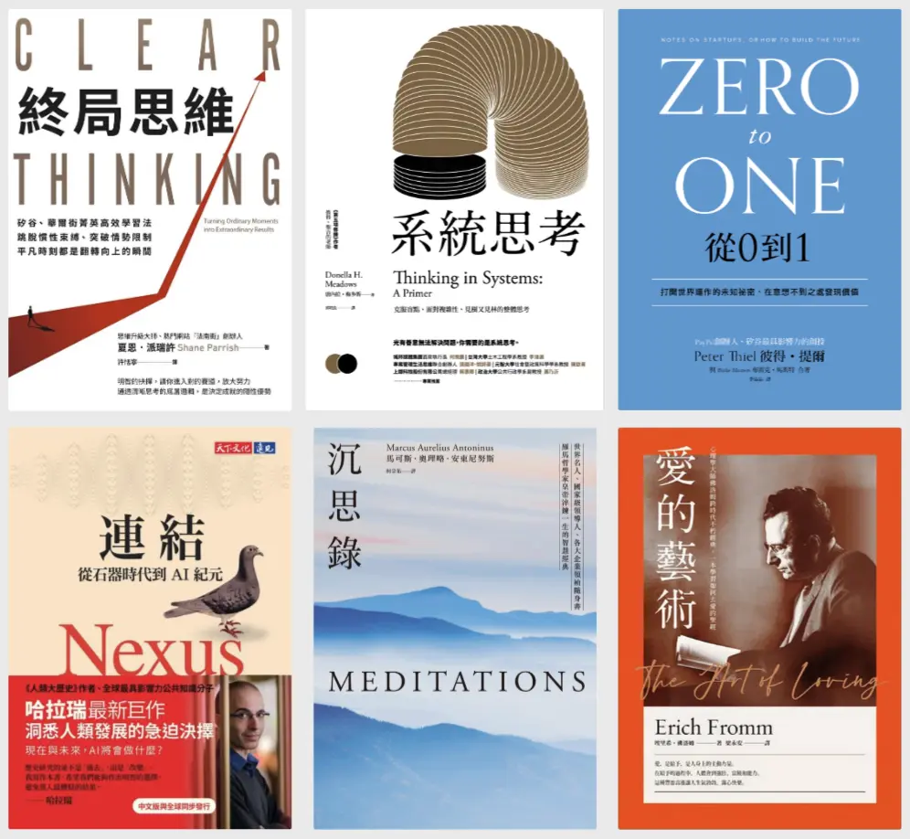

+++
title = "2025 閱讀總回顧"
date = 2025-12-31
description = "探索《連結》、《系統思考》等書籍對於 2025 年的閱讀啟示，了解從 AI 速食知識中維持深度閱讀的挑戰。"

[taxonomies]
categories = [ "年度回顧",]
tags = []

[extra]
image = "books.webp"

+++

# 閱讀目標

今年大概是從 2021 開始有穩定的讀書習慣後，閱讀最少的一年。

年初幫自己設定今年要閱讀 18 本書，結果最後只看完了 6 本，似乎延續 [在前一年九月就開始的閱讀停滯](@/blog/2024-reading-summary/index.md)。

如果要內省來找個原因的話，覺得是自己在閱讀上有一些心態上的轉變：
1. 自己算是偏向隨機閱讀，但主軸或許還是與追求生產力、效率、學習等等有關的書。在閱讀到一定的量之後，在相似領域的書開始讀到越多重複或類似的概念，有種**閱讀邊際效益降低**的感覺。
2. 用 AI 做知識的初步探索的成本太低了：當為了某個主題利用 AI 做探索，達到大概 60 到 70 分的了解所需要的時間降低了很多，有種**知識速食化**的感覺。而這樣速食化的知識取得使**求知的需求**快速被滿足，讓需要花費較多時間來閱讀書籍成為一件更有**摩擦力**的事。

不過回頭來說，即使今年閱讀的時間少了很多，但在閱讀時獲得新知或想法時還是蠻快樂的。

# 2025 書單

簡單回顧今年閱讀的書籍以及從中學到最重要的一件事：

* 《**終局思維（Clear Thinking）**》：人有很多因為基因或社會性帶來的預設潛意識反應，可以細分為情緒、自尊、社會、慣性等不同來源。必須培養讓自己能跳脫這些預設值的機制，為自己重要的決策做出更好的決定。
* 《**系統思考（Thinking in Systems）**》：講述一套用**系統動力學**來解析一個系統運作的方式，包含當中的結構關係與行為之間的交互影響等等。雖然需要透過刻意的練習來熟練這種思考方式，不是輕易就能上手，但覺得在一些複雜問題上可以當作一個特別的視角來思考。
* 《**從 0 到 1（Zero to One）**》：要創造一個成功的事業體要考慮很多面向，如技術、時機、市場、人員、銷售、護城河、秘密等等。當想要開啟一個事業是不錯的墊腳石。
* 《**連結（Nexus）**》：是繼《[人類大歷史](@/reading-notes/sapiens/index.md)》、《[人類大命運](@/reading-notes/homo-deus/index.md)》後，又再一次拜讀作者哈拉瑞（Harari）的書，蠻喜歡這本書用**網路**的框架來解釋社會的運作，再用一樣的框架來討論當 AI 出現後的時代會對人類文明造成什麼樣的危機。覺得在 AI 越來越成熟的現今，是很值得看的一本書。
* 《**沉思錄（Meditations）**》：是古羅馬帝國皇帝馬可奧理略寫給自己的話，即使在距今將近 1900 年的時間跨度下，當時思考的哲學問題到今日還是相當實用，也想要努力追尋書中提到**依本性而活**的道理。
* 《**愛的藝術（The Art in Loving）**》：「愛」這件事如果要很認真討論大概就會是這本書的樣子吧。回頭談到愛的來源是出自於對「**合一**」的渴望。偏偏每個人卻又是獨立的個體，再怎樣向外求愛，到頭來都是對自己的自戀。需要先回到自身解決母愛與父愛的議題，才能真正去愛人，甚至達到更高的普世愛。

今年最喜歡的是《連結》和《系統思考》。哈拉瑞的書雖然都超厚一本，但隨著他的編排閱讀，總是能信服於他對世界的框架；系統思考雖然偏硬，但總覺得認真拿來使用會是個很棒的方法論，有時間應該會想多投入一些時間弄得更清楚一點。

覺得明年或許不會訂太高的閱讀數量，但希望可以把這些知識整理地更好，能在生活中實踐更多。

# 更多閱讀總回顧
* [2021 閱讀總回顧](@/blog/2021-reading-summary/index.md)
* [2022 閱讀總回顧](@/blog/2022-reading-summary/index.md)
* [2023 閱讀總回顧](@/blog/2023-reading-summary/index.md)
* [2024 閱讀總回顧](@/blog/2024-reading-summary/index.md)
