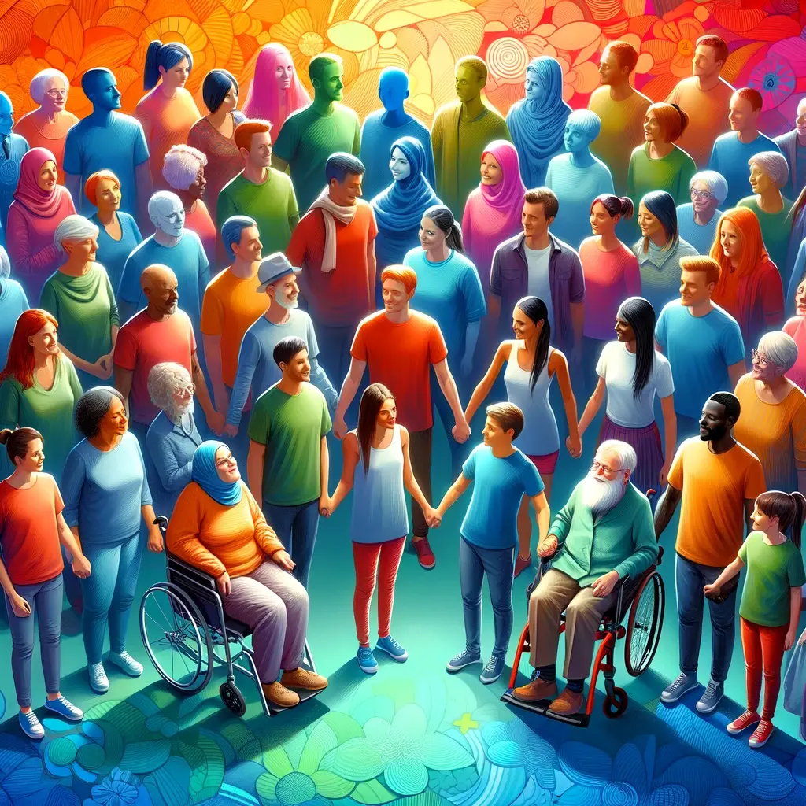

+++
title = "接受每個人的獨特，包括自己的"
date = 2024-01-26
description = "每個人都有獨特之處，探索自身與他人的獨特性，接受不同並促進多元合作，這是人類真正的價值所在。讀取更多，了解如何發現和接納每個人的獨特性。"

[taxonomies]
categories = [ "想法",]
tags = []

[extra]
image = "accept-peoples-uniqueness.webp"

+++

# 我們不一樣

每個人天生從基因開始就有多樣性，之後也會隨著家庭教養、成長環境的不同產生每個人獨特的生命歷程。如果沒有好好仔細思考自己的獨特，就容易陷入傳統價值與主流價值的綑綁裡，選擇不適合自己的道路；如果沒有好好理解每個人都有自己的獨特性，我們會用自己喜歡被對待的方式對待他人，我們會用自己思考的方式推論別人的意圖，而這往往會產生誤解與衝突。

> 每個人都與眾不同，與眾相同是一種幻覺。
>
> —— 唐鳳

<!-- more -->

# 如何探究自己與他人的獨特性？

坊間其實有很多人格特質之類的測驗，如 [大家熟知的十六型人格 MBTI](https://www.16personalities.com/tw/%E6%80%A7%E6%A0%BC%E6%B8%AC%E8%A9%A6)，在 [原則](@/reading-notes/principles/index.md) 一書裡也有提到在工作場域上也有蠻多分析工具，像是 [Workplace Personality Inventory](https://alison.com/psychometric-test/personality) 和 [Team Dimensions Profile](https://internalchange.com/order-profiles-training-materials/non-disc-products/team-dimensions-profile/)。透過這些方式，我們可以粗略地對人格特質與傾向做簡單的分類，什麼類型的人適合做什麼樣的事，不同類型的人該如何合作與相處，可以當作人際交流的基礎考量。

在個人探索上，我覺得透過日記寫作可以獲得更多。記錄日常的經歷、在過程中有哪些情緒和感覺，可以很有效地探索內在自我的訊息。想要獲得更多數據的話，甚至可以嘗試執行戰地筆記（Field Notes），在生活或工作活動結束的片刻，保留一點時間記錄這段時間做了什麼、心情的變化、以及下一段時間的計畫，搭配 [番茄鐘](https://zh.wikipedia.org/zh-tw/%E7%95%AA%E8%8C%84%E5%B7%A5%E4%BD%9C%E6%B3%95) 在休息的時間做這件事也很合適。

# 在理解每個人都有各自的獨特性之後

在理解自己與他人都有各自的獨特性之後，我們要接受當中的不同。

## 由於每個人的不同，對他人有效的原則或方法不一定適合我，我的也不一定適合他人。

我們可以參考他人的方法，實驗並調整成適合自己的樣式。同時也要理解強迫他人實行自己的方法並不合理，更應該用分享、討論的形式，以善意的方式來交流。

> 如果我們誤認為每個人都是自身的反映，就看不到事物的本然。
>
> —— 《[僧人心態 Think Like a Monk](@/reading-notes/think-like-a-monk/index.md)》

## 由於每個人的不同，多元與合作更能展現人類的價值。

一個偉大的作品，需要在多個面向細緻雕琢。獨特性也代表了個人的局限性。在想法上，擁抱多元可以讓不同的想法碰撞，產生更好的想法、集結成更完整的智慧；在能力上，每個人都有不同的優勢與劣勢，知道哪裡是自己的優勢，加以發揮；而透過委派和合作關係降低弱項帶來的影響，創造雙贏。讓每個人在最適合自己的位子展現自己的獨特優勢，是我對人類群體合作最美好的夢想。

