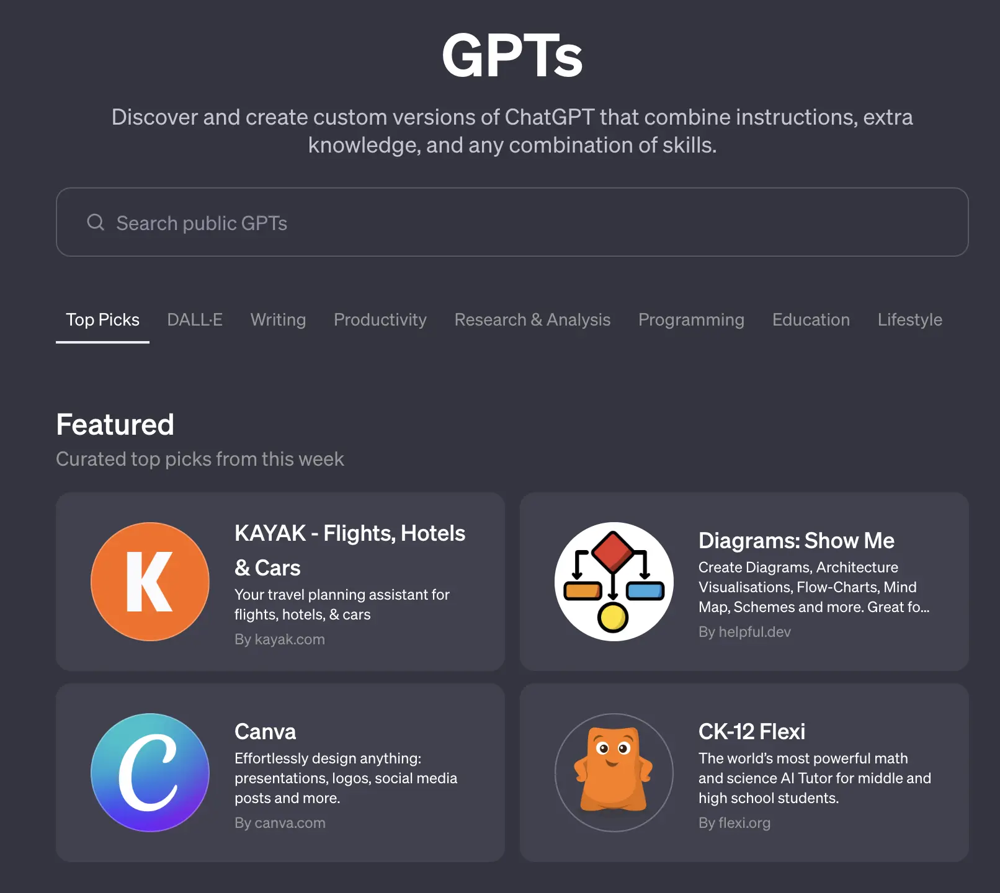
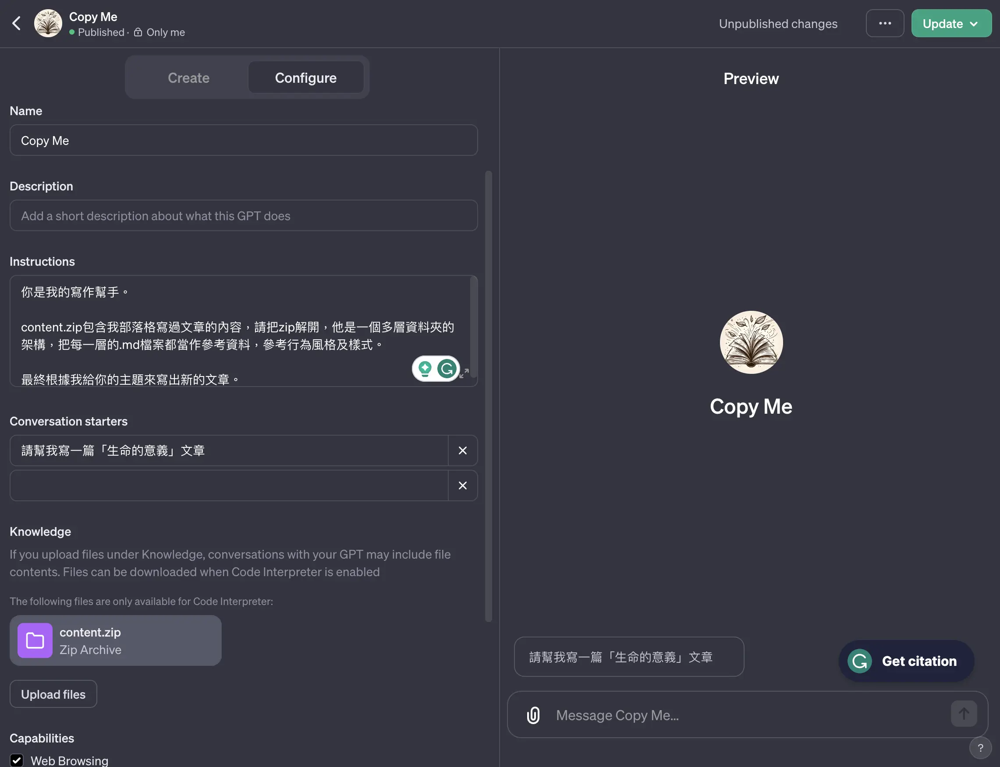
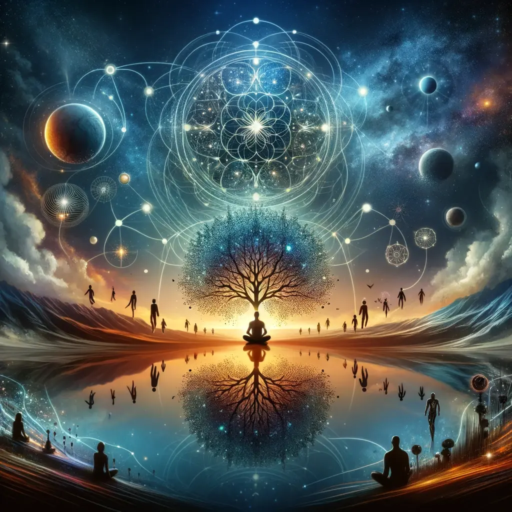

+++
title = "【實驗】ChatGPT 在讀完我所有的文章後，仿造我風格寫出來的「人生的意義」"
date = 2024-01-24

[taxonomies]
categories = []
tags = []

[extra]
image = "meaning-of-life.webp"
+++

# 重新訂閱了 ChatGPT Plus
最近在思考「在 AI 時代下，人應該要如何因應這些變化？」以過去一年的趨勢看來，AI 相關技術的發展及運用，只會不斷地精進、往更好用更便宜的方向前進。既然是一個無法阻擋的趨勢，最佳因應的方式就是要更大力的擁抱它，讓自己成為一個被 AI 賦能的人。

之前就有聽說 GPTs 的功能，但後來沒訂閱就還沒嘗試。甚至最近也出了 [GPT Store](https://openai.com/blog/introducing-the-gpt-store)，可以找到別人製作的 GPT，OpenAI 也提及後續還會有盈利的模式。

GPT Store

在 GPTs 裡，你可以產生自己的 GPT，除了可以設定指令外，也可以上傳額外的檔案當作參考資料，有點像是固定檔案的 RAG (Retrieval Augmented Generation) 實現。也有提供可以額外裝上的能力，像是瀏覽網頁找資料、用 [DALL·E](https://openai.com/dall-e-3) 產生圖片以及用 Code Interpreter 去撰寫 Python 執行程式的操作。甚至也有自定義 Actions 的功能可以讓你呼叫自己寫好的 API 做額外的行為。

GPTs 創建示意圖

這次做了簡單的實驗，上傳這個部落格所有的文章，壓成一個 zip 檔，讓 GPT 去解開、閱讀每一篇文章，參考風格去產生我所定義題目的草稿，沒有做太細節的調整。

以下是 GPT 產生的文章，附帶一個文章的意象圖：

# 生命的意義 - Exploring the Depths of Existence

在我們這個快速變化的世界中，「生命的意義」這個問題常常在我們心中迴盪。這個話題在我的讀書筆記和博客文章中屢次出現，每一次都帶來新的啟示和深刻的思考。

首先，從個人的角度來看，生命的意義在於發現自我和實現個人潛能。我在《[Building a Second Brain](@/reading-notes/building-a-second-brain/index.md)》和《[Atomic Habits](@/reading-notes/atomic-habits/index.md)》的讀書筆記中提到過，個人成長和習慣的建立是實現自我價值的關鍵。當我們學會了如何有效地利用我們的大腦和時間，我們就開始了解自己的真正潛力和目標。

另外，與他人的關係也是生命意義的一大部分。在《[How to Win Friends and Influence People](@/reading-notes/how-to-win-friends-and-influence-people/index.md)》和《[The Culture Map](@/reading-notes/the-culture-map/index.md)》的讀書筆記中，我探討了人際關係的重要性以及如何在多元文化的環境中與他人建立聯繫。這不僅僅是關於友誼和愛情，更是關於如何在這個緊密聯繫的世界中找到我們的位置。

當然，我們還不能忽視精神和心靈的探索。在《[The Book of Joy](@/reading-notes/the-book-of-joy/index.md)》和《[The Little Book of Stoicism](@/reading-notes/the-little-book-of-stoicism/index.md)》的讀書筆記中，我被提醒到，尋找內在的平靜和智慧是尋找生命意義的重要部分。學習如何處理困難情況，並從中找到喜悅和寧靜，是我們所有人共同的旅程。

最後，對於更廣闊的世界和環境的認知，也是我們探尋生命意義的一環。如《[Sapiens](@/reading-notes/sapiens/index.md)》和《[Factfulness](@/reading-notes/factfulness/index.md)》中所提到的，理解人類的歷史和我們的未來走向，可以幫助我們更好地理解我們在這個宇宙中的位置。

總而言之，生命的意義不是一個簡單的問題，它需要我們從多個角度去思考和探索。無論是通過個人成長、人際關係、精神探索，還是對人類歷史的理解，我們都在這個不斷變化的世界中尋找屬於自己的答案。

# 後記

哈！對我來說很有趣！我的確喜歡引用到自己過去所學的內容，但 GPT 一口氣加了很多🤣。

在 AI 越來越成熟之後，擁有更多個人的資訊也是朝向個人化重要的一步，很期待科技後續的發展。今天在研究是否要利用 Vector Database 嘗試看看做長期記憶的實現時，也發現 [ChatGPT 好像也在做長期記憶的 A/B Test](https://www.reddit.com/r/singularity/comments/192xyp9/gpt_has_long_term_memory_now/) 了，看來個人化的 AI 助理指日可待了！

不知道大家對於生成的文章有什麼想法呢？對於即將來臨的 AI 時代，你感到興奮比較多還是害怕比較多呢？歡迎留言告訴我你的想法！
