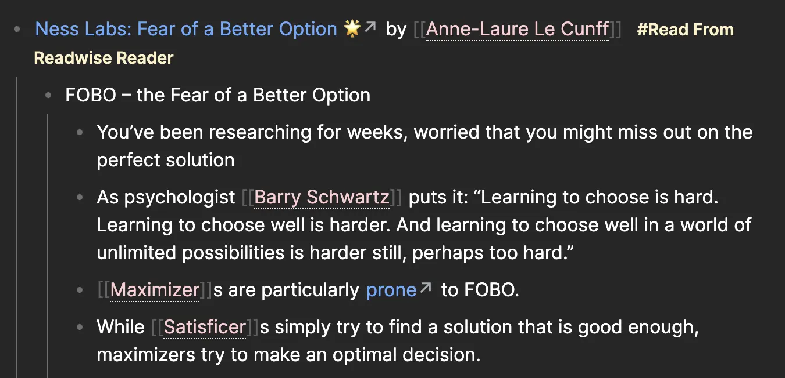
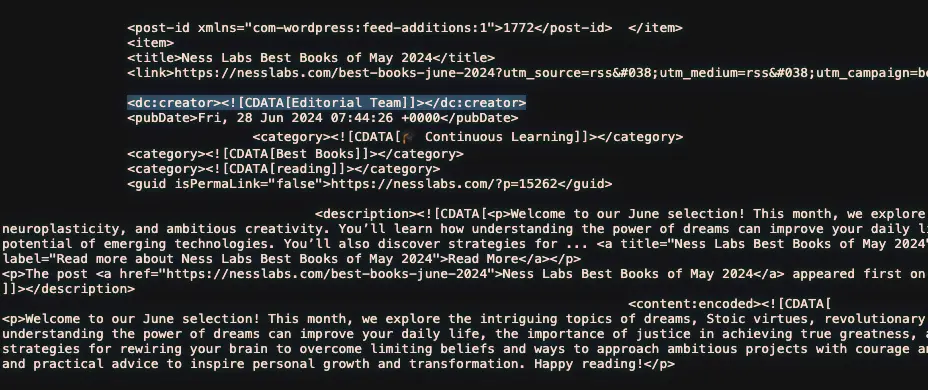
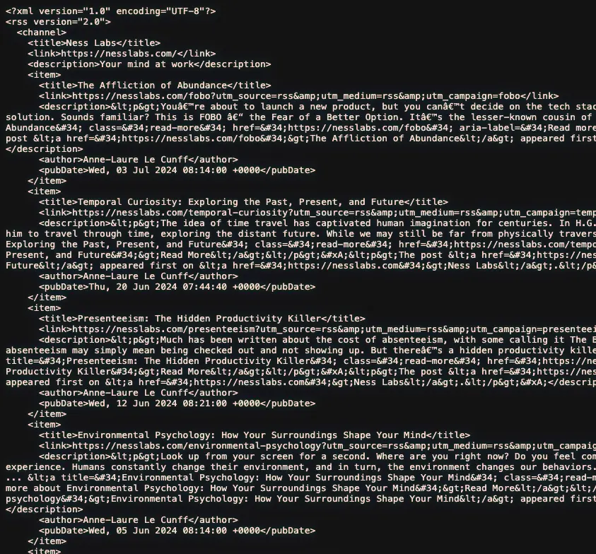

+++
title = "與 Claude 3.5 Sonnet 協作一小時內完成開發並部署 RSS Filter 到 Netlify Functions 上"
date = 2024-07-09

[taxonomies]
categories = ["經驗分享"]
tags = ["ai", "netlify", "rss"]
+++

[Anthropic 在 6/20 發表了 Claude 最新的版本 3.5 Sonnet](https://www.anthropic.com/news/claude-3-5-sonnet)，並發表了 Artifacts 功能，多了一個側邊欄可以觀看程式碼或跑出來的結果。

{{ youtube(id="rHqk0ZGb6qo") }}

最近在社群媒體上也看到蠻多人的嘗試，最常見就是快速開發抽獎程式或是決定午餐吃什麼的網頁轉盤。

# 動機

我目前把習慣將網路上想看的文章和感興趣的電子報都存到 [Readwise Reader](https://readwise.io/read) 裡收藏，在適合的時候閱讀。閱讀時用內建的功能劃重點，最後用設定好符合 Roam Research 格式的 export template 把重點筆記複製到 [Roam Research](@/blog/roam-research/index.md) 做整理。

```
[{{ title }}]({{ url }}) by {{ author }} #[[Read From Readwise Reader]]

 - {{ highlight.content }}

```
<p class="image-caption">我的 Roam Research export template</p>

最後會類似像下圖，保留了文章的網址、作者等等的資訊。



在這樣子的流程裡，比較麻煩的是電子報的訂閱，最後會留下像"*mailto:reader-forwarded-email/c6abf78da7706aaa6d68caf8f87528bb*"沒有辦法分享的網址。

所以最近只要遇到電子報的內容也有提供 [RSS Feed](https://zh.wikipedia.org/zh-tw/RSS) 選項的話，就會優先用 RSS 訂閱。

中間遇到的問題是，我很喜歡 [Ness Labs](https://nesslabs.com/) 裡 Anne-Laure Le Cunff 的電子報，有很多跟科學、心理健康及生產力相關的好文章。但如果查看網站的 [RSS Feed](https://nesslabs.com/feed)，會發現除了想看的電子報文章外，還會有來自同網站不同編輯者發表的內容，但我沒有這麼感興趣。


<p class="image-caption">Ness Labs 的 RSS Feed 截圖</p>

網路上可以找到蠻多提供 [RSS Filter 功能的網站](https://filterrss.ssig33.com/)，也有蠻多是開源的。但如果直接使用別人的網站，怕如果網站壞掉或關閉自己會不知道，導致 RSS 訂閱中斷。後來試圖直接複製開源專案，在與 Claude 3.5 Sonnet 一起研究分析開源專案時，忽然覺得如果我直接和 AI 討論需求及實作會不會更快，甚至我也可以從 AI 提供的選項中，選擇我相對熟悉的語言或平台。

最後在討論下，覺得我的使用情境只需要一個 API 用 Query Parameters 提供過濾的條件，產生過濾後的 RSS Feed 就符合我的使用情境。最後選擇了 [Netlify Functions](https://docs.netlify.com/functions/lambda-compatibility/?fn-language=go) 和 Golang 當作平台及語言的選項，大概兩三次來回就把可以部署的程式碼都生出來了。中間只有針對在部署時，用到過新平台還沒支援的 Golang 版本做退版就解決了問題。

整個流程大概一個小時就完成了，不需要閱讀文件，不需要複習語法，跟 AI 協作真的能大量降低初期的摩擦力，可以快速做個 PoC 發揮創意。當然更大型專案或需要效能優化或架構優化的情境，還是需要更多的專業介入。

最後的成果如下：[做了一個 API 可以用 RSS 的欄位做過濾條件](https://functions.mickzh.com/api/rss-filter?url=https://nesslabs.com/feed&author=Anne-Laure%20Le%20Cunff)，可以直接把網址放進 Readwise Reader。


<p class="image-caption">結果截圖</p>

整體協作的感覺很好，跟寫作一樣，應該要有更多嘗試。
