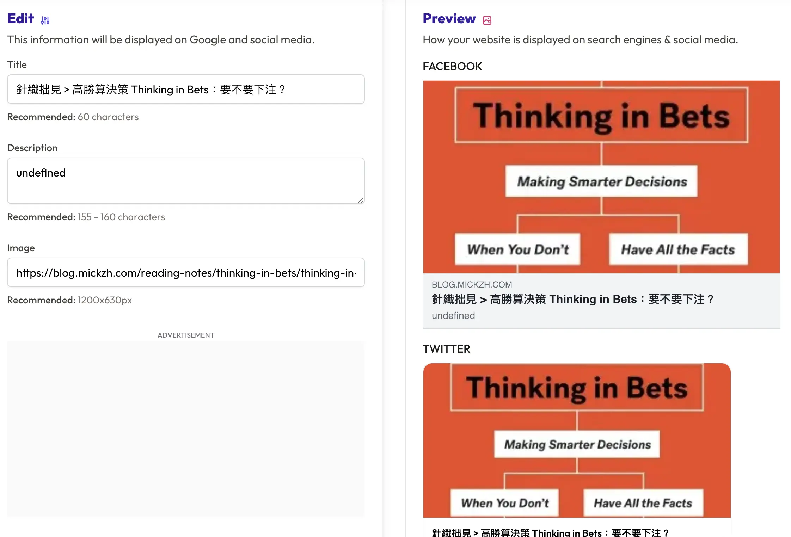

+++
title = "修正 Twitter Card 沒有顯示的問題"
date = 2023-05-21
description = "解決 Twitter Card 無法顯示問題，加入必要 meta 標籤讓分享卡片更美觀。了解 Open Graph 的作用，並運用多種工具除錯。"

[taxonomies]
categories = [ "網站開發記錄",]
tags = [ "zola", "twitter", "web",]

+++

# Zola 的設定

我的 Zola 網站的初版是參考 [Owen 的博客](https://www.owenyoung.com/) 和 [Pin 起來！](https://pinchlime.com/) 建立而成的。一開始看到他們的 base.html 對我來說有點內容過載，無法很快速地把所有東西都弄懂。決定在不破壞網站的狀態下，慢慢刪除部分的內容到一個我可以理解的版本。其中刪掉的一塊就是 `<head>` 裡面的眾多的 `<meta>` 區塊。

網站建立到一個雛形的時候，唯一困擾我的問題就是在分享到 Facebook 跟 Twitter 時，圖片會不受控制選擇用左上角的 logo，而不是用文章裡面的圖片。

很快就找到可以使用 `og:image` 設定 Open Graph 的圖片，而其餘資訊像是網頁標題看起來沒有問題，所以當時就只加了 `og:image`。

# 無法顯示的 Twitter Card

一直都習慣把新寫的讀書筆記連結轉發到 Facebook 跟 Twitter 上，發送前會用 [OpenGraph](https://www.opengraph.xyz/) 預覽一下。但這個預覽網站似乎無法偵測到在 Twitter 的問題，直到貼到 Twitter 才發現並沒有產生 Twitter Card。


<p class="image-caption">Open Graph 網站顯示一切正常</p>

當下就有猜測到應該是 Open Graph 設定上的問題，前輩大大也給了「是否沒設定到 Twitter Card 的 meta」的方向。

## 解法

第一步嘗試加上 `twitter:card` 的 meta 並設定值為 `summary_large_image`，結果還是沒辦法成功顯示 Twitter Card。

接著利用 Twitter 所提供的 [Card Validator](https://cards-dev.twitter.com/validator) 做偵錯，錯誤訊息中指出找不到 `og:title` 的 meta，後來補上 `og:title` 之後就可以順利顯示 Twitter Card 了。


<p class="image-caption">成功修復啦！</p>

# Open Graph 是什麼？

抱著解決完問題應該嘗試寫一篇文章做記錄的心態，就順便研究了一下 Open Graph。

Open Graph 當年是由 Facebook 提出，主要目的是讓網頁的擁有者可以有方式控制網頁在社群網站上顯示的樣子。各個社群網站也都可以從 Open Graph 的 meta 得到所需要做呈現的資訊。

[Protocol](https://ogp.me/) 定義了以下的必要的 meta：
* og:title
* og:type
* og:image
* og:url

根據不同的 type（像是 video、music）等等，還有各自對應的其他 meta。

比較常使用到的是 `og:title`、`og:image` 跟 `og:description`，用這個組合就可以決定主要的長相（如下圖）。


<p class="image-caption">source: https://ahrefs.com/blog/open-graph-meta-tags/</p>

部分網站也有自己獨有的 open graph meta，可以用來特製單一網站的連結卡片長相。

## 圖片的小技巧
由於每個網站的呈現方式都不太一樣，像是 Facebook 也有自己的 [圖片建議](https://developers.facebook.com/docs/sharing/webmasters/images)。

主流是長寬比 1:1.9 的圖像，在網站裡可以使用 `og:image:width` 和 `og:image:height` 來預防當圖片過大時顯示的問題。


## 除錯工具
在每個社群網站上如果有非預期的狀況，可以嘗試網站提供的除錯工具。
- Facebook: [https://developers.facebook.com/tools/debug/](https://developers.facebook.com/tools/debug/)
- Twitter: [https://cards-dev.twitter.com/validator](https://cards-dev.twitter.com/validator)
- LinkedIn: [https://www.linkedin.com/post-inspector/](https://www.linkedin.com/post-inspector/)
- Pinterest: [https://developers.pinterest.com/tools/url-debugger/](https://developers.pinterest.com/tools/url-debugger/)


# 在了解更多後的更動
* 決定把定義的必要 meta 都補齊
* 如果可以的話盡可能都加上 description
* 設定在有圖片和沒圖片的時候會產生不同的策略（例如在 twitter，沒圖片的時候會用 summary 的 card 方便顯示正方形的 logo）
* 不太確定好不好，但用更多的 Tera 變數來控制 Open Graph 的設定值

附上這次學習後做的相對應的更動：
```html






















<!DOCTYPE html>
<html lang="zh-Hant" itemscope itemtype="http://schema.org/Blog">
  <head>
    <meta property="og:title" content="{{ title }}" />
    <meta property="og:description" content="{{ description }}" />
    <meta property="og:type" content="website" />
    <meta property="og:image" content="{{ sns_image }}" />
    <meta property="og:image:width" content="1200" />
    <meta property="og:image:height" content="{{ image_width }}" />
    <meta property="og:url" content="{{ current_url }}" />
    <meta name="twitter:card" content="{{ twitter_card }}" />
  ...
```
