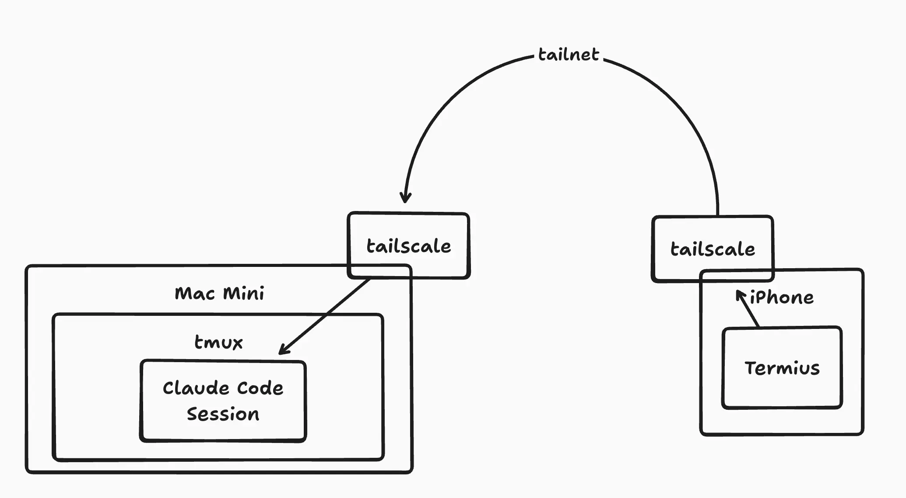
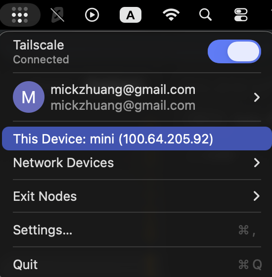

+++
title = "AI 負責寫 Code，工程師去重訓：用 Tailscale + tmux + Termius 實現健身房開發"
date = 2026-03-19
description = "用 AI 開發的比例越來越高，等 AI 跑的空檔正好能配合組間休息。紀錄用 Tailscale + tmux + Termius 在健身房用手機遠端開發的完整設定流程。"

[taxonomies]
categories = [ "經驗分享",]
tags = [ "claude-code", "tailscale", "ai-coding",]

[extra]
image = "ttt.webp"

+++

# 等 AI 的空檔，拿來重訓

最近覺得用 AI 輔助開發的比例越來越高，特別在嚴謹度需求較低的專案，不需要像以前每行程式碼都仔細審視，而是透過作更完整的設計與規劃，設定好驗證的機制，然後持續地與 AI 一次次迭代，來達到有品質的成果。

搭配最近考慮健康相關的問題，突發奇想「**在這樣需要等 AI 產出與迭代的過程，工程師如果是邊重訓、邊在組間休息時驗證及決定下一步**」似乎是一個還不錯的 Work-Health Balance 組合 😆

所以最近一兩週的一個小目標，就是想建立一個能在健身房用手機用 Claude Code 開發的工作流。

# 之前踩過的坑

## Omnara

最早有試過 [Omnara](https://omnara.com)，這是一個 YC 的新創公司，能將 Coding Agent 包裹起來，提供手機 App 讓你操控你的 Coding Agent。

但嘗試過後體驗不太順，你必須要先在電腦上用 Omnara 建立好 Claude Code Session 才能操作，而且 Claude Code 本身更新很快，Omnara 的 UI 常常沒能跟上，用起來容易有破版或缺功能的問題，一陣子後就沒在用了。

## Claude Code Remote Control

後來聽說 Claude Code 要推出 Remote Control 的功能，還蠻期待的。

但等到自己可以用之後，試了一次在健身房遠端開發。結果遇到需要允許較高權限的指令時，畫面就卡住不動，重新連線後雖然有顯示 Allow Once 的選項，但按下去也沒反應。

可能還需要等待一段時間讓穩定性更高一些。

# Tailscale + tmux + Termius

Remote Control 嘗試失敗之後，就讓我想到之前其實就有在 Threads 上看人推薦 Tailscale + tmux + Termius 三件組可以達到一樣的目的，但一直因為要安裝設定三個東西覺得很麻煩，遲遲沒有行動。

直到今天重訓前，臨時起意試著設定看看，結果花了大概十分鐘就全部搞定，覺得當初高估了它的複雜度。

後來[在 Threads 簡單分享這個組合很好用](https://www.threads.com/@vder/post/DWA_qtxk-Yo?xmt=AQF0tpDNlBkwa4R7kXGbS4XUrqWh5BS9Ytk73Qsd94vcnw)，發現很多人回覆先卡一個之後試，跟之前的我一樣，就覺得可以寫篇文章給大家一些指引，或許沒有你想像的那麼難裝。


> 不過前情提要一下，因為我是工程師，或許安裝這些東西原本就對我來說更容易一點。然後我之前在[設定龍蝦時](@/blog/openclaw-tailscale-integration/index.md)，其實就把電腦端和手機端的 Tailscale 都設定好了，所以我設定的十分鐘其實不包含 Tailscale 的部分。

## 這三個工具是什麼

### Tailscale：建立安全的私人網路

[Tailscale](https://tailscale.com/) 是一個基於 WireGuard 的 VPN 服務，可以把你的裝置組成一個私有網路（Tailnet）。只要裝置都在同一個 Tailnet 裡，就可以用固定的私有 IP 互相連線，不需要設定防火牆、不需要暴露在公開網路上。

免費方案支援最多 100 個裝置，個人使用完全夠用。

### tmux：讓 Session 在背景持續運行

[tmux](https://github.com/tmux/tmux) 是 Terminal 的 Session 管理工具。它讓你可以把 Terminal 工作階段跑在背景，就算 SSH 連線斷了，遠端的 Claude Code 依然繼續執行，下次連回來只需要 `tmux attach` 就能接回原本的狀態。

### Termius：手機上的 SSH Client

[Termius](https://termius.com/) 是手機上的 Terminal 應用程式，支援 iOS 和 Android，介面設計對觸控蠻友好的，也支援儲存 SSH 連線設定，不用每次都手動輸入 IP 和帳號密碼。

三個工具加在一起：Tailscale 負責讓手機找得到電腦、tmux 讓 Claude Code 在背景持續跑、Termius 讓手機能操作 Terminal，就是完整三件組的能力。


<p class="image-caption">簡易示意圖</p>

# 設定步驟

> 我的裝置是用 iPhone 去連結 Mac Mini 上的 Claude Code，如果裝置不同可能會有一些差異。

## 電腦端（Mac Mini）

### 1. 安裝 Tailscale

```bash
brew install --cask tailscale
```

安裝完後開啟 Tailscale，登入帳號，確認 Mac Mini 出現在 [Tailscale Admin Console](https://login.tailscale.com/admin/machines)。

### 2. 啟用 SSH

macOS 預設沒有開 SSH，需要手動啟用：

**系統設定** → **一般** → **共享** → 開啟 **遠端登入**

確認有勾選允許你的帳號存取。

### 3. 安裝 tmux

```bash
brew install tmux
```

### 4. 設定 tmux（行動裝置優化）

安裝完後建議加一份最小設定，讓 Termius 在手機上操作更順：

```bash
# ~/.tmux.conf
set -g mouse on           # 觸控捲動與點選 pane（最重要）
set -sg escape-time 0     # 減少輸入延遲
set -g history-limit 10000  # 增加捲動記錄長度
```

其中 `mouse on` 是關鍵：沒有這行的話，在 Termius 上滑動畫面不會捲動輸出，而是會循環切換歷史指令，非常難用。

設定完後執行一次讓設定生效：

```bash
tmux source-file ~/.tmux.conf
```

### 5. 確認 Tailscale IP

可以在狀態列看到



在 Mac Mini 上執行：

```bash
tailscale ip -4
```

記下這個 IP（格式通常為 `100.x.x.x`），等一下在 Termius 設定 SSH 連線時會用到。

---

## 手機端

### 1. 安裝並設定 Tailscale

在 App Store 或 Google Play 安裝 [Tailscale](https://tailscale.com/download)，登入**同一個帳號**，確認 Mac Mini 的名稱出現在裝置列表裡。

### 2. 安裝 Termius

在 App Store 或 Google Play 安裝 [Termius](https://termius.com/)。

### 3. 在 Termius 新增 SSH Host

開啟 Termius，新增一個 Host：

- **Hostname**：填入剛才的 Tailscale IP（`100.x.x.x`）
- **Username**：Mac Mini 的使用者名稱
- **Password**：密碼，或設定 SSH Key（建議）

存好之後點進去連線，如果成功看到 Terminal 畫面就設定完成。

---

# 實際使用流程

1. 確認電腦和手機的 Tailscale 都有開啟
2. 開啟 Termius，連線到 Mac Mini
3. 執行 `tmux attach -t termius 2>/dev/null || tmux new-session -s termius` 創立或接回 session
    1. 如果 Termius 付費的話，可以直接用 Startup Snippet 做這個設定，就不用自己打指令
4. 開啟 Claude Code 或下其他指令

---

# 加碼：RealVNC（處理需要畫面的操作）

我自己是還有在手機上裝 RealVNC 來做如果需要操作電腦桌面的選項，例如 Claude Code 的 Session 過期需要重新登入。

**手機端：** 安裝 [RealVNC Viewer](https://www.realvnc.com/en/connect/download/viewer/)，輸入 Mac Mini 的 Tailscale IP 連線。會跳出連線沒有加密的警告，但在 Tailnet 的設定下沒有問題。

# 心得

設定完之後立刻就去健身房試了一下，除了 Termius 在打中文字時畫面會有點破版（但不影響輸入），整體使用下還蠻方便的。

另外有感的是要慎選要做的專案，如果需要介入操作太多就不太適合，一直久佔器材不重訓是會被討厭的喔 😆