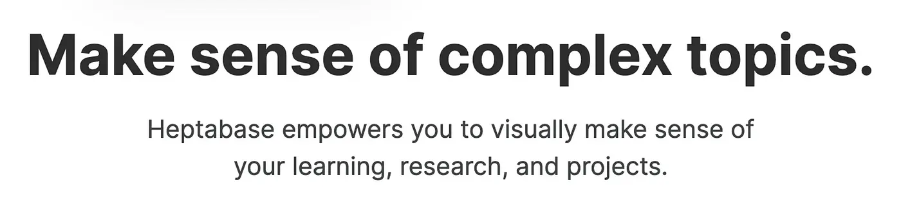
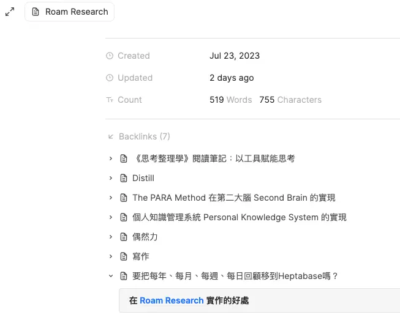
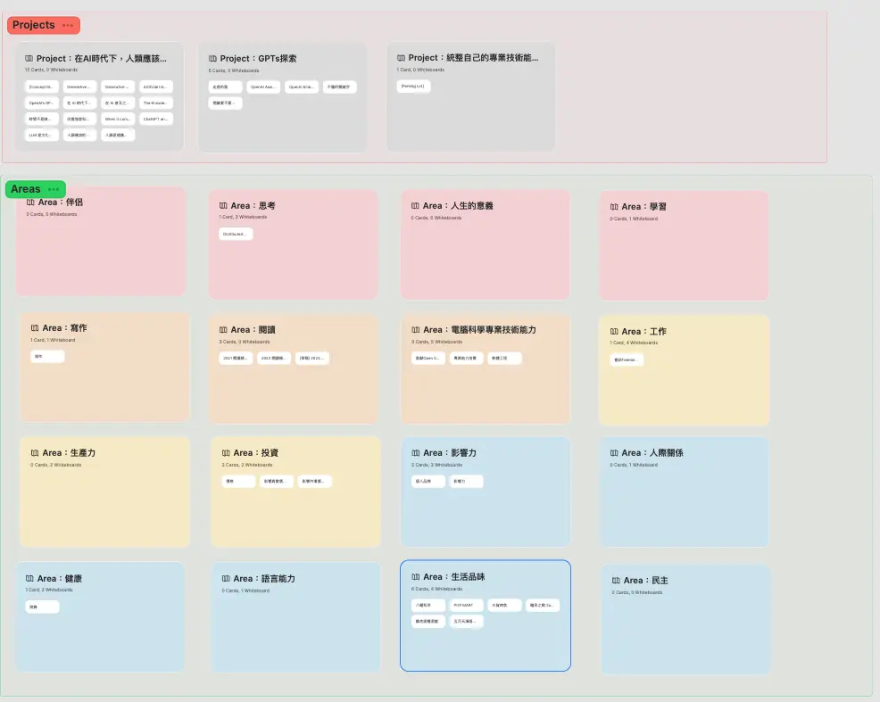

+++
title = "我的工具盒：筆記軟體 Heptabase"
date = 2024-02-06
description = "探索 Heptabase 筆記軟體的強大功能和獨特魅力，讓你高效思考、分類筆記及視覺化！了解更多開發進展與實用場景！"

[taxonomies]
categories = [ "生產力工具",]
tags = [ "tool-for-thought", "heptabase",]

[extra]
image = "vision.webp"

+++

# 我喜歡 Heptabase 的地方

* **開發能量強，與社群溝通順暢**：開發速度非常快，持續有新功能推出，而且從詹雨安（Alan Chan）的文章可以瞭解他對於這個產品的設計和思考邏輯，提供一個有遠見、令人安心的 Roadmap，當中最推薦兩篇 Alan 的文章——《[My Vision: Heptabase](https://sheracaolity.ghost.io/r/b9e3b20e)》和《[My Vision: The Roadmap](https://sheracaolity.ghost.io/my-vision-the-roadmap/)》。從 Discord 社群和程式內的問題回報，也能很快速找到團隊成員。

* **用白板做視覺化的輔助思考**：用白板可以保持思考的脈絡，可以持續性地深入發展主題。視覺化也讓對該主題的記憶力更清晰、維持更久。

* **熱起動，重視使用者體驗**：之前有摸索過 Notion 和 Obsidian，前置的設定要花比較多時間，套用他人的模板也不一定適合自己的使用場景，Heptabase 預設的功能就能滿足很多使用場景，[官網的文件也給了很多範例](https://wiki.heptabase.com/)，不需自行拼裝組裝車。

* **用 Tag 分類筆記，設定相對應的欄位**：可以實作《[打造第二大腦](@/reading-notes/building-a-second-brain/index.md)》提到的 context tag，有點類似 Tana 的 [Supertags](https://tana.inc/supertags)，讓筆記可以用 Table 或 Kanban 的形式作更多元的運用。

# 我覺得 Heptabase 還不夠好的地方

* **重複卡片問題**：允許有同標題的卡片，加上在白板雙擊就能產生新的卡片，不小心會創造同樣標題的卡片，要融合卡片時，需要手動更改所有的 backlink，在融合卡片的場景不太友善。

* **不易用手機操作**：目前手機端的效能還不太好，卡片比較多的時候，打開卡片庫的時間會蠻長的。同步機制目前也不太穩定，切換裝置的時候會遇到衝突。

* **反向連結看到的資訊較少**：這可能是設計上的問題，因為在卡片的內容是自由編輯的，所以反向連結就只看得到連結的那行，要看到更多就需要跳到完整的卡片，在反向連結越來越多的情況下，就更難探索。例如在下圖中，反向連結回去是一個文字區塊，但就不能在一個卡片裡很方便的探索。

# 我的使用場景

* PARA 的實現，用多層級的白板來搜集及發展 Area 的主題。

* 閱讀筆記的整理、主題性的整理。
