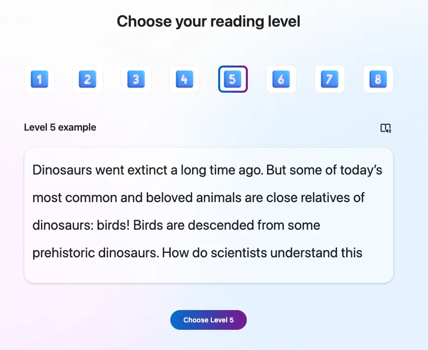

+++
title = "免費的英語發音學習好幫手：Microsoft Reading Coach"
date = 2024-01-23

[taxonomies]
categories = ["學習工具"]
tags = ["English", "AI"]

[extra]
image = "reading-coach.webp"
+++

截圖自 <a href="https://coach.microsoft.com/">Microsoft Reading Coach</a>

[Microsoft 在 1/18 發表了 AI 在教育領域的新應用](https://educationblog.microsoft.com/en-us/2024/01/unlocking-productivity-and-personalizing-learning-with-ai)，提供一系列以 AI 輔助教學的工具，其中一項就是免費開放了預覽版的 [Reading Coach](https://coach.microsoft.com/)。

AI 在教育上展現了一些新的優勢，可以根據每個人現有的知識與技能，產生相對應的素材針對弱點補強，提供針對性主題有耐心且全年無休的老師。隨著科技不斷地演進，未來 AI 的資源會越來越便宜、越來越容易取得。只要具備主動學習的心態，就有無盡的資源等待著你去探索。

簡單試用了一下，覺得不管是有基礎英文閱讀能力的兒童、就學中的學生、或是想要再進修的上班族都蠻適合利用這個工具來練習英語發音。

# 兒童導向：AI 生成故事、人為決定故事發展

對於小朋友來說，這個平台提供了創造故事的功能，可以自行選擇故事中的主角與發生的場景，由 AI 生成故事。

截圖自 <a href="https://coach.microsoft.com/">Microsoft Reading Coach</a>

截圖自 <a href="https://coach.microsoft.com/">Microsoft Reading Coach</a>

可以根據自己的英語能力選擇難度，並且主導故事的發展。

截圖自 <a href="https://coach.microsoft.com/">Microsoft Reading Coach</a>

截圖自 <a href="https://coach.microsoft.com/">Microsoft Reading Coach</a>

最後會根據你朗讀的結果做分析，並提供有哪些單字可以加強練習發音。

截圖自 <a href="https://coach.microsoft.com/">Microsoft Reading Coach</a>

# 特定領域學習導向：自行加入內容

目前 AI 生成的故事和系統內建的故事都是兒童導向，對於年紀大一點的學生可能就沒有那麼合適。但在平台上也提供了可以加入故事的功能。

截圖自 <a href="https://coach.microsoft.com/">Microsoft Reading Coach</a>

可以放上課文、專業領域的文章、甚至新聞、詩、小說和任何感興趣的文章，當作特定領域單字的探索與發音的練習。

對目前的版本（1/23）做了一些嘗試，有遇到一些限制和不太重要的問題：
* 標題的長度會有 40 字元的限制、故事會有 10000 個單字的長度限制。
* 會有一些單字不認識，例如 ChatGPT，會抓到你的發音錯誤，但練習的發音也不正確。
* 對於非單字的字，也會用發音法嘗試生成發音。

截圖自 <a href="https://coach.microsoft.com/">Microsoft Reading Coach</a>

# 心得

AI 時代的來臨，會出現越來越多新的工具來強化個人的能力。與其恐懼新科技的到來，不如用好奇心來試探適合自己的工具、驅使主動學習，你將會擁有更多。
