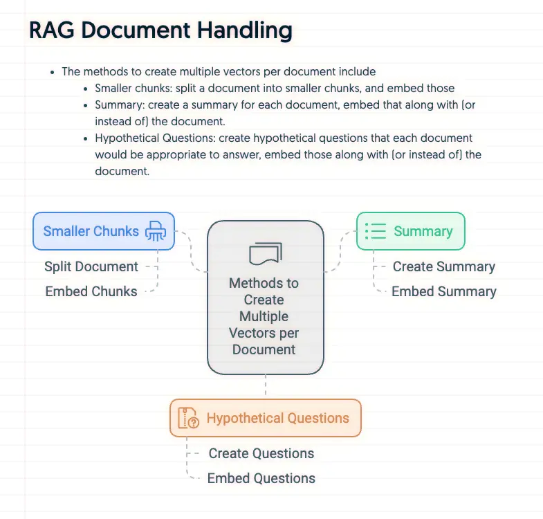

+++
title = "資訊圖生成工具：Napkin AI"
date = 2024-09-17

[taxonomies]
categories = ["生產力工具"]
tags = ["generative-ai"]

[extra]
image = "napkin-ai.webp"
+++

蠻強的應用，只要把文檔貼入，就會根據內容生成多種樣式供選擇，細節的文字與配色也都還可以做微調。

全民製圖時代來臨！

連結：[Napkin AI](https://napkin.ai)

