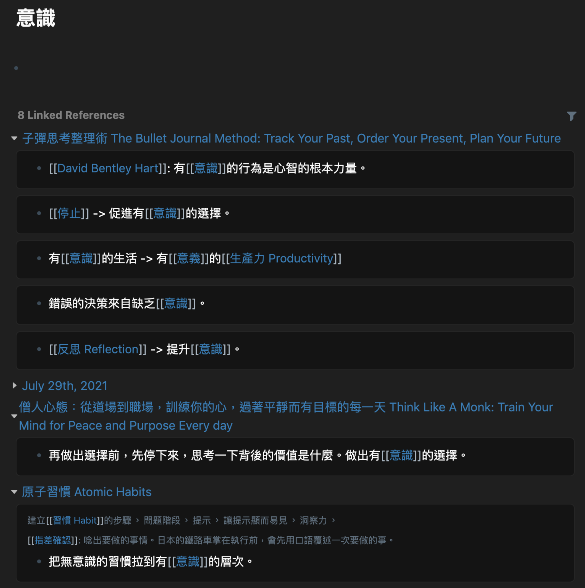

+++
title = "Roam Research 一年使用心得分享"
date = "2021-08-11"

[taxonomies]
categories = ["生產力工具"]
tags = ["Roam Research"]
+++

# 前言

過往其實有大概五六年的時間都是用 Evernote 作為主要的筆記軟體，後面四年有升級到 Personal 付費帳號來使用進階的功能。Evernote 帶來了簡單方便的資料擷取，付費版甚至可以做到文件內的關鍵字搜尋。只要把所有筆記和文件都往 Evernote 丟，就可以建立個人的小型資料庫。

但隨著使用時間越來越長，資料累計數量越來越大之後。當你搜尋一個研究很久的主題，相關的筆記數量很多時，簡易分資料夾與 Tag 來搜尋並不足以幫助你很快找到過往的筆記。後期常常困擾在該直接 Google Search 重新找一次答案，或是試著在自己的 Evernote 資料庫中找到過往已經解析過的答案。

<!-- more -->

去年因緣際會下讀了 How to Make Smart Notes，學習了 Zettelkasten 卡片盒筆記法，帶給我一個全新做筆記的方法。朱騏的 [Zettelkasten 卡片盒筆記法，建立知識連結網路來活用筆記](https://medium.com/pm%E7%9A%84%E7%94%9F%E7%94%A2%E5%8A%9B%E5%B7%A5%E5%85%B7%E7%AE%B1/zettelkasten%E5%8D%A1%E7%89%87%E7%9B%92%E7%AD%86%E8%A8%98%E6%B3%95-%E5%BB%BA%E7%AB%8B%E7%9F%A5%E8%AD%98%E9%80%A3%E7%B5%90%E7%B6%B2%E8%B7%AF%E4%BE%86%E6%B4%BB%E7%94%A8%E7%AD%86%E8%A8%98-f85a91729521) 有非常詳細的介紹。在去年 9 月[研究該用什麼方式實行卡片盒筆記法](../../reading-notes/how-to-take-smart-notes)，認識了 Roam Research。

# Roam Research 簡易介紹

Roam Research 做為一個筆記軟體，帶來最大的不同就是雙向連結，當你把一個詞或句子用`[[]]`匡起來，就會開出一個頁面立刻建立一個雙向的連結。

看似簡單的改變，卻對於做筆記的思維帶來很大的影響。筆記系統不再只是一個分類資料庫，筆記間開始出現關聯，成為一個網狀的系統。不再只是把各個筆記放到相對應的資料夾、加上定義好的 tag。而是當你寫下每一行每一句時，你都與你過往的筆記再次碰撞與連結。

你或許會覺得寫筆記還要特別做出連結很困擾 (如下圖)。但其實這就是 How to Make Smart Notes 提到的——當你寫下一個筆記時，你要思考以後會怎麼用到他，留下未來重新看這個筆記時所需要的 context。

# 我用 Roam Research 做什麼？

## 日記：早晨計畫和夜間反思

這個概念是從 6 分鐘日記的魔法學到的，每日的早晨計畫與夜間反思有助於我們在現代快速節奏的生活中，留下一個反思的空間。想想生活中有什麼值得感恩的事、做得好的地方、可以改善的地方，可以重新省思生活、定義目標。

Roam Research 在每一天都會自動生成一個 Daily Note，只要簡單設定 Template，就可以快速開始寫日記。

## 工作日誌

如果你的工作充滿了各種會議和資訊轟炸，如何妥善的整理資料、如何適時能找到過往的資料都很重要。

在 Roam Research 中，你也可以在 Daily Note 中寫下重要的筆記，賦予相對應的連結，你就能很快速的找到同一個主題所有的筆記。

## 閱讀筆記

卡片盒筆記法最大的成就就是發明者 Niklas Luhmann 利用這樣的筆記系統，在他 40 年的研究生涯中出版了超過 70 本著作和 400 篇學術論文，而且跨越了多個領域。要達成這樣的成就，除了同領域的**大量閱讀 (Syntopical Reading)** 外，卡片盒筆記法形成了一個外部的**第二大腦**，你利用它輔助審視從不同來源得到的想法，解決你心中的問題。

# 後記

如果你對 Roam Research 有興趣的話也可以申請一個月[試用](https://roamresearch.com/#/signup)，或是用免費的 [Obsidian](https://obsidian.md/) 嘗試卡片盒筆記法。也歡迎跟我分享你的心得與疑問。
