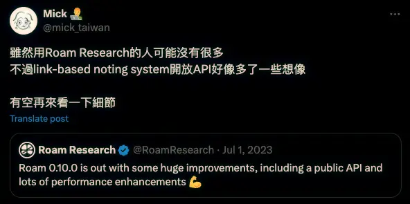
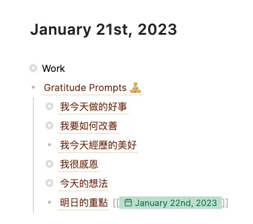

+++
title = "Roam Research 研究（一）：Roam Backend API 與 Datalog Query"
date = 2024-09-28
description = "探索 Roam Research 的 Backend API 和 Datalog Query 的強大功能，了解如何使用 API 取得和查詢資料，掌握筆記庫的操作技巧。"

[taxonomies]
categories = [ "學習工具", "生產力工具",]
tags = [ "roam-research",]

[extra]
image = "og-image.webp"

+++

還記得之前看到 Roam Research 開放 API 時還蠻興奮的，感覺是社群期待的一個大功能。不過一直都沒有實際的應用情境，這件事就一直擱著，沒有認真去研究。



當時有做的嘗試是把自己的筆記庫重新搬遷一次，改成不加密的版本，因為 Backend API 不支援加密過的筆記庫（Graph）。時至今日，也依然還不支援。

使用 API 的方式是在不加密的筆記庫，從 `Settings > Graph` 產生 API token，就可以使用。官方提供的 [Postman 範例](https://www.postman.com/roamresearch/roam-research-backend-api/collection/ny8dg5n/roam-backend-api-public-beta) 是蠻好的出發點，直接執行官方給的範例，可以大概了解 API 的功能。

# 時隔一年多的第二次探訪

有感在生成式 AI 的時代，個人資料將會越來越有價值，不論是 Agent 或是其他形式的個人應用，有更多的個人資料代表著更準確的服務，而 Roam Research 是我最主力的筆記系統，是充滿我學習歷程與生活記錄的大寶庫。

因此，想再度探索 API，想更進一步理解目前可以做到的事和瓶頸是什麼。

首先，我們可以先看 [Roam Backend API](https://roamresearch.com/#/app/developer-documentation/page/W4Po8pcHQ) 提供的端點：

- POST `/api/graph/{graph-name}/q`
- POST `/api/graph/{graph-name}/pull`
- POST `/api/graph/{graph-name}/pull-many`
- POST `/api/graph/{graph-name}/write`

很單純，有一個強力的搜尋功能 `q`，兩個在已知 block id 情況下能有效率抓取資料的 `pull` 和 `pull-many`，最後是強力的修改功能 `write`。

這篇文章會以取得資料為主，雖然搜尋和抓取資料的方式不太一樣，但用到的語法類似，所以以下會介紹 `q` 的用法，很容易可以移轉到 `pull` 和 `pull-many`。

# Datalog

*本篇會以 Roam Research 的 API 角度來介紹它的查詢語言 Datalog，可能對於 Datalog 的介紹不夠完善或有些許偏差，歡迎提供不同角度的見解。*

Roam Research 底層是以 Datomic 當作資料存儲的資料庫，以 Datalog 當作查詢語法。

即使我之前做了很多資料處理的工作，對 Datomic 和 Datalog 的認知，也只有在 [Designing Data-Intensive Applications](https://www.goodreads.com/book/show/23463279-designing-data-intensive-applications?from_search=true&from_srp=true&qid=6jKSemA8aL&rank=1) 這本書曾看過，只知道是圖學類資料庫比較古老的實作方式。

在第一眼看到它的搜尋範例，也蠻難第一時間就看懂他的意思。

```json
{
    "query" : "[:find (pull ?e [*]) :in $ ?search-string :where [?e :block/string ?block-str] [(clojure.string/includes? ?block-str ?search-string)]]",
    "args": ["中文"]
}
```

以下會先介紹在 Roam Research 資料庫裡的 Entity 所擁有的資料，再進一步介紹 Query 的用法。

## Roam Research 的 Entity

簡單來說，可以想像存在資料庫裡的資料，每一筆都是一個 Entity。一個 Entity 有它的 Attibute，每個 Attribute 有它的 Value。

在 Roam Research 的設計裡，Block 是所有內容的基本單位。包含筆記頁面與內含的所有內容。

### 筆記（Page Entity）

一個筆記也是一個 Block，是一個擁有標題，而沒有內容字串的特殊 Block，而筆記裡的內容是多個 Block，會以 Children Blocks 的方式表示。



```json
{
    ":create/user": {
        ":db/id": 3
    },
    ":create/time": 1673797584462,
    ":node/title": "January 21st, 2023",
    ":edit/user": {
        ":db/id": 3
    },
    ":block/children": [
        {
            ":db/id": 18439
        },
        {
            ":db/id": 18458
        }
    ],
    ":log/id": 1674259200000,
    ":block/uid": "01-21-2023",
    ":block/open": true,
    ":edit/time": 1673797584467,
    ":db/id": 18459
}
```

以「January 21st, 2023」的筆記為例，我們可以從 API 中撈出完整的資料，可以看到筆記頁面的 Entity 以 `:node/title` 儲存筆記的標題，而筆記的內容則是會以 `:block/children` 的方式，記錄可以連結到對應 Block 的 `:db/id`。

### Block Entity

在 Roam Research 多階層 Outline 裡的內容也都是 Block，以上圖筆記的 `Gratitude Prompts` 為例，從 API 獲取 Entity 的細節。

```json
{
    ":create/user": {
        ":db/id": 3
    },
    ":block/string": "((Ey9y4W9Er)) ",
    ":create/time": 1674273459186,
    ":block/refs": [
        {
            ":db/id": 3071
        }
    ],
    ":edit/user": {
        ":db/id": 3
    },
    ":block/children": [
        {
            ":db/id": 18444
        },
        {
            ":db/id": 18448
        },
        {
            ":db/id": 18449
        },
        {
            ":db/id": 18452
        },
        {
            ":db/id": 18456
        },
        {
            ":db/id": 18457
        }
    ],
    ":block/uid": "m9KpPoyOT",
    ":block/open": false,
    ":edit/time": 1674273463758,
    ":db/id": 18458,
    ":block/parents": [
        {
            ":db/id": 18459
        }
    ],
    ":block/text-align": "left",
    ":block/order": 1,
    ":block/page": {
        ":db/id": 18459
    }
}
```

可以看到 `:block/page` 的 `":db/id": 18459` 連結回原本的筆記 `January 21st, 2023` 的 `":db/id": 18459`。此外，可以看到它用 `:block/string` 儲存 Block 的文字內容，不過在這個範例中，它是引用了另一個 Block 的內容，所以不是直接顯示`Gratitude Prompts` 文字，而是 Block 引用的語法 `((Block uid))`，也可以從 `:block/refs` 看到他引用了另一個 Entity。而 Block 之間的階層關係則是會用 `:block/parents` 和 `:block/children` 表示。

## Query

有了資料庫裡 Entity 的概念後，我們就能進一步理解上面查詢的意思。讓我們整理一下上面的查詢範例：

```
query = [
  :find (pull ?e [*])
  :in $ ?search-string
  :where
    [?e :block/string ?block-str]
    [(clojure.string/includes? ?block-str ?search-string)]
]
args = ["中文"]
```

在解釋之前，直接先說這個查詢的目標是**尋找內容包含「中文」的所有 Block。**

在分析查詢前，有一些需要知道的 Datalog 語法：

- 會用 `()` 呼叫定義好的 functions，像例子中的 `pull` 和 `clojure.string/includes?`
- 會用問號開頭的字來定義查詢語句裡的變數，像例子中的 `?search-string`、`?e` 和 `block-str`

查詢是由三個部分組合：

- `:find`：用來決定回傳的欄位，像是一般 SQL 裡的 `select`。可以直接指定變數名稱，也可以利用像範例中的 `pull` 指令，取得 Entity 中的 Attribute。
- `:in`：主要是用來傳入外來的參數。在這個例子裡，`?search-string` 就是在 `args` 裡定義的「中文」。
- `:where`：有兩種用途，一種是用來把必要的變數串在一起，在這個例子裡，我們必須要取得 Entity 裡的 `:block/string` 來與傳入的字串做比對，所以需要寫下 `[?e :block/string ?block-str]` 這個語句，這是由 `[Entity Attribute Value]` 組成的三元組；另一個用途就是實際上的查詢條件，這邊利用 `clojure.string/include?` 的 function 來判斷一個字串是否包含另一個字串。

利用這些學到的概念，就可以回到 Roam Research 提供的 [Postman 範例](https://www.postman.com/roamresearch/roam-research-backend-api/collection/ny8dg5n/roam-backend-api-public-beta)，嘗試去理解查詢的內容，並修改查詢達到自己的目的。如果看到最後一個範例，會發現在 Datalog 的語法，甚至可以做到自定義 function 並呼叫的功能，相當複雜。

這邊先貼出來給大家看看，大家能猜到他要做什麼事嗎？

```json
{
    "query" : "[:find (pull ?block [:block/uid :block/string :create/user]) :in $ % ?user-display-page-title :where [?page :node/title \"elephant\"] [?page :block/uid ?page-uid] [?block :block/refs ?page] [?block :block/uid ?uid] (created-by ?block ?user-display-page-title)]",
    "args": ["[[(created-by ?block ?user-page-title) [?user-page :node/title ?user-page-title] [?user :user/display-page ?user-page] [?block :create/user ?user]]]", "Baibhav Bista"]
}
```

祝大家都能順利地查詢到自己 Roam Research 筆記庫裡的資訊，有什麼問題也歡迎留言與我交流。
