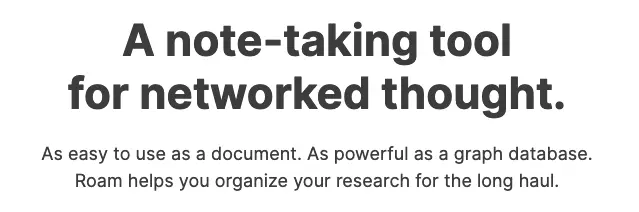
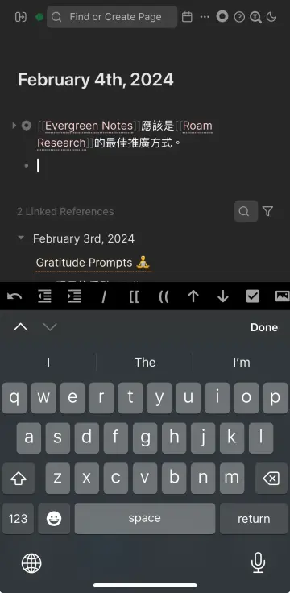
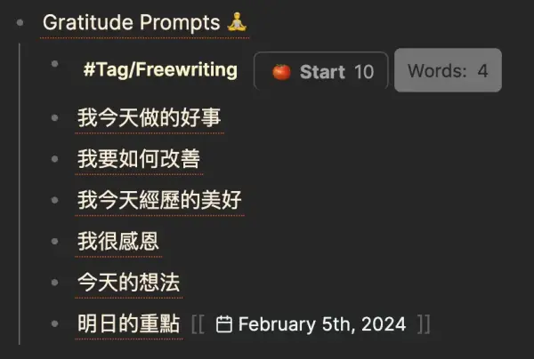

+++
title = "我的工具盒：筆記軟體 Roam Research"
date = 2024-02-06

[taxonomies]
categories = ["生產力工具"]
tags = ["tool-for-thought", "roam-research"]

[extra]
image = "vision.webp"
+++

# 我喜歡 Roam Research 的地方

* **Outline 形式**：Outline 的形式降低了寫筆記的摩擦力。這種形式強制維持有層級的關係，讓反向連結往回看 Reference 的時候可以往上下層得到更多的細節。只要反向連結做得好，即使筆記數量不斷增加，在搜尋上還是很快速。

* **適合廣泛搜集筆記，延後處理**：低摩擦的輸入，可以先產生大量的反向連結，等到想統整該主題的時候再來整理。我最大的興趣是廣泛地閱讀不同主題的書籍，透過這樣的方法，可以在寫筆記時不用考慮太多，最後會在累計大量筆記後，用之間的連結創造出更多價值。

* **用 SmartBlocks 編寫 Low-code、多功能的模板**：[SmartBlocks](https://github.com/RoamJS/smartblocks/blob/main/docs/050-command-reference/index.md)提供蠻多功能讓使用者可以創建更有彈性的模板，例如「附帶番茄鐘的自由書寫模板」、「直接擁有隔日連結的每日日記模板」等等。

* **以標題作為筆記的唯一識別**：唯一識別是指同樣的標題只會有一個筆記，不會有重複的筆記用一樣的標題。這樣在筆記過程中做鏈結就能找到唯一的代表筆記，當不小心創造類似的筆記，Roam Research 也提供只要更改成同樣的筆記標題就能合併兩個筆記，包括所有相關的反向連結。如果同一個標題在不同領域想分成不同比筆記，我則會用 Namespace 把兩者隔開。

* **多裝置同步**：Roam Research 在蠻早期就把同步這件事做得蠻好的，在有多裝置使用下，是一個很重要的功能。手機端的應用也使得可以隨時隨地取用自己的筆記。

* **單純的文字編輯**：用類似 Markdown 的形式，讓編輯器的實作比較簡單，使用上不會遇到奇怪的介面 bug。

* **手機使用者介面特化**：針對 Link-based 設計比較好的輸入介面，包含在 outline 模式中很重要的縮排控制，以及為了 Page（`[[]]`）跟 Block（`(())`）的輸入加了快捷按鈕，讓使用者在手機上編輯筆記也很方便。

# 我覺得 Roam Research 還不夠好的地方

* **缺少視覺化功能**：雖然適合搜集筆記，但比較難發展想法。可以簡單地把筆記攤開來比較，但就沒有更多發展想法的工具。

* **沒落的社群**：在 Roam Research 之後，也出現更多的雙鏈筆記，像是 Obsidian、Logseq、Tana、Heptabase，注重不同價值的群眾開始擁抱不同的軟體，一方面 Roam Research 的開發團隊也無法回應大部分的需求，就漸漸沒落了。但早期開發的核心功能對我來還是蠻夠用的。

# 我的使用場景

透過用 SmartBlocks 創造的模板，可以根據不同的需求設計，像最近就想要多練習自由書寫，就可以很簡易的更改模板。

* Daily Journaling
* Weekly, Monthly, Yearly Planning

把書籍的閱讀和網路文章的閱讀導入 Roam Research 整理，在連結的過程中也整理舊有的筆記，保持一個豐富連結自己的經驗與閱讀筆記的第二大腦。

# 嘗試過但沒有持續的使用場景

* To-Do List：雖然在筆記軟體裡做可以保留很多細節，但隨著未完成的任務變多就顯得雜亂，不好管理。後來轉換用 OmniFocus 後又轉到比較簡易的 Things 3。
