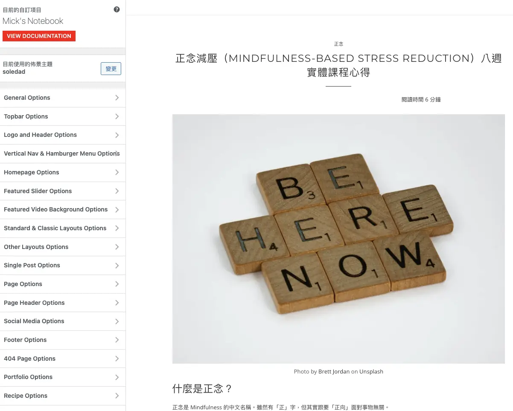

+++
title = "尚未成功的搬遷：把網站從 Bluehost (Wordpress) 遷移到 Zola"
date = "2023-05-03"

[taxonomies]
categories = ["網站開發記錄"]
tags = ["zola"]

[extra]
image = "zola.webp"
+++

<!-- more -->

# 我的第一個部落格：以購買驅動行為

在 2020 年一時興起買了 bluehost 來架站，利用金錢的支出來逼迫自己經營[部落格](https://mickzh.com)、促使自己寫一些東西。但沒有太用心在網站的細節，只速速瀏覽了幾篇網誌教學後，買了很多人推薦的佈景主題 [Soledad](https://themeforest.net/item/soledad-multiconcept-blogmagazine-wp-theme/12945398)、根據需求裝了一些必要的 plugin，接著就是不定期寫一些閱讀心得放上去。

即使有覺得網站蠻多地方不符合自己的喜好，不過沒有動力深入了解 Soledad 的佈景主題，可以調的東西實在太多了，每次都看一看就作罷了。

Soledad 的佈景主題後台

# 種下 Static Site Generator (SSG) 的種子

直到 2022 年 4 月看到了 [P.J. Wu 吳秉儒](https://pinchlime.com/about/) 分享了 [Pin 起來改版了！從 Wordpress 搬家到 Zola！](https://pinchlime.com/blog/rebuilt-pinchlime/)。覺得很吸引人，當時在心中種下了一顆 SSG 的種子。

2022 年 7 月某個閒暇的週末下午一個起心動念就開始嘗試用 zola 來架站。

# 想像很豐滿，現實很骨感

跟使用大量的軟體經驗類似，很開心的走完 Get Started 之後，就開始遇到難題。大概可分為幾個階段：

## 1. 促使轉到 Zola 的源頭是跟風，對於成品沒有完整的想像和動機。

雖然完全同意 [Pin 起來改版了！從 Wordpress 搬家到 Zola！](https://pinchlime.com/blog/rebuilt-pinchlime/) 談到的好處：
> 速度，包含人或非人讀取網站的速度，以及我產出到編輯完成一篇文章的速度。
>
> 價錢，我想找更經濟實惠的選項。
>
> 想藉由這個機會學更多一點東西、讓網站更符合自己的想像。

但因為我寫文章的頻率很低、已經預付網站的費用、對網頁技術沒有特別感興趣，導致沒有足夠的動機去執行。

## 2. 不想重蹈覆徹選擇改不動的主題，但又不夠動機探究網頁技術的細節。

當時嘗試用現有的 Zola 成品—— [Owen 的博客](https://www.owenyoung.com/) 和 [Pin 起來！](https://pinchlime.com/) 當做基底來改，雖然把 CSS 跟 Template 設定好就有個大略的長相，但為什麼每一個細節呈現成什麼樣子，對我來說是一個蠻大的障礙。另外也受工程師自尊的影響，覺得現在的網站已經不像 Wordpress 是個黑箱，應該要搞懂才能把這個網站上線。

接下來的三個月偶爾在週末抽點時間來研究，但最後動機不足還是造成這個計畫的失敗。

## 3. 跟 ChatGPT 一起協作

事隔半年，在 2023 年 3 月中離職之後，多了一些可運用的時間。一離職就遇到 AI 的炸裂進展，開始投入時間在追蹤、學習 ChatGPT 的新知。

到 4 月中，想說當作一個機會，試著透過與 ChatGPT 協作的方式來解決之前卡關的問題，沒有用太特別的 Prompt，只是請他扮演專業的工程師與我協作。不管在 HTML、CSS、或是 Javascript 的問題，都像多個夥伴一樣可以討論、解決問題。

雖然還是會有美感的問題很難突破，但至少在 Zola 的功能面上有更多的了解。也開始可以思考這個新網站對我自己的意義是什麼。

# 還是有收穫
在 2023 年的 5 月，終於有個初版，也把舊的文章都搬過來了。即使還是覺得網站很醜，且資訊的排列還無法完整呈現自己想要的樣子。但在搬運過程中，有機會回顧了以前寫的文章，想清楚在這個階段寫作最重要還是為了自己。也趁這次的搬遷，把所有的文章都變成了 Markdown 的形式，以後想要換個呈現方式也會比較容易。

# 對新網站的期待
- 因為控制性變高了，希望可以漸漸想清楚自己網站想呈現的樣貌，漸漸變成自己想要的樣子。
- 產出的想法，要先對自己有益，再來思考要怎麼要對其他讀者有益處。
- 新網站透過 Markdown 的形式，降低了輸出的難度，希望自己能增加輸出量，達到自己想做到 Learn In Public 的效果。

