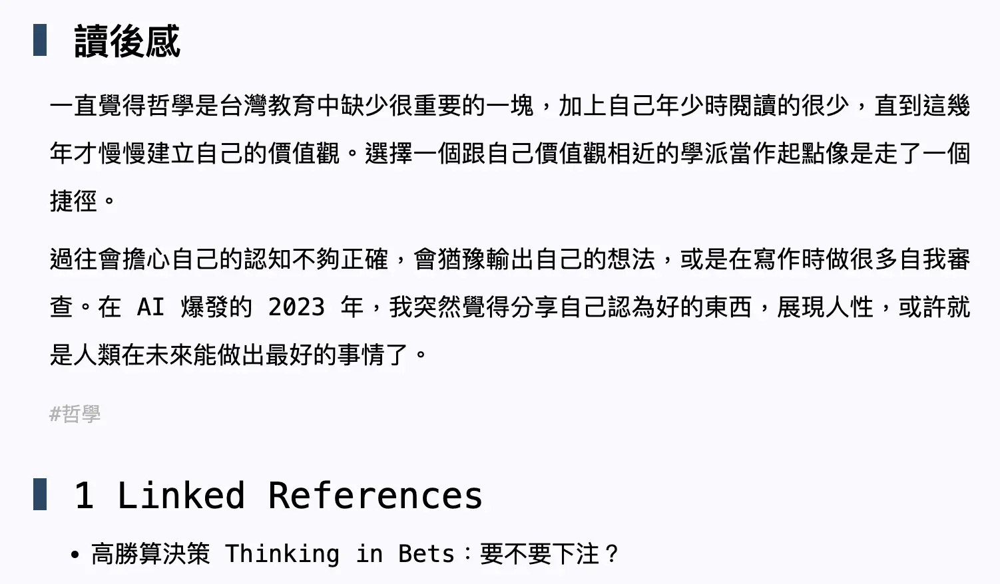

+++
title = "幫文章加上了 Backlinks！"
date = 2023-05-18

[taxonomies]
categories = ["網站開發記錄"]
tags = ["zola"]

[extra]
image = "zola-backlinks.webp"
+++

# Backlinks 的意義

從 2020 年開始用 Roam Research 當作主要的筆記軟體，覺得最關鍵的差別就在於有 Backlinks 這個功能。在寫入筆記時可以多思考一步————「*我期待未來用什麼方式找回這個筆記？*」

在使用上不管是將工作或閱讀的資訊不斷地往裡面添加，並不會像之前用 Evernote 有資料越多越難搜尋的問題，反而是當未來需要思考某個主題的時候，可以觀看相關的 Backlinks 提供與這個主題相關的資訊。

Roam Research 範例截圖

目前最喜歡的 Backlinks 顯示方式還是 Roam Research 的樣子，雖然 Outlining 的架構在寫筆記上看似有點死板，但可以利用層級的關係保留一些上下文的關聯性，在呈現 Backlinks 的時候也能直接取得相關的資訊，在綜覽資訊上相當便利。

# Zola Backlinks
雖然 Zola 只做到單篇文章的 Backlinks，沒辦法呈現連結的其他資訊，但覺得可以嘗試看看這個功能，希望在文章越來越多的情況下，會產生出新的價值。在觀看 Pin 起來的[部落格加上了 Backlinks 的功能](https://pinchlime.com/blog/supported-backlinks/)的介紹後，在新增這個功能的過程中沒有遇到問題，最關鍵就是站內連結的方式要用 zola 文件裡 [internal links 的方式](https://www.getzola.org/documentation/content/linking/#internal-links)。

目前做完的長相會是這樣。

Zola Backlinks 截圖

直接用 Roam Research 的 **Linked References** 當作名稱，表達我對 Roam Research 的喜愛。
