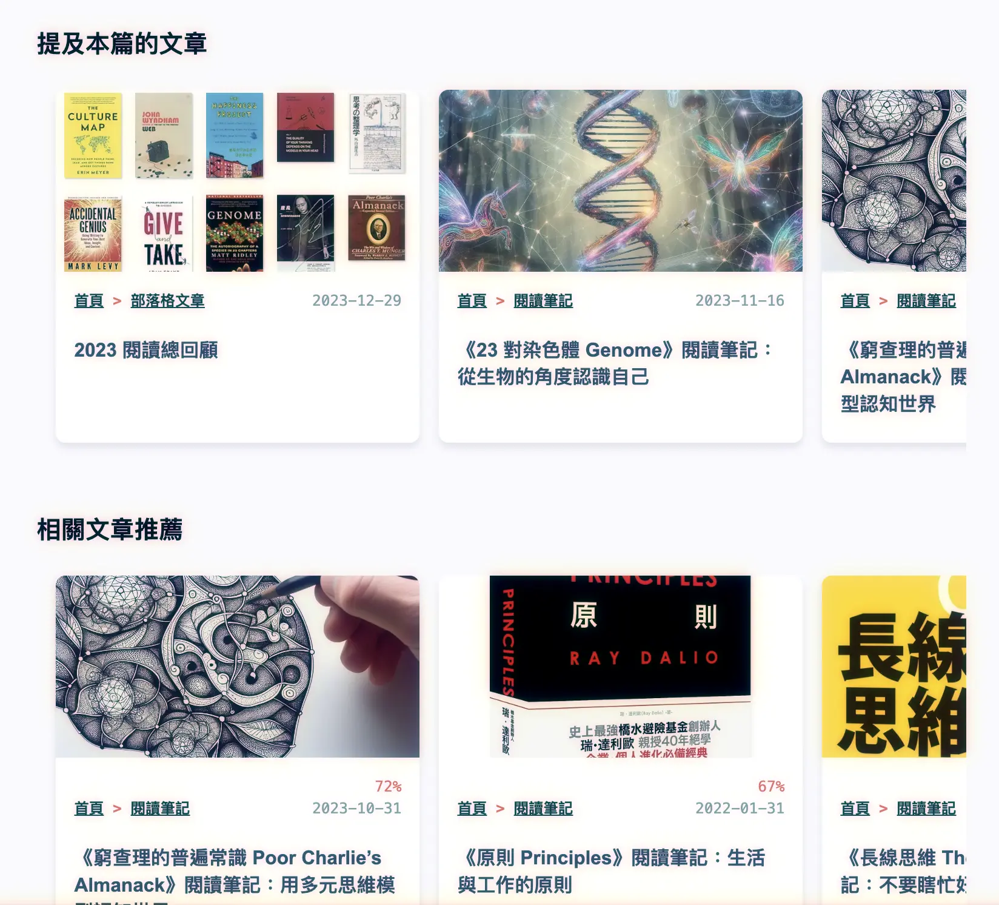
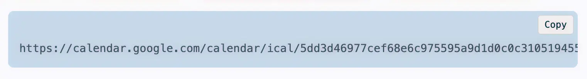
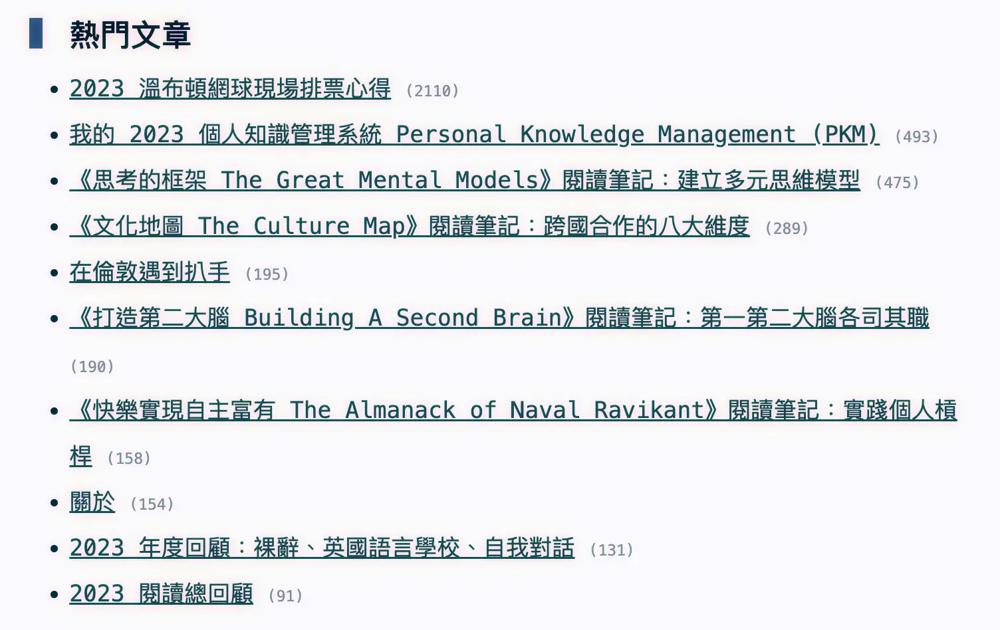
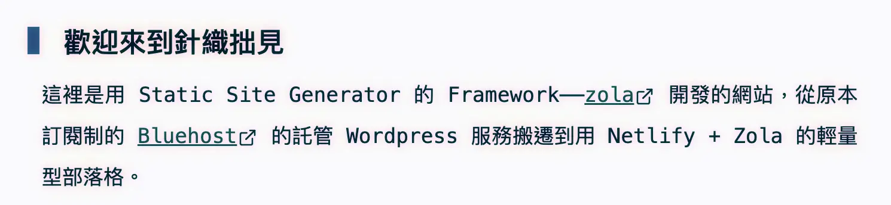
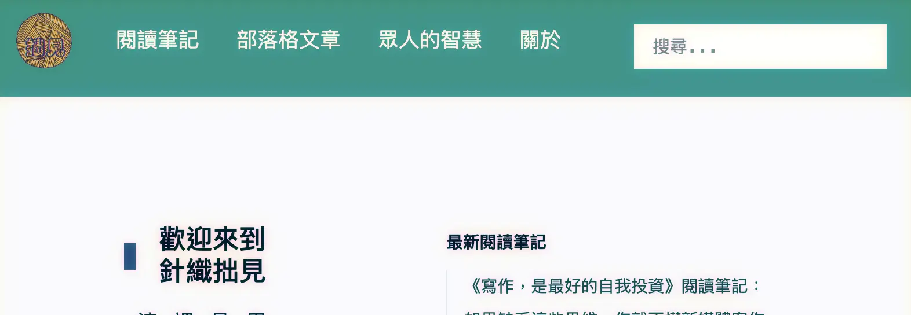

+++
title = "Changelog"
date = 2023-05-03
description = "使用 Semantic Versioning 管理網站更新，從大幅改版到小問題修復。點擊了解我們最新的變更，包括新增功能、介面調整、搜尋功能，和更多實用工具。"

[taxonomies]
categories = [ "網站開發記錄",]
tags = []

+++

> 用 Semantic Versioning (MAJOR.MINOR.PATCH) 來做網站的版號系統
> * MAJOR: 有大型更新時變動，例如網站規劃改變。
> * MINOR: 有小型更新時變動，例如增加了 sortable table view 或是搜尋功能。
> * PATCH: 有小幅度修正時變動，例如改了 style 或文章的 properties。

# [2024-08-01][v1.7.3] 將「提及本篇的區塊」也改為 Card View
## Changed
* 將「提及本篇的文章」也改為 Card View

# [2024-07-28][v1.7.2] 增加 Code Block 複製按鈕
## New
* 由於 Code Block 是從 Markdown 產生的，用的方式是額外加 Javascript 動態增加。

# [2024-07-26][v1.7.1] 更改推薦相關文章方法
## Changed
* 推薦的方法從「挑選最相關的三篇」改為「相關度大於 60%」的文章，有可能 0 篇，也有可能很多篇。

# [2024-07-25][v1.7.0] 新增推薦相關文章功能
## New
* 詳請請見 [與 Claude 3.5 Sonnet 協作開發「相似文章推薦」](@/blog/claude-3-5-sonnet-similar-posts/index.md)

# [2024-07-23][v1.6.0] 加上每篇文章的 View Count
## New
* 從 Google Analytics 每日抓取各個 path 的 view count，存成 json 的 map 之後，在顯示每篇文章時去查詢 view count。
* 在首頁呈現 Top-10 文章。

# [2024-06-29][v1.5.1] 對外部的連結加上 Marker
## New
* 對外部的連結加上 Marker

## Changed
* 微調顏色與文字大小

# [2024-06-22][v1.5.0] 增加搜尋功能
## New
* 簡單做了藉由 Google 作搜尋的功能，沒想到跟 ChatGpt 一起協作，只問了一個問題就做完了🫨
  * [Pull Request](https://github.com/mickm3n/blog/pull/4/files)

# [2024-05-13][v1.4.0] 更改評分制
## Changed
* 把讀書心得的評分從五分制改為十分制，提供比較細的區分。

# [2024-01-28][v1.3.1] 改善選單成下拉式
## Changed
* 更改手機瀏覽時的選單成下拉式
* 網站首頁移除 Changelog

# [2023-11-07][v1.3.0] Youtube Shortcode
## New
* 參照 [Shortcodes](https://www.getzola.org/documentation/content/shortcodes/) 增加 [Youtube shortcode](https://github.com/mickm3n/blog/commit/829e6252ce901e4a810b9734c2a31aca8bf35eb3)

# [2023-10-19][v1.2.1] 調整網頁架構與呈現
## Changed
* 從網頁名稱移除網站名稱，讓網頁名稱更簡潔。
* 把所有文字內容都塞進 `og:description` 看有沒有幫助於 SEO。
* 調整 CSS 讓文字大小更合適。
* 分開網誌和閱讀筆記的頁面，可以呈現不同的資訊。
* 修正閱讀筆記頁面的表格，更改排序操控位置從表格標題列移到表格上方。
* 增加文章資訊：字數與閱讀時間。

# [2023-06-16][v1.2.0] 增加留言功能
## New
* 導入 utteranc.es 作留言功能，實驗的過程記錄在 [留言功能上線](@/blog/comment-system/index.md)。

## Changed
* 增加 `blog/method` 的 sub-section 把其他人提出的方法放在一起。
* 調整網頁標題從 `website-name > article-name` 改為 `article-name | website-name`，來強調文章的標題。
* 增加 meta description。
* 調整 CSS，幫粗體加上深紅色、在手機模式下隱藏 sidebar、調整排版。

# [2023-05-21][v1.1.1] 修正了 Twitter Card 顯示的問題
## Changed
* 加上 `og:title` 和 `twitter:card` 來修正 Twitter Card 沒有生成的問題。
* 根據 [Open Graph Protocol](https://ogp.me/) 補齊更多缺少的 meta。

詳細過程在 [修正 Twitter Card 沒有顯示的問題](@/blog/fix-open-graph-in-twitter-card/index.md)

# [2023-05-18][v1.1.0] 增加了 Backlinks 功能
## Changed
* 根據文件裡建議的 [internal links](https://www.getzola.org/documentation/content/linking/#internal-links) 方式重新修改既有的內部連結。

## New
* 幫文章加上了 Backlinks，如果有其他文章引用，會在文末產生 Linked References。

# [2023-05-06][v1.0.1] 增加 h1 前的小方塊增進閱讀性
## Changed
* h1 tag 的前面增加一個小方塊區別 h1 跟 h2，並且把段落文章再往右移一點點可以分出標題和段落文章。

# [2023-05-03][v1.0.0] Zola 網站正式上線
## New
* 網站命名：[針織拙見](@/about/index.md)
* 亂產生了一個 Logo
* 把 [舊的部落格](https://mickzh.com) 的文章全部搬到新的網站
* 加入基本的 CSS 與 Template 設定
* 加入部署 Netlify 的設定
  * 將 [https://blog.mickzh.com](https://blog.mickzh.com) 導到 Netlify
* 加入 [閱讀筆記](@/reading-notes/_index.md) 的 sortable table view 來輔助找到分數較高的書
