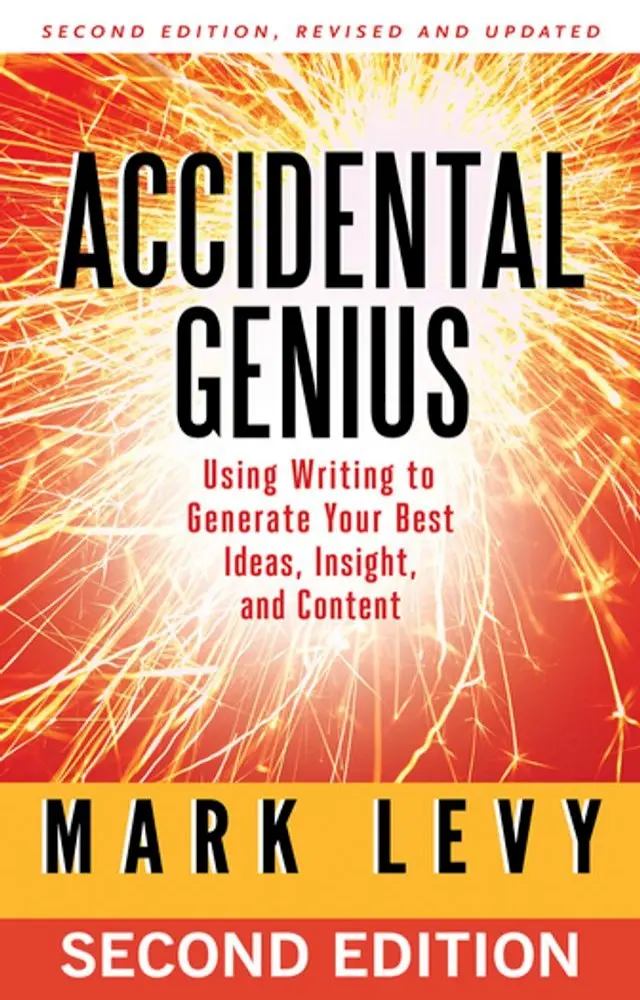

+++
title = "《自由書寫術 Accidental Genius》閱讀筆記：我手寫我腦"
date = 2023-12-05
description = "閱讀《自由書寫術 Accidental Genius》，學習不斷快寫解放創意，擺脫自我審查，找到寫作靈感與方法論。"

[taxonomies]
categories = [ "閱讀筆記",]
tags = [ "writing",]

[extra]
rating = 10
image = "og-image.webp"

+++

一二三言以蔽之
=======

利用自由書寫，我們得以暫時從自我審查中逃脫，讓意識自由飛梭。

親手將每個想法捕捉，攤開在紙上，細細品味。

書籍
==

為什麼我會讀這本書
=========

雖然在讀完每本書後，都會嘗試寫作，但每次的寫作其實對我來說都是蠻痛苦的過程，常常自我懷疑「寫出來的東西有價值嗎？」「我有什麼獨特的見解嗎？」

自我審查的守衛總是威風凜凜的站在門口，讓我在遠處徘徊不前。希望透過這本書，能掌握自由書寫的方法，讓文字輸出更加有方法論、更加有效率。

摘錄觀點
====

自由書寫的原則
-------

### 不停快寫，跟著想法走，不要評斷自己的想法

自由書寫利用不停的快寫讓專注力維持在寫作與腦中的想法，強迫大腦持續運轉。即使想法很雜亂也要如實地寫下來，關鍵是讓自己不要停下來，持續寫下每個一閃而過的想法。

### 計時器是自由書寫必備的幫手

在自由書寫開始前，設定時間長度，一般會設定在 10 到 20 分鐘。加了時間限制後，一方面讓自己知道寫作會有終點，而且計時器會負責看著時間並提醒你，所以你只需要專注在寫作上。另一方面，限制反而能夠讓人激發潛力，在限制的範圍內展現最有創意的內容。

### 無需在意用字、文法、讀者

自由書寫的結果只會給自己看，就算是公開的寫作，自由書寫也只會產生暫時的初稿，後續還會有修飾的環節，所以在這個階段可以放鬆去寫，不需在意品質。

自由書寫的錦囊妙計
---------

書上提供了蠻多當我們在自由書寫時，可以用來輔助我們產生更多想法的問題、引導句和技巧。

可以在自由書寫時，把這些提示放在容易取得的位置。

-   [輔助自由書寫的問題](@/wisdom/lists/freewriting-questions/index.md)

-   [輔助自由書寫的引導句](@/wisdom/lists/freewriting-prompts/index.md)

-   [輔助自由書寫的詞彙解析技巧](@/wisdom/methods/freewriting-open-up-words/index.md)

-   [輔助自由書寫的概念轉化技巧](@/wisdom/methods/freewriting-perspective-shift/index.md)

讀後感
===

寫作版的正念冥想？
---------

本書的架構是將自由書寫的方法拆解二十八個秘訣，並在每個秘訣的最後有個練習。不管在閱讀時穿插的練習，或是最近為了實驗做的練習，某方面都覺得和正念冥想有蠻高的相似性。

正念冥想定錨在呼吸、身體部位或想像上，覺察當有其他想法出現時，把注意力帶回到自己所設定的呼吸或其他部位上；自由書寫則是把注意力放在書寫上，做刻意的書寫，注意自己這時候是否有任何想法，並將其想法抄寫在紙上或螢幕中。

另外一個跟冥想相似的點就在於，時間越拉長之後感覺越痛苦，近期有嘗試十分鐘和二十分鐘的自由書寫，在做完二十分鐘的自由書寫後的疲憊感是十分鐘的好幾倍，需要有比較高的精神能量和意志力。

自由書寫肌肉
------

一直以來都有在晚上寫日記做一整天的反思的習慣，最近也把這個習慣改成用自由書寫的方法。以前的作法是列一個一個問題，例如「今天做得好的地方」、「今天有什麼想改善的地方」等等。改成自由書寫後，就是自由的回顧今天，會把今天做的事進行非時序性的回顧。有發現相較於回答每個問題，自由寫作的方式更沒有拘束，會寫出更多的內容。

另外進行多次的十分鐘自由書寫後，也發現自由書寫的摩擦力降低許多，一開始或許因為需要比較多的心靈能量，排斥的心態會比較多一點。因此，只要持續的做自由書寫，也會使自由書寫變得越來越容易。

用自由書寫寫閱讀筆記？
-----------

原本嘗試用自由書寫完成這篇閱讀筆記。但用自由書寫寫了二十分鐘的結果過於雜亂，且每個論點的完整度也不夠高，要拿來修飾文字發表的修改成本還是太高了，便作罷。

相較於直接產生可發表的文章，用在內容發想上其實是一個蠻有效的方法，在二十分鐘甚至更長時間的自由書寫中，你會嘗試回想相關的概念組合成文句，默默地在腦中就把這些概念連結過了一遍。在最後真的要寫閱讀筆記時，已經很清楚在腦中有哪些可用的素材，整合、寫作也變快了不少。

在查詢的相關資料中，蠻多文章利用自由書寫當作是寫作前的構思（Prewriting）的其中一種方法，看來是相對更合理的做法。
