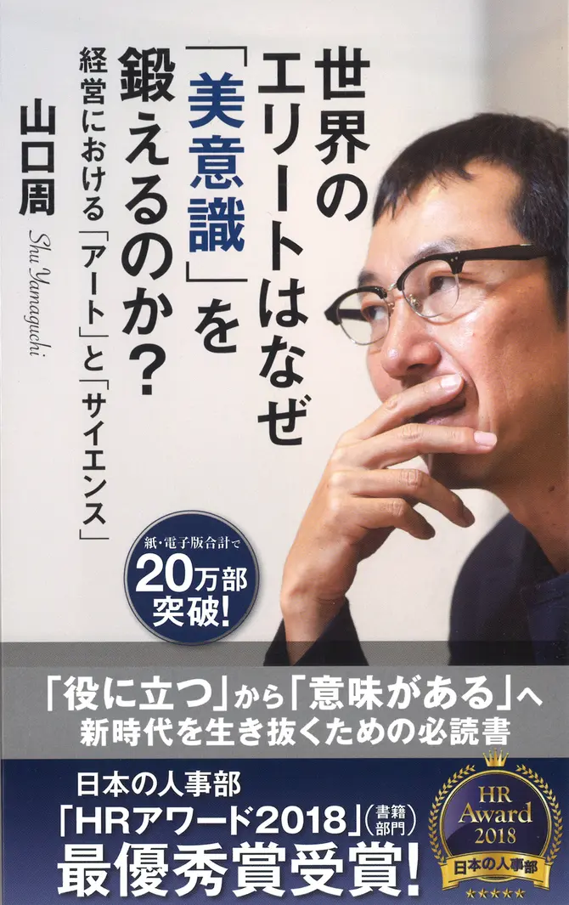

+++
title = "《美意識》閱讀筆記：在邏輯理性極限之後"
date = 2023-05-06

[taxonomies]
categories = ["閱讀筆記"]
tags = []

[extra]
rating = 3.5
image = "aesthetic-consciousness.og.webp"
+++

# 一二三以蔽之
在 VUCA 時代裡，難以單獨用邏輯理性做出良好的決策，美感是在新時代中不可或缺的能力。

# 書籍

# 為什麼我會讀這本書
這本書是讀書會投票想要看的書。此外[這本書在 Amazon Japan](https://www.amazon.co.jp/%E4%B8%96%E7%95%8C%E3%81%AE%E3%82%A8%E3%83%AA%E3%83%BC%E3%83%88%E3%81%AF%E3%81%AA%E3%81%9C%E3%80%8C%E7%BE%8E%E6%84%8F%E8%AD%98%E3%80%8D%E3%82%92%E9%8D%9B%E3%81%88%E3%82%8B%E3%81%AE%E3%81%8B%EF%BC%9F%EF%BD%9E%E7%B5%8C%E5%96%B6%E3%81%AB%E3%81%8A%E3%81%91%E3%82%8B%E3%80%8C%E3%82%A2%E3%83%BC%E3%83%88%E3%80%8D%E3%81%A8%E3%80%8C%E3%82%B5%E3%82%A4%E3%82%A8%E3%83%B3%E3%82%B9%E3%80%8D%EF%BD%9E-%E5%85%89%E6%96%87%E7%A4%BE%E6%96%B0%E6%9B%B8-%E5%B1%B1%E5%8F%A3-%E5%91%A8-ebook/dp/B073S1RJX2) 的評價也是蠻高的。

# 摘錄觀點
## 什麼是 VUCA？
VUCA 是 Volatility（易變性）、Uncertainty（不確定性）、Complexity（複雜性）、Ambiguity（模糊性）四個字的合稱。原本是使用在戰場上的詞，現在也被泛用在商業上的複雜情況。這幾年從 **Covid-19** 到**烏俄戰爭**都是很好理解的例子。

## 什麼是美感？
書中提到的美感涵蓋範圍很廣，從感覺上的美、道德上的美、甚至直覺也是。也就是不透過現實面的數據分析和規則來決定行為，而是以感覺與價值觀所做出的選擇。

## 為什麼需要美感？

作者主要指出了三個原因：
* 邏輯理性的極限
* 自我實現的消費模式
* 企業法規跟不上全球局勢變化

### 邏輯理性的極限

邏輯和理性，稱為科學的力量。企業在初期透過數據科學分析，可以快速提升效率。但科學的可解釋性與標準化，會造成商業上最重要的差異化消失，競爭對手有機會透過相同的方式得到競爭力。若沒有用美感創造出遠見、品牌價值開拓新藍海，就會陷入速度與成本的時基競爭。

### 自我實現的消費模式

經濟的成長與全球化，全球會有越來越多的人口滿足生存相關的需求，漸漸地往更高層次移動。需求會從基本的功能性利益，轉為品牌價值的情緒型利益，甚至到達表達自我的自我實現型利益。透過美學提升品牌價值，才能保有長遠的成長。

### 企業法規跟不上全球局勢變化

科技與商業模式不斷地成長，法規往往跟不上局勢的變化，若我們只用法規當作標準，而不追求更崇高的美德，我們就會偏向短期利益而犧牲更長期的利益。

相同的道理也可以用在體制的改革上，順應體制取得權力後再改變體制是成功機率相對較高的方法。但若在心中沒有堅持的道德基礎，則會在順應體制的過程中一起被體制吞噬。

> 我們都置身於臭水溝中，但仍有些人仰望著星空。
>
> -- Oscar Wilde

## 培養美感的方法？
書中推薦了幾種培養美德的方法：
* 在繪畫鑑賞上使用視覺化思維策略：培養虛心且開放的心態純粹觀看
  * 說出自己的作品的感覺
    * 這幅畫上畫了什麼？
    * 畫中正在發生什麼事？接下來可能發生什麼事？
    * 這幅畫現在帶給你什麼樣的情緒和感覺？
  * 由學習者互相分享和引導者的引導讓學習者了解一件事物有更多種不同的視角。
* 閱讀哲學或文學：文學是用故事表達哲學，不管是直接閱讀哲學或文學都可以讓我們與作者一起再次經歷生活哲理的思考過程與反思其適用性與變化。
* 增加修辭能力做出更佳的譬喻：學習用更好的譬喻，增進我們對事物的抽象化與表達。

# 讀後感
一路在理工科的學習，很容易把邏輯和理性視為圭臬，強調透過數據分析做策略才有準確性。但如同所有的思維模型，每個模型都會有適用的範圍與其極限性。

若我們用邏輯理性來處理所有決策，可能會遇到以下問題：
* 要解決的問題難度較低，若不加入美感做出差異性，恐成為速度和成本的紅海競爭。
* 邏輯理性成為決策失敗的藉口，決策在邏輯理性上已達成合理，不算是個人的決策錯誤。

在相較複雜的決策上，要以邏輯理性當作基礎，再額外加入美學來判斷：
* 加入更多直覺、倫理、道德和審美觀的判斷因素。
* 利用試誤法（Trial and Error）來逐步修正。
