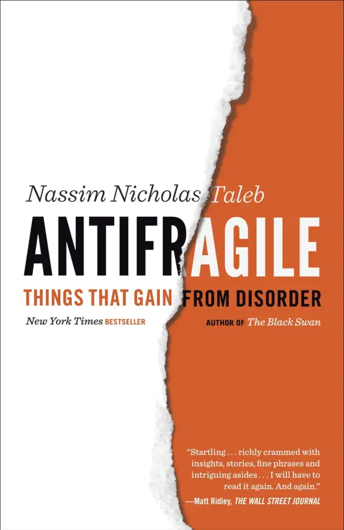
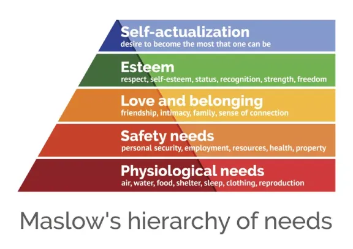

+++
title = "《反脆弱 Antifragile》閱讀筆記：凡殺不死我的必使我更強大"
date = 2022-05-08
description = "探索《反脆弱 Antifragile》如何在不確定性中獲得強化，了解脆弱、強固及反脆弱的本質，並學習應對黑天鵝事件的策略。"

[taxonomies]
categories = [ "閱讀筆記",]
tags = []

[extra]
rating = 8
image = "antifragile.webp"

+++

# 書籍

# 前言
這次拜讀黑天鵝 (The Black Swan) 作者塔雷伯 (Nassim Nicholas Taleb)「不確定性」三部曲的第三部——「反脆弱」。相信大家對黑天鵝這個詞肯定不陌生。黑天鵝泛指發生機率低，但一當發生時，就會帶來大規模的傷害，從金融海嘯、到近幾年的 Covid-19，都是世界級規模的黑天鵝。

# 觀點摘要
## 面對黑天鵝的解方：反脆弱

面對這樣的黑天鵝，最重要的就是保有反脆弱性。不過反脆弱到底是什麼意思？

首先介紹塔雷伯對脆弱性最基本的定義。所有事物的脆弱性都可以歸於三元組——脆弱、強固及反脆弱。
* 脆弱：在一般時候錯誤很少發生，但一但發生時，規模都很大，無法扭轉。比如桌上的玻璃杯，人造的複雜系統。
* 強固：對於錯誤表現中性，不容易被破壞，但也不會因此強化。多半發生在無生命物體，比如金屬。
* 反脆弱：錯誤雖頻繁發生但規模小，系統能夠扭轉錯誤並快速克服，甚至強化系統。多半是有機深奧系統，比如大自然，肌肉組織。

究竟個體要如何做到反脆弱呢？我們可以藉由認識深奧系統來萃取可以套用在生活中的部分。

## 擁有反脆弱特性的深奧系統
深奧系統有幾個特性：
* 因果不透明性
* 過度補償

### 因果不透明性
深奧系統中各個因子間的交互作用，並無法簡單地用線性的方式去解釋，比如在身體系統中沒辦法說只要吃了幾克的蛋白質，就可以增加幾克的肌肉。在這段時間內做了什麼行動，有什麼樣的賀爾蒙變化，都有可能對結果產生影響。在這樣的系統中，通常也都摻雜了隨機性，重複做一樣的事情，不一定會產生相同的結果。

### 過度補償
少量的傷害反而有益於整體的健康。例如毒物興奮效應，少量的毒素，甚至人體從青菜中攝取到的一些元素，都可以在身體反應後產生更多好的元素。鍛鍊肌肉也是一樣的道理，讓骨骼和肌肉系統受到更高的壓力因子，使得骨骼和肌肉都更為強健來反應這樣的壓力因子。

## 不干預、不預測
在知道深奧系統的特性後，我們就可以藉此設定策略降低我們的脆弱性。

由於深奧系統都有因果不透明性與隨機性，且隨機性有助於避免來自黑天鵝的傷害。因此透過干預來降低隨機性是無效的，干預反而帶來脆弱性，降低平常時候的錯誤，增加引發黑天鵝的可能性。預測風險也不是特別有效的方法，因果不透明性與隨機性使得我們不容易有高預測正確率，與其追求正確率，更有效率的方式是檢驗脆弱性。

## 要如何檢驗脆弱性呢？
### 不要一昧地拒絕風險
大部分的人不喜歡風險。風險，除了發生的機率以外，你應該要考慮上檔利益與下檔損失，算出期望值。選擇具有正期望值的行動，在時間複利下，得到長期的正效果。

### 防止過大的下檔風險
去設想最壞的情況，在最糟的狀況下自己會受到的最大傷害是什麼，若這樣的傷害會使你一蹶不振，就要搭配方案來降低傷害，例如買保險、反向投資、最嚴重時甚至就放棄這個計畫。

### 避免過度優化 (Overfitting)
思考自己計畫的可拓展性 (Scalability)，思考當你計畫中的某個因子量級提升之後，會不會有可能產生一些新的不預期的傷害。

## 槓鈴策略 (Barbell Strategy)
在清楚這些特性後，我們應該要加入槓鈴策略到我們的生活中，專注在高風險與低風險的行動中，而避免那些中庸、溫和的行動。在有黑天鵝疑慮的行動中，我們要採取保守的策略降低下檔損失。但在無關緊要的小風險中，我們應該要積極的投入來創造上檔利益。

Photo by Victor Freitas on Unsplash

## 不對稱的選擇權：利大於弊
最好的狀態就是我們可以從生活中去尋找不對稱的選擇權，也就是下檔損失有限，而上檔利益無限，並且你有可以藉由理性選擇要或不要的權利。在投資方面的選擇權就是很好的例子，在生活中，書裡面也提到參與一場社交活動也算是一種選擇權。利用這樣不對稱的選擇權，就算我們沒有一流的資訊與情報，也不至於在這樣的行動中損失太多，但卻擁有無限上檔利益的可能性。

## 反脆弱了，然後呢？
而這一切的一切，都是讓我們擁有更多的反脆弱性。反脆弱讓我們在生活中擁有更多的餘裕、擁有更多的自由，可以去擁抱真正對我們重要的事物，而不需要去分心、擔心其他的事情。

願大家都能追逐對自己重要的事情。

Plateresca / Getty Images

