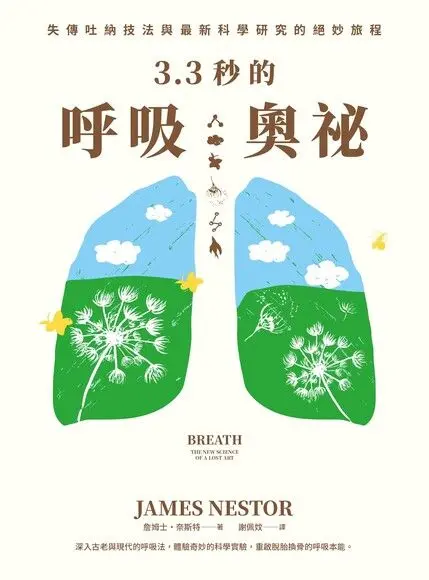

+++
title = "3.3 秒的呼吸奧秘 Breath - 呼吸是唯一可控制的身體系統"
date = 2023-07-26

[taxonomies]
categories = ["閱讀筆記"]
tags = ["breath"]

[extra]
rating = 4.5
image = "breath.webp"
+++

# 一二三言以蔽之

這本在 2020 出版的書探索了呼吸的秘密。作者用自己的身體大量做與呼吸相關的實驗，透過科學測量讓數字說話，讓我們知道在日常生活中如何透過呼吸讓自己更健康。

<!-- more -->

# 書籍

# 為什麼我會讀這本書

一直對冥想和呼吸的主題都蠻有興趣的。希望透過冥想和呼吸提升自己的狀態，讓生活更美好。

# 摘錄觀點

書中提供了很多呼吸相關的知識與數據，可以整理為以下幾個重點：
* 用鼻子呼吸
* 減少呼吸次數
* 增加咀嚼
* 有時可以增加呼吸次數

## 用鼻子呼吸

### 用嘴巴呼吸的缺點

作者做了用嘴呼吸的實驗，刻意把鼻子塞住，強迫用嘴呼吸，並測量用嘴呼吸後的身體狀態。在睡眠時，打呼的時間增加了 13 倍，且呼吸中止次數也增加了 4 倍。而透過心跳變異性的測量，也發現身體明顯處於更有壓力的狀態。

且若習慣用嘴呼吸，會減輕口腔內的壓力，使得口腔後方的柔軟組織鬆弛而往內縮，使得呼吸更加吃力。所以**一旦開始用嘴呼吸就會更常用嘴呼吸。**

甚至還會增加牙周病、口臭、蛀牙等口腔疾病的風險。

### 用鼻子呼吸的優點

用鼻子呼吸的優點較廣為人知。透過鼻子呼吸，過程中會淨化、暖化、加濕空氣使其更好吸收。鼻竇也會釋放大量一氧化氮，是擴大毛細管、促進氧合作用及放鬆平滑肌的重要分子。

> 呼吸是內在自我與外在世界溝通的樞紐
>
> —- 最後一次相遇，我們只談喜悅

鼻子也是連結交感神經系統與副交感神經系統的重要器官。透過控制呼吸，使我們有機會調節身體其他的複雜系統。[淨脈呼吸法](@/blog/method/nadi-shodhana/index.md)就是利用不同鼻孔的特性，來控制呼吸達到調節身體的方法。

## 減少呼吸次數

一般成人的肺可以容納 4 到 6 公升的氣體。在正常時候，人體動脈的血氧濃度也都在 95% 以上。**平常與其擔心呼吸不足，真實的狀況其實是呼吸過量。**

最佳的呼吸方式其實是放慢呼吸。放慢呼吸使血液裡的二氧化碳濃度變高，有助於排出血紅素裡的氧氣，也可以增加我們的有氧耐力。

可以透過[共振呼吸法](@/blog/method/resonant-frequency-breathing/index.md)來訓練減少自己的呼吸次數。

## 增加咀嚼

現代人呼吸變得困難的其中一個原因是因為農作物快速工業化，產生精緻化、柔軟好入口的食物，減少了咀嚼的次數與強度。使我們的口腔漸漸萎縮，成為容易呼吸道受阻的樣貌。

透過加強咀嚼，可以強迫身體生成幹細胞來增建上頜骨，使我們更健康。可以選擇質地較硬的口香糖來增加咀嚼次數。

## 有時可以增加呼吸次數

刻意地加快呼吸的頻率，可以刻意開啟交感神經系統。

有些人會透過這樣的方式來鍛鍊身體，有名的拙火呼吸法就是透過增加呼吸頻率與刻意讓自己暴露在低溫下，來強化自己的身體。

心理學家 Stanislav Grof 甚至利用猛烈呼吸法讓身體處於極度壓力的狀態下，讓患者進入潛意識或無意識的階段，透過破壞再重建來治療心理問題。

不過這些偏極端的方式都需要有專業人士指導，請勿自己嘗試。

# 讀後感

在閱讀後研究了一些呼吸法，從[實驗數據](https://murphymind.blogspot.com/2020/04/resonance-frequency-breathing-hrv.html)發現，透過呼吸法放慢呼吸可以增加心跳變異率，帶來接近冥想的好處。如果冥想對你來說太難執行，每天做幾分鐘的呼吸練習或許對你會有幫助！
