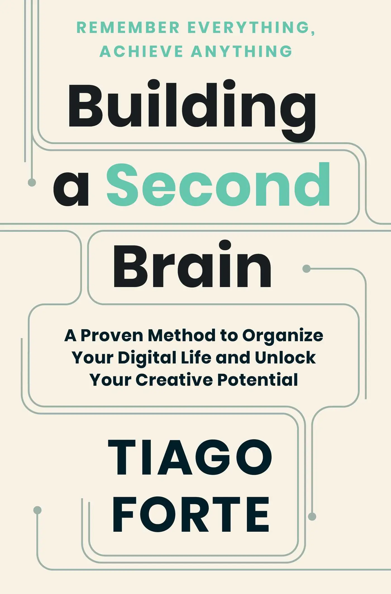

+++
title = "《打造第二大腦 Building A Second Brain》閱讀筆記：第一第二大腦各司其職"
date = 2023-08-11

[taxonomies]
categories = ["閱讀筆記"]
tags = ["personal-knowledge-system"]

[extra]
rating = 9
image = "building-a-second-brain.webp"
+++

# 一二三言以蔽之

隨著資訊時代的演進，現今有半數以上的勞動者都可被視為「知識工作者」。與其讓大腦忙碌於處理及記憶大量的資訊，透過架構數位第二大腦讓資訊外化，解放大腦的能量回歸到思考與創造的核心角色。

# 書籍

# 為什麼我會讀這本書

自從閱讀 [How to Take Smart Notes](@/reading-notes/how-to-take-smart-notes/index.md) 之後，我就熱衷於筆記系統。離開了使用好幾年以資料夾架構為主的 Evernote，投入當時初探頭以連結為基礎的筆記軟體——Roam Research。使用 Roam Research 做筆記很自由也很快樂，透過增加連結，很容易找回以前的筆記。在跨領域的知識被連結起來的時候，產生滿足的多巴胺使我能不斷投入地於筆記系統。當時追蹤了好幾個在新型態的筆記軟體上開創筆記方法的人，Tiago Forte 就是其中一個。

Tiago Forte 提出的 The CODE Method 和 The PARA Method 的概念其實以前都有看過。但過往的我好像著重在做筆記本身，滿腦子思考著「如何降低寫筆記的摩擦力」、「如何讓我更容易找到過往的筆記」。當時只把這兩個方法記錄在筆記系統裡，沒有實際思考是否能把方法整合進我的系統裡。

直到今年相繼讀了「[Ernest PKM 個人知識系統 工作流程](https://www.ernestchiang.com/zh/posts/2023/ernest-pkm-workflow/)」和吳秉儒的「[我的個人知識管理系統](https://pinchlime.com/blog/my-personal-knowledge-management-system-2023/)」，發現我相對缺乏的是目標；享受寫筆記的過程而沒有實際上運用這些筆記達到什麼成果。

Tiago Forte 的「打造第二大腦」一直在我的待讀清單中，剛好就趁這個機會閱讀，希望能整理屬於我的第二大腦並使用它輔助解決生活中的難題以及達成生活中的目標。

# 我受益最多的地方

## 第二大腦

第二大腦不只單純是一個筆記軟體或儲存空間，更重要的是它存有我們篩選過的內容，每個人都會透過自己的經驗發展出獨一無二的第二大腦；相較於從品質不一的網路中大海撈針，第二大腦保有著與我們有連結的重要資訊。

當我們不依靠第二大腦的輔助來思考生活中的問題時，我們憑藉著記憶與直覺，會容易受到可得性偏差及近因偏差的影響，近期的想法和記憶會大大影響了我們的決策結果。若我們不斷的累積想法在第二大腦裡，我們可以透過搜尋與瀏覽和跨時空的自己對話，做出更全面的思考與判斷。

> 你的獨特觀點或可補綴人類襤褸織物的某些微小破洞。
>
> —— Ryder Carroll，《子彈思考整理術》

## Tiago Forte 的 The CODE Method {#the-code-method}

CODE 方法是由四個步驟：Capture、Organize、Distill、Express 取首字母組成的方法，主要在描述資訊工作流，從收集、組織、萃取、到產出。

* Capture：收集對你有意義、產生共鳴的資訊。

*要有意識地選擇資訊，要專注就要忽略更多。*

* Organize：組織資訊，讓資訊更容易使用。

*以專案導向，搭配 The PARA Method 讓資訊透過適當的擺放方式創造更大的價值。*

* Distill：萃取出知識的精髓，方便使用。

*用自己的語言描述精髓，成為自己的知識。可參考書中提到的累進式摘要，一層一層的萃取出重要的部分。*

* Express：利用你獨特的成長與學習歷程，分享你的獨到見解。

*書中建議盡可能把時間和能量投注於創造，而不要將其耗用於消費資訊。*

詳細可參考：[The 4 Levels of Personal Knowledge Management](https://fortelabs.com/blog/the-4-levels-of-personal-knowledge-management/) 或本書

## 十二道最愛的難題 Twelve Favorite Problems

透過思考「什麼是我始終感興趣的問題」來探索對自己真正重要的事物。列下十二道對自己最重要的開放性問題，可以時時回顧目前正在做或未來打算要做的專案，是不是有助於解決自己的難題。設下自己的北極星，為自己指引方向。

我也寫下了[我的十二道最愛的難題](@/blog/my-twelve-favorite-problems/index.md)，也歡迎你跟我分享你的難題。

## 獲取資訊的原則

在資訊過載的時代，與其怕得不到資訊，不如該擔心被過多沒價值的雜訊淹沒。

在獲取資訊之前，可以參考書中提到的原則：
1. 是否對我有所啟發？
1. 是否派得上用場？
1. 是否與我息息相關？
1. 是否令我意想不到？

吸收資訊的目的是使我們的思想更完整，不需要閱讀與自己所知相似的資訊來強化我們的確認偏誤。

## 專案導向

過多的資訊會分散我們的注意力，當我們在執行某項專案時，我們只需要保留與專案相關的資訊，專注在我們所設立的目標。

Tiago Forte 是利用他的 The PARA Method 來達到這個目的。

## Tiago Forte 的 The PARA Method {#the-para-method}

PARA System 是由 Projects、Areas、Resources、Archives 等字的字首所組成。方法的核心是建立有彈性、有不同優先次序的檔案系統。
* Projects：近期專注的專案
  * 有明確的結束條件。
  * 有時間範圍。
* Areas：對自己來說重要的議題
* Resources：未來可能會使用到的素材
* Archives：其他
  * 已完成的專案、不再感興趣的領域、已無未來價值的資訊。

The PARA Method 讓我們可以快速分類一個筆記的去向。當我們處理不同的專案或領域時，有專屬的視野讓我們能專注在有價值的資訊上。這套方法並不只是綁定在單一系統上，而是當作一個抽象的概念橫跨在工作流裡的所有工具上。

詳細可參考：[The PARA Method](https://fortelabs.com/blog/para/)

## 豐足心態 {#abundance-mindset}

在資訊爆炸時代，特別在生成式人工智慧爆發後，可預見在注意力市場上的競爭會更加激烈，每分每秒都有新的資訊被產生。我們應該保有「豐足心態」而非「匱乏心態」，放下那些「自認生存所需，實則用不到」的事物，專注在有助於自己目標的事物上。

## 使用第二大腦需要培養的重要習慣

書中建議使用第二大腦有三個重要的習慣：
* 建立專案檢查表
* 定期檢討
* 行動

在「建立專案檢查表」和「定期檢討」上，書中都提供了蠻不錯的範本，可以從範本開始，漸漸修正為最適合你的樣子：
* [專案啟動檢查表](@/wisdom/templates/tiago-forte-project-kickoff-checklist.md)
* [專案完成檢查表](@/wisdom/templates/tiago-forte-project-completion-checklist.md)
* [每週回顧的範本](@/wisdom/templates/tiago-forte-weekly-review-template.md)
* [每月回顧的範本](@/wisdom/templates/tiago-forte-monthly-review-template.md)

與其一股腦地不斷衝刺，設定計畫與目標、檢視並檢討結果、定期回顧都是讓我們停下來覺察自己的狀態與更了解自我的重要時刻。

# 讀後感

如我在「為什麼我會讀這本書」所述，相較於專注寫筆記，現在我更期待可以從筆記中產生價值、解決生活中實際遇到的問題。我很喜歡「十二道最愛的難題 Twelve Favorite Problems」，我也花了時間思考對我重要的問題。我也喜歡「The PARA Method」的分類方式，我從中學習利用「Projects」和「Areas」不斷發展我關注的議題。

但從這本書上，我想關注的「發展想法」與「輸出」上獲得的東西還是比較少。書中有提到「構想列島」、「海明威橋」、「縮減規模」等等方式，但對我來說並沒有特殊的感觸，就沒有特別提及。

接下來的其中一個目標是不斷地改進我的「第二大腦」，使它成為我的思考好夥伴。我也想記錄我這一段個人知識系統改變的歷程。
