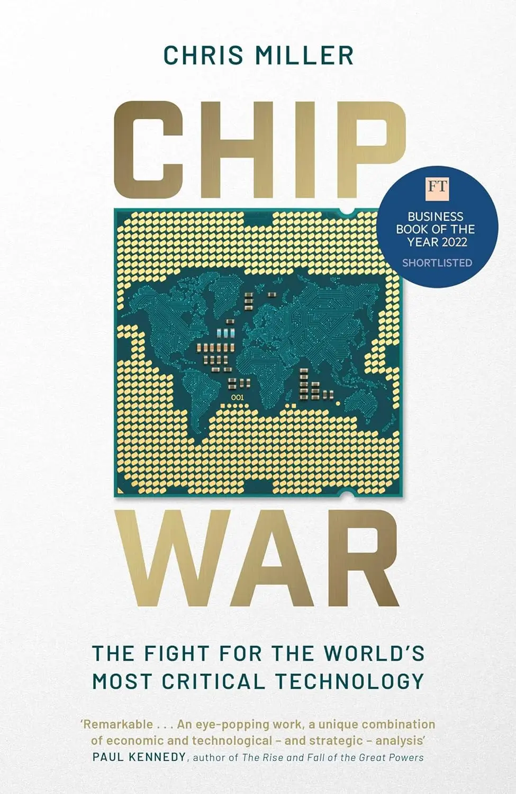
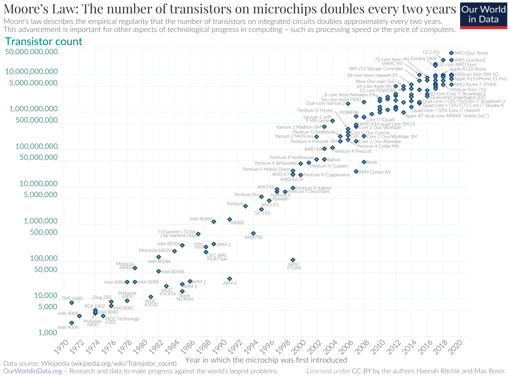

+++
title = "《晶片戰爭 Chip War》閱讀筆記：算力戰爭才正開始"
date = 2024-08-16

[taxonomies]
categories = ["閱讀筆記"]
tags = []

[extra]
rating = 10
image = "book.webp"
+++

# 一二三言以蔽之

從晶片發展的過去看到現在，看過程中各國的角力、難題與突破，思考未來的發展。

# 書籍

# 為什麼我會讀這本書

在 2023 出版中文版的《晶片戰爭》後，不斷耳聞此書的好評，其中一大原因或許是主題與台灣的主要產業——半導體——息息相關。受到身旁很多人的好評也使我將其列為優先閱讀的書籍。

# 摘錄觀點與延伸思考

本書將晶片的發展，從古至今切成八大段並拆成五十四章，切成小片的故事很容易入口，閒暇時看個兩三章，十分輕鬆無壓力，很適合現代碎片化時間的閱讀。

## 摩爾定律（Moore’s Law）

> 積體電路上可容納的電晶體數目，約每隔兩年便會增加一倍。
>

取自 Wikipedia

因為就讀資訊工程學系的關係，在就學期間就有聽過摩爾定律，但對它的認知充其量就是神奇卻很準確的預言，沒有深究過其原因，覺得是技術的發展帶動了這樣的增進速度。

這樣的想法果然過於天真。有部分的突破當然來自於科學發現，但背後在製造、供應鏈及行銷上也都要達到高水準，才有可能有如此驚人的進步。

## 晶片的發展：科學 → 需求觸發 → 成本降低 → 大爆發時代

晶片的發展，一開始是從科學出發，由 William Shockley 提出半導體材料理論，並在貝爾實驗室成功證明；而後 Jack Kilby 嘗試在一塊半導體材料上組裝多個元件，發明「積體電路」，讓硬體有更多組合邏輯的能力。

快速進步的需求大多都來自技術外的觸發點，蘇聯在 1950 年代中後期開展了太空計畫，在冷戰時期帶給美國極大的壓力。1957 年 10 月 4 日，蘇聯成功發射了人類史上第一顆的人造衛星——史普尼克 1 號（Спутник-1），這天也是 Robert Noyce 才和 Gordan E. Moore 叛離 William Shockley 的半導體實驗室、成立快捷半導體（Fairchild Semiconductor）後的第三天。美國決心投入登陸月球的太空計畫，需要為太空船設計導引電腦，是當時有史以來最複雜的電腦。使用快捷半導體積體電路的電腦，在體積和重量上都比當時用離散電晶體的電腦少三分之一，耗電量也比較低。

在為美國太空總署持續增加生產晶片的過程中，也使得快捷半導體能大幅降低成本，光是從 1961 年 12 月到 1962 年 10 月，單個積體電路的價格，就從 120 美元降至 15 美元。Robert Noyce 的願景是將運算晶片帶到民用市場。在 1960 年代中期，晶片的售價更驚人地降至 2 美元，為了能說服更多的客戶試用晶片，甚至不惜低於成本價出售。在 1968 年，民用市場的購買量就已經與軍方單位一樣多。Gordan E. Moore 提到：「Robert Noyce 的降價策略，與快捷半導體生產積體電路的技術一樣，都是重大的創新。」

後續 Robert Noyce 和 Gordan E. Moore 離開快捷半導體並創立了 Intel，創造了邏輯晶片（CPU）與記憶晶片（DRAM）。消費市場持續地擴大也引來更多人力的需求，並且是全球化的參與，在製造和供應鏈上有很多需要投入的位置。

後續的發展，亞洲國家，如日本、韓國和台灣都在其中漸漸扮演了重要的角色。能搶下重要的位置，不只是自由市場競爭的結果，更多是政府在背後大力撐腰，可以分為幾個層面：

1. **提供廉價資金**：政府大量提供便宜的資金支援產業，當市場動盪時，有政府支持的公司仍有足夠的資金承受虧損，打敗競爭對手。三星的一位高層曾描述這是一個「膽小鬼賽局」：兩台車彼此對衝，先轉向的就是膽小鬼，由另一方勝出。
2. **制定關稅、控制幣值**：強大市場的國家會祭出關稅保護自家的企業，而以出口為導向的國家會努力壓低匯率，使出口更有競爭力。
3. **制定法規、減稅**：針對產業訂定有利的法規與稅賦減免。
4. **培養人才**：更改國家教育方針，資助大學成立研究機構，發放獎學金。

## 張忠謀與台積電

談到半導體當然不能少了張忠謀與台積電。張忠謀出生於中國，二戰後遠走波士頓求學，錄取哈佛大學讀英國文學，後來覺得走技術有比較好的出路，才轉往麻省理工學院讀機械工程。1958 年加入德州儀器，並在 1968 年隨執行長赴台商討台灣設廠案，這才是他第一次踏上台灣。

1985 年，台灣政府聘請他擔任工研院的院長，讓他成為台灣晶片開發的核心人物。1987 年，台灣政府為台積電提供了 48% 的創業資金，而張忠謀說服荷蘭飛利浦出資並轉移生產技術與授予智慧財產權，以換取台積電 27.5% 的股份。

張忠謀以過去的經驗預測未來「無晶圓廠（Fabless）」的趨勢，創造了純代工不做產品的模式。如此，晶片設計公司不必擔心自己的創意會被剽竊，而省下龐大建造晶圓廠的成本，也使新創公司更能發揮創造力；台積電生產越多的晶片，也有更多機會能夠精進製程、提升良率，因此創造互相循環的正向飛輪。

## 全球化已死？

晶片產業的蓬勃發展，仰賴的是全球化的供應鏈在各方面的提升，不斷達成摩爾定律的預測。當自由市場遇到政府的力量時，會產生不公平的競爭劣勢，面對極權國家更是如此。近幾年地緣政治的考量越來越重要，歐美國家從脫鉤（Decoupling）到去風險（De-risking）、到美國的晶片禁運。世界上漸漸分裂成兩組供應鏈，搭配一些遊走於兩邊的國家。未來的世界會怎麼發展？也只能繼續看下去了…

# **讀後感**

這本書很完整地補足對半導體不夠理解的發展史，藉由這本書能暸解從技術的初始到今日的複雜狀況。台灣是地緣政治中很重要的一個點，了解歷史和國際情勢能使我們的思考更完整一點，非常推薦大家閱讀這本書。
