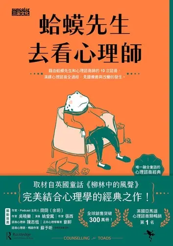
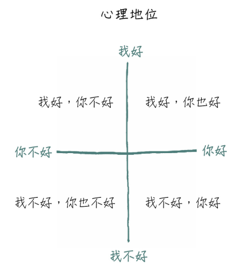

+++
title = "《蛤蟆先生去看心理師 Counselling For Toads》閱讀筆記：尋求改變之前，先認識自己"
date = "2023-01-24"

[taxonomies]
categories = ["閱讀筆記"]
tags = ["mental-health"]

[extra]
rating = 4
image = "counselling-for-toad.webp"
+++

# 一二三言以蔽之

本書以童話的方式，輕鬆帶入心理諮商的過程，是想一窺心理諮商很好的入門磚。

# 書籍

# 摘錄觀點

## 人格的來源

在故事的進程中，蒼鷺（諮商師）不斷地在輔助蛤蟆先生（諮商者）了解自己行為的來源。其實很多成年後的行為都是受到童年的經驗建立出的自我所影響。

在溝通分析理論中，定義了這三種建立自我的來源：
* **兒童自我狀態 (Child Ego State)**：父母是童年世界的全部，嬰兒所做的每一件事幾乎都會引發父親或母親的反應，這些的反應對孩子具有深遠的影響。這些早期的經驗是永遠無法否定或忘記的。
* **父母自我狀態 (Parent Ego State)**：模仿並實踐父母的價值觀，大多透過批評或教育的方式，試圖讓他人接受觀點。
* **成人自我狀態 (Adult Ego State)**：能突破從過往經驗所建立而成的兒童及父母自我狀態，以理性、不情緒化的方式來處理當下的狀況。

唯有在成人自我狀態，我們能突破過去經驗的枷鎖，利用我們的知識與技能去突破僵局。但沒有人可以迫使他人進入成人自我狀態，諮商只能透過分析與鼓勵的方式，讓當事人願意對自我負責，做出改變。

## 每個人都是自我人生的編劇師

雖然每個人都處於同一個世界，但每個人看到的都是不同的世界，每個人的信念與經歷會影響看世界的視角。

大家會在潛意識裡為自己寫好一套劇本，暗自地操縱各種情勢來符合設定好的劇情。

> 雖然演出悲情的角色有點痛苦，但如果跟著劇本走，至少可以省去思考和決定的麻煩。否則，和別人打招呼完要說什麼呢？

在 [Games People Play](https://www.goodreads.com/book/show/49176.Games_People_Play) 書中，作者整理了 36 種「人間遊戲」，就像這裡提到的劇本。

人們會根據心理地位設定不同的劇本。在「我不好，你好」和「我好，你不好」特別強烈。

以下列出在「蛤蟆先生去看心理師」有出現的一些經典劇本：

### 「我不好，你好」的劇本

#### Poor Little Old Me

低自尊的人通常覺得命運之神給他一副很差的牌，卻給別人比較好的牌。一般而言，這種心理地位的人覺得自己是受害者，所以會玩那些把自己變受害者的遊戲。有些人會竭盡所能地選擇記住那些悲傷和不愉快的事，而忘記或忽略美好的時光。

> Until you make the unconscious conscious, it will direct your life and you will call it fate.
>
> -- 榮格 Carl Gustav Jung

### 「我好，你不好」的劇本
#### 我逮到你了，你這個壞蛋。
#### 你為什麼總是讓我失望？
#### 你怎麼敢！

這類劇本的共通點都會發怒或批評別人。他們可以藉此證明兩件事：

* 別人在本質上無能又不可靠。
* 責備與懲罰別人是他的責任。

## 別忘了，「每個人都是自我人生的編劇師」

正如你可以為自己寫下受害者的設定，你也能重新幫自己定義新的角色。

我們可以**選擇**用什麼態度和方法回應遭遇的事情。但為什麼實行起來這麼困難呢？因為我們一般還是會根據習慣，針對生活上的刺激，做出類似的自動化回應。我們需要更有意識地去檢視自己的情緒和處理事情的方式。唯有越了解自己，有想要改善的動機，才能突破自己的習慣綁架。

# 讀後感

心理健康一直是一件我覺得很重要的事。相較於艱澀難以吞嚥的心理健康書籍，我覺得「蛤蟆先生去看心理師」是一本相當棒的入門書籍。書中帶入了簡單的溝通分析理論，讓人在閱讀中也反思自己的童年經歷。書本最後也有一些關於 EQ 的討論，期許自己在能好好獨立處理自己的情緒後，能達到共生的境界，可以擴大影響範圍，幫助周邊的人。
