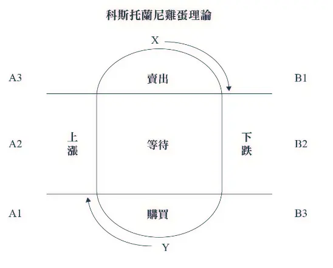

+++
title = "《一個投機者的告白 Die Kunst über Geld nachzudenken》閱讀筆記：反向操作但要順勢而為"
date = 2024-03-29

[taxonomies]
categories = ["閱讀筆記"]
tags = ["investment"]

[extra]
rating = 4.0
image = "og-image.webp"
+++

一二三言以蔽之
=======

可以把 André Kostolany 的「投機」定義為短中期的「投資」，是透過市場資訊分析、獨立思考的結果，不是跟風或賭博式的投機。我們可以透過認識他的雞蛋理論，理解他對證券交易心理學的看法。

書籍
==

為什麼我會讀這本書
=========

過往的投資比較偏向價值投資派，選好標的作中長期的配置。在穩定的工作狀態，把薪資不斷投入市場，資本額也就慢慢地堆升上去。大部分的時間情況是好的，從市場獲得投資報酬，報酬也會隨著資本額增加而提升。

但在 2022 的股市大跌就繳了很大一筆學費。以長期配置的心態，當然就是越跌越買，本多終勝。長期看起來或許是沒問題的，但那一年持續把積蓄投入，投入的結果就是隨著舊有的庫存股越賠越多，每個月的虧損都比薪資多，對於心理狀態其實不太健康。當時發現自己對投資的認知不足以應付這種情況，而且隨著穩定工作、資本額增加的狀況，同等幅度的下跌在投資後期的虧損是初期資本額低時獲利的好幾倍。

剛好在離職後有點時間投入學習更多投資相關的概念。當時是選了一門有關於右側交易（動能交易）的線上課程，補足另一側缺乏的思維。課程中用科斯托蘭尼雞蛋理論（Kostolany's Egg）當作操作方法的基礎理論，就開始讓我對這本書有了興趣，在結束課程後也閱讀了這本書。

摘錄觀點
====

André Kostolany 是誰？
-------------------

André Kostolany 是一位享譽盛名的股市投機大師，人生大部分時間在德國和法國度過，被譽為德國證券界教父。Kostolany 擅長捕捉市場時機，憑藉其獨到的投資眼光和大膽投機心理，在資本市場上賺取了龐大財富。他提出了著名的「雞蛋理論」，闡釋了投資心理學的重要性。Kostolany 的投資哲學強調獨立思考、勇於承擔風險和把握時機，對於現代投資者來說，其理念和做法至今仍有重要的借鑒意義。

### 他的金錢觀

書中有一段提到他對「百萬富翁」的定義：「不依賴任何人，以自己的資本，就能滿足自我需求的人。」是否擁有一百萬元不是重點，重要是經濟獨立。經濟獨立可以增加自由的寬度，但要注意，也會受到邊際效益的影響，所以要想清楚你和金錢的關係。

-   不要變成「守財奴」。過分吝嗇不會成為百萬富翁——不管是從物質，還是從智慧上看。

-   要喜歡賺錢但不要狂熱。對錢的狂熱會導致病態的貪婪，或病態的揮霍。對許多人來說，真正的刺激不是擁有金錢，而是賺錢。

> 金錢像海水，喝得愈多，覺得愈渴。
>
> — 叔本華 Schopenhauer

### 投機對他的意義

他說自己不是喜歡投機賺錢，而是這代表自己和別人有不同的見解，並且被證明是正確的。這點和許多投資大師如巴菲特（Warren Buffett）、查理蒙格（Charles Thomas Munger）、甚至常聽的股癌都相同🤣。

Kostolany 對投機的定義
-----

在閱讀這本書之前，我覺得投資偏向長期對價值的信仰，而投機是偏向短期對價格的賭博。一般人的論調似乎也貴投資而賤投機。

我跟作者相同的點是在時間上，作者也把「投資者」定義為「證券市場中的長跑者」，但他對「投機者」的定義是「三思而後行的證券交易人士，能夠準確預測經濟、政治和社會的發展趨勢，並從中獲利。」而在市場中沒有中心思想、偏賭博式的買賣者，他將他們稱為「證券玩家」。

他認為投機者要關注各種基本因素，如金融和貸款政策、利率、國際局勢、貿易收支、經營報告...等等。投機者像是新聞記者和醫生的綜合體，要收集、分析資訊，而做出診斷，並根據狀況修正診斷。

Kostolany 的投機理論
-----

### 成為固執的投資者

André Kostolany 定義投資者和投機者都是固執的投資者。並引用 Von Moltke 的「勝利不可或缺四要素」，當作投機是否能成功的關鍵。

-   金錢：關鍵不是擁有多少財產，而是資本是否完整，是否有被迫償還的債務。

-   想法：對錯不重要，但每次都要三思而後行，要有想像力。~~投機也是想象的世界。~~

取自《葬送的芙莉蓮》動畫第二十一話

-   耐心：要相信自己訂下的策略，堅持直到結束時反思。

-   運氣：結果無法強求。如果運氣沒來，耐心被消耗完，還是得失敗。

如果沒有這四樣，就無法把經驗轉化成成就。

> 一個懂得很多的笨蛋，比無知者還要加倍愚蠢。
>
> — Molière

### 觀察證券市場

#### 投資最看重是普遍的趨勢，其次才是選股

在指數上漲過程中，即使是最差的投機者也能賺到一些錢；而在指數下跌的過程中，即使挑到好股票的人也賺不到錢。

其中我最喜歡作者用「主人與狗」來形容證券價值與價格之間的關係：

> 有一個男子帶著狗在街上散步，像所有的狗一樣，這狗先跑到前面，再回到主人身邊。接著，又跑到後面，看到自己跑得太遠，又再折回來。整個過程裡，狗就這樣反反覆覆。最後，他倆同時抵達終點，男子悠閒地走了一公里，而狗跑來跑去，走了四公里。

換句話說，如果主人（價值）走向我們期望的方向，狗（價格）再怎麼跑，我們能獲得正報酬的機率就比較高。轉化這樣的道理，我們可以：

-   選擇基本盤穩定成長的公司，有穩固的價值。

-   關注利率變化、國際情勢，選擇景氣好的時候投機。

#### 科斯托蘭尼雞蛋理論 Kostolany's Egg

擷取自書中

在任何投機市場裡，每一次的行情大漲和大跌都由三個階段構成：

-   修正階段

-   調整或相隨階段

-   過熱階段

可以細部劃分為六個階段

-   A1：修正階段（成交量小，股票持有人數量很少）。

-   A2：相隨階段（成交量和股票持有人數量增加）。

-   A3：過熱階段（成交量異常活躍，股票持有人數量大，在 X 點達到最高）。

-   B1：修正階段（成交量小，股票持有人數量逐漸減少）。

-   B2：相隨階段（成交量增加，股票持有人數量繼續減少）。

-   B3：過熱階段（成交量很大，股票持有人數量少，在 Y 點達到最低）。

仔細想想其實跟大家常會提到的擦鞋童理論（Shoeshine Boy Theory）一樣——連擦鞋童都在討論股票的話，就代表已經過熱，之後會反轉。

### 不要當空軍

André Kostolany 的第一個理由是，空軍賺的是痛苦錢，這種痛苦是別人的痛苦，是精神上的一種墮落。雖然或許有些人喜好這一味（？

另外他提及影響證券市場的最重要兩大因素就是和平情況與經濟發展，而在這兩點上他都是看好長期走多的趨勢：雖然世界還是有少數的戰爭，但從二戰後整體世界的和平基本上是受到保障的；而經濟成長受到大眾對高標準生活的渴望，加上取消金本位增加的貨幣流動性，也是長期樂觀的。

### 不要尋求投資建議

> 投機是種藝術，而不是科學。
>
> — André Kostolany

為什麼不要尋求投資建議？有兩個原因：

-   投資是很個人化的事：每個人對於投資風險的考量和本身的價值觀都不同，所以很難給予最適合你的投資建議。

-   注意委託代理問題（Principal-Agent Problem）：如果來自是投顧從業員的建議，要確保他的利益方向跟你的是否一致，而不是只是想推銷給你購買。

André Kostolany 的十律與十戒
---------------------

最後分享作者在書中提到的十律與十戒，或許你可以從中提取適合自己的金科玉律。

### 十律

一、有主見，三思後再決定：是否應該買進，如果是，在哪裡，什麼行業，哪個國家？

二、要有足夠的資金，以免遭受壓力。

三、要有耐心，因為任何事情都不可預期，發展方向都和大家想的不同。

四、如果相信自己的判斷，便必須堅定不移。

五、要靈活，並時刻考慮到想法中可能有錯誤。

六、如果看到出現新的局面，應該賣出。

七、不時查看購買的股票清單，並檢查現在還可買進哪些股票。

八、只有看到遠大的發展前景時，才可買進。

九、考慮所有風險，甚至是最不可能出現的風險，也就是說，要時刻想到有意想不到的因素。

十、即使自己是對的，也要保持謙遜。

### 十戒

一、不要跟著建議跑，不要想能聽到秘密訊息。

二、不要相信賣主知道他們為什麼要賣，或買主知道自己為什麼要買，也就是說，不要相信他們比自己知道的多。

三、不要想把賠掉的再賺回來。

四、不要考慮過去的指數。

五、不要躺在有價證券上睡大覺，不要因期望達到更佳的指數，而忘掉它們，也就是說，不要不做決定。

六、不要不斷觀察變化細微的指數，不要對任何風吹草動做出反應。

七、不要在剛剛賺錢或賠錢時做最後結論。

八、不要只想獲利就賣掉股票。

九、不要在情緒上受政治好惡的影響。

十、獲利時，不要過分自負。

讀後感
===

投資真的是很個人化的事情：遵循不同原則，會各別有人賺錢；遵循相同原則，也會有人賺錢、有人賠錢。細節與時機操作的不同，對於結果會有很大的影響。其實在線上投資課所學到的和閱讀這本書的所得有點衝突，雖然都共同用了雞蛋理論：在動能交易上，看到交易量升高是加入市場的訊號，但雞蛋理論的過熱階段卻是該退場的時機。

去年底在上完線上投資課後有嘗試將課程提到的方法實際在市場上操作，前期大賠了一波。但在過程中記錄每週的操作結果，思考可以做什麼調整還是蠻有幫助的，證券市場或許就是得繳學費才能學到東西，如 Kostolany 的座右銘所述：「投機中賺的錢是痛苦錢，先有痛苦，然後才有金錢。」

操作一段時間後，雖然沒辦法整理出很明確的方法論，但好像也有點收獲，或許要等下一次的熊市才是真正考驗的時刻吧。

