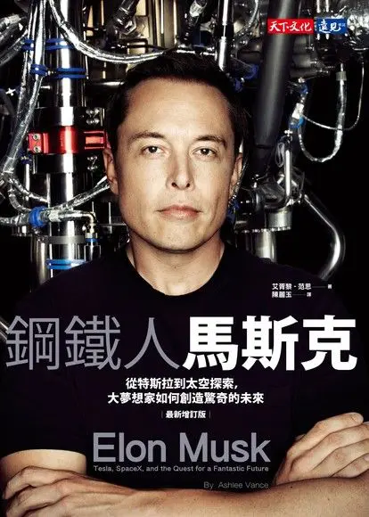
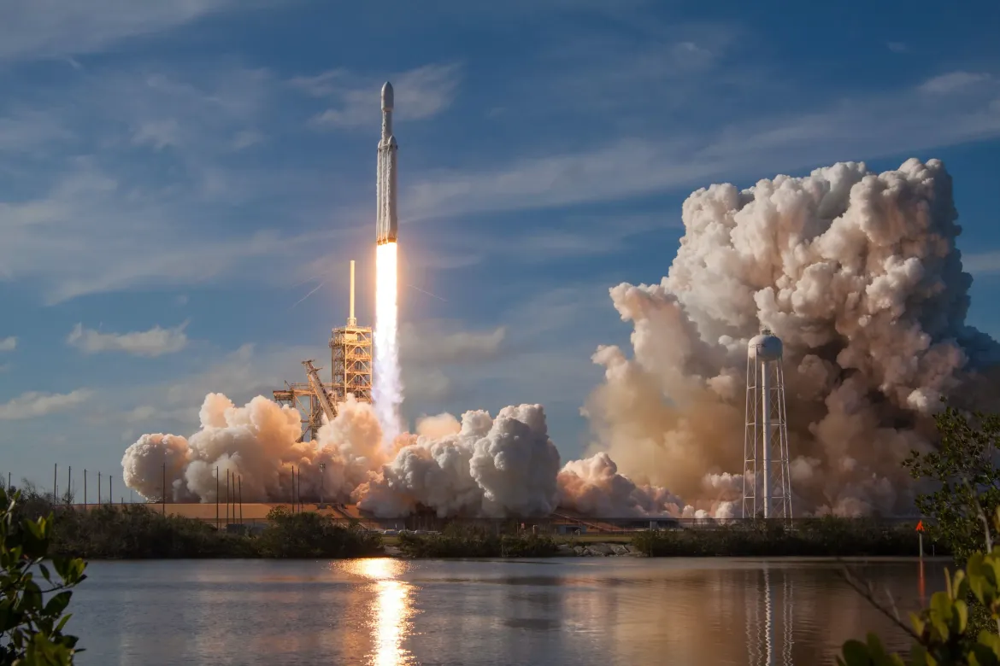
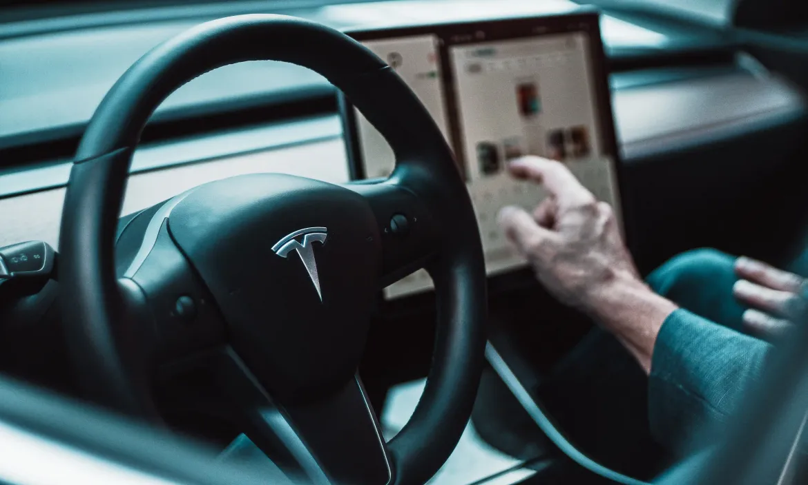
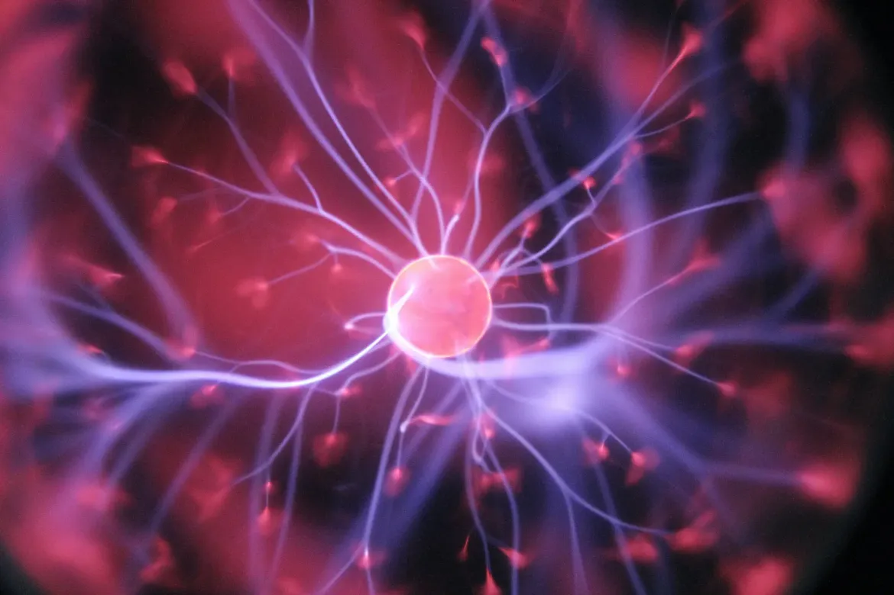
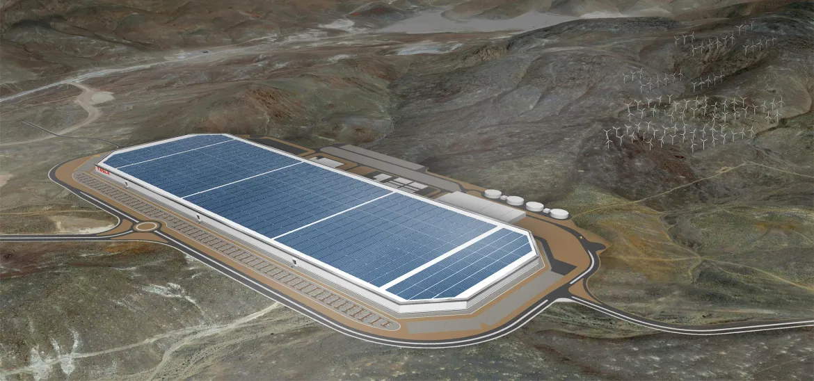

+++
title = "《鋼鐵人馬斯克 Elon Musk》閱讀筆記：在火星用腦機介面奔馳電動車"
date = 2022-05-24

[taxonomies]
categories = ["閱讀筆記"]
tags = []

[extra]
rating = 4
image = "elon-musk.webp"
+++

# 書籍

# 前言

Elon Musk，相信近幾年你對這個名字一定不陌生，世界首富、SpaceX 與 Tesla 的 CEO、Boring Company 跟 Neuralink 的 founder、甚至他充滿話題性的 Twitter。Elon Musk 近十年的個人成就，絕對是創新的代表人物之一。

Elon Musk 經手的公司都在近幾年有炸裂性的成長，各個公司乘載的價值都不容小覷。

# 摘要
## 正在創造人類歷史的公司
### SpaceX

在難以入門的航太產業，一塊一塊拼湊出自製的火箭，也做出大量的創新，使得火箭推進器可以被重複使用，大大降低火箭發射的成本，在可見的未來應該能看到更多在太空上的發展。

也發展了低軌道衛星網路 Starlink，一方面可以為偏遠地區或受限制區域提供網路，一方面也能作為未來火星計劃的通訊基礎。近期在烏俄戰爭中提供 Starlink 的服務讓烏克蘭部分區域恢復通訊，也是佔盡了新聞版面。

Photo by SpaceX on Unsplash

### Tesla

轉變過往汽車公司專注於組裝和行銷通路，在汽車上實現大量的創新，除了與電動車較為相關的自動駕駛技術外，Tesla 還包含了太陽能發電公司 SolarCity、最大再生能源鋰電池製造工廠 Gigafactory、全球充電站網路、還有專門為 Tesla 使用情景設計的車用晶片與作業系統。每個主題都不是簡單的小題目，Tesla 一間公司卻能涵蓋全部，如此的跨領域的成功為 Tesla 帶來了良好的整體設計也大幅降低了製造成本。

Photo by David von Diemar on Unsplash

### Neuralink
腦機接口也是一個未來感十足的題目，人類是否能藉由在大腦中植入晶片，處理及回應腦波訊號，而近一步突破大腦的限制呢？Neuralink 當前目標著重於腦部癱瘓患者的治療，一旦成功，將大幅增進對這項科技的想像。

Photo by Hal Gatewood on Unsplash

## 現代鋼鐵人
究竟什麼樣的特質讓 Elon Musk 能夠創造如此高的價值？我們可以透過這本專訪 Elon Musk 的傳記一探究竟。

### 願景 (Vision)

所有有偉大成就的人，都立下激勵人心但難以達成的願景，在無限賽局中不斷驅使著自己往前。

「讓人類成為跨星球的生物」是 SpaceX 的終極目標，為了達成這樣的偉大目標，過程中的痛苦都是養分，達成的各個里程碑也讓人興奮，吸引了世界頂尖的一流人才一起創造歷史。

### 工作道德（工作狂）

> 人類應該試圖讓世界更美好，因為反之毫無意義。
>
> -- Elon Musk

人生短暫，你可以選擇揮霍度日，可以細細品嚐當下，也可以燃燒生命為世界做出最大貢獻。「忠於理想，全心投入」就是 Elon Musk 面對生命短暫的態度。

### 授權

如果要達成偉大的夢想，除了本身是一個超人外，還得需要眾人的配合。只要你有能力，Elon Musk 就很願意給你機會。SpaceX 的 Hollman 提到當時還不到 25 歲就被委以重任，給了當時的他很大的自信。但 Elon Musk 也是相當嚴格深究細節的人，你一定要做好完整準備，不能只是報告問題，而是要全盤了解並提出解決方案，但 Elon Musk 也會確保幫你清除路上的絆腳石。

Elon Musk 這樣的個性，也讓員工產生「馬斯克崇拜」的神化作用：員工們害怕馬斯克、崇拜馬斯克、願意為馬斯克賣命，三種衝突的感覺同時存在。SpaceX 的前主管也形容這種工作氛圍像是「永動機」，靠的是「不滿足」和「永恆希望」混合在一起的奇妙動能。

### 整合 (Synthesis)

Elon Musk 另一個很厲害的地方在於他有跨領域的能力。同時擁有軟體和硬體的能力，可以將有趣的軟體加到硬體上，使得特斯拉不只是一台汽車，可以透過軟體升級獲得新的功能。也能混合科技與商業，從物理性質分析問題、推估時程、成本分析、成本最佳化、商業模式，可以實際上將科技轉換成可營利的模式，在這實踐創新上有莫大的價值。

> 對於我們不太了解的事物，直覺並不可靠。
>
> -- Larry Page

而交疊跨領域知識所產生的視野，可以讓我們更清楚看到前往成功的道路。

# 讀後感

在軟體業界工作多年，職涯早期總覺得技術能力是唯一評斷價值的標準，隨著職涯一年一年的成長，發現要成功推動一件重要的事，除了技術能力要夠高能解決難題之外，有全面性的思考，能抓到問題的要點，選擇適合當下狀態的解法，清楚的溝通與協調，這些軟實力都在其中扮演舉足輕重的角色。若要再提高自己的視野，就要把更多的東西納入自己的關注圈 (The circle of concern)，市場銷售經驗、商業模式、硬體可能性、科學知識，都能讓你突破現狀做出更全面的判斷。在這越來越複雜的世界，無論是領域特長的專業人員，或是經驗豐富的整合人才，都有機會在對的位置創造出自己的最大價值。

## 閱讀之餘的小發現

### Elon Musk 也是槓鈴策略的實行者！

還記得在《反脆弱》裡我們學到了拒絕中庸的槓鈴策略，我們應該盡可能把能量押注在正確的地方。這本書提及 Elon Musk 在求學階段也有類似的策略。「對於某些必修課程，我就是不明白為什麼要學，覺得可笑，我就拿個及格的分數。至於物理和電腦等，我就拿那些課程可以拿到的最高分數。」鎖住下檔損失，創造無限上檔利益。

### 這難道是碎形自我相似性 (Fractal Self-similarity) 的實作？！

前一段時間看 Elon Musk 的影片，主持人提到 Tesla 的 Gigafactory 長得超像晶片，讓我想到自然界很多的事物都會呈現我相似性，就像樹枝或樹葉。不知道 Gigafactory 在設計時是不是有考量類晶片排列能創造出工作效率？

from https://www.tesla.com/gigafactory

