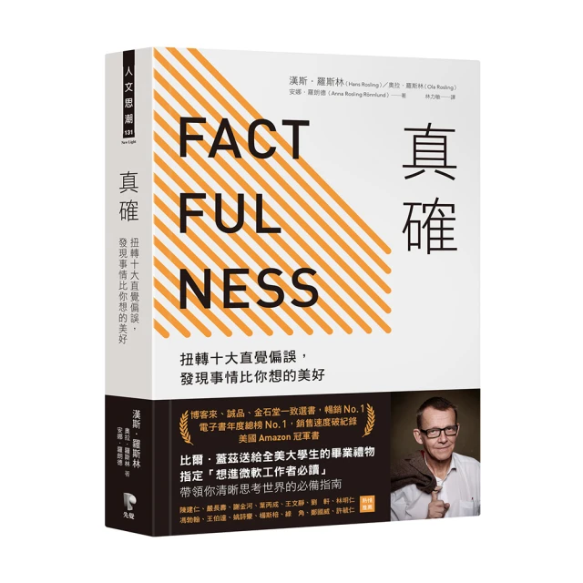
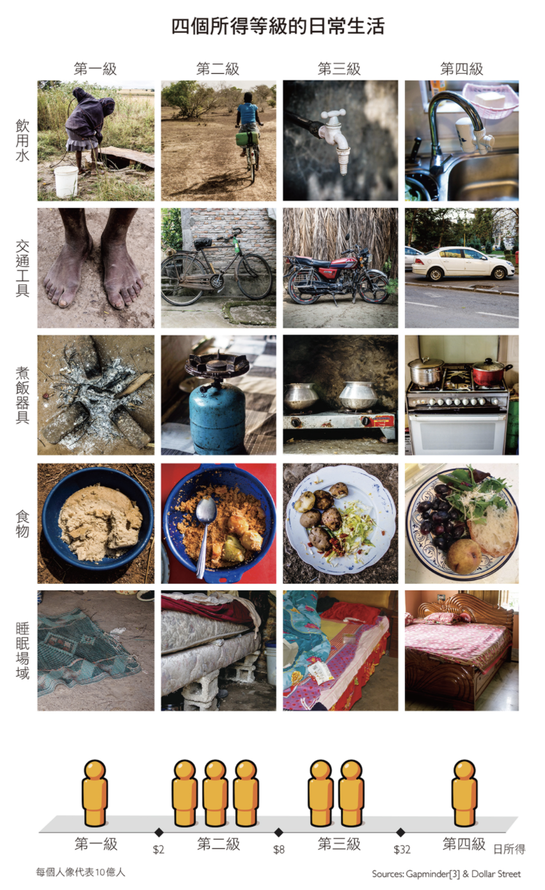

+++
title = "《真確 Factfulness》閱讀筆記：資料並不等於事實"
date = 2021-11-17

[taxonomies]
categories = ["閱讀筆記"]
tags = []

[extra]
rating = 8
image = "factfulness.webp"
+++

# 書籍

# 前言

好久沒有更新讀書心得。十月花了許多心力在搬家，需要時間重新整頓生活，平常培養的看書習慣也中斷了。不過搬家後的生活改變也是充滿收穫，從這篇開始重拾讀書的熱情吧。

# 觀點摘要

## 你對世界的認知有與時俱進嗎？

真確這本書目的在翻轉人們對世界的認知。除了長期旅居各國、關心世界文化局勢變動的人以外，大多數人對世界的認知都停在求學階段，但世界的改變從未停止過。本書的一開始直接丟出一組考題，藉由世界菁英的平均分數比隨機猜題還來的差，來證實大眾對世界的錯誤認知，有興趣的人可以試試看你能得幾分：[題目](https://upgrader.gapminder.org/)

## 問題出在哪裡呢？
作者指出了十大直覺偏誤，也都為各個偏誤舉出了相對應的例子。

簡單幫大家歸納為以下幾點：
* 想用簡單的規則解釋負責的世界
  * 只看平均值不看分佈
  * 用二分法，非黑即白
  * 對於趨勢圖，用直線想像後續的走勢
  * 只想找戰犯不想思考
* 用自己的世界觀點推論別人所在的世界
* 被有心人以誇大吸引眼球的資訊操弄認知
* 用個案以偏概全

也簡單給大家幾個應對的心法：
* 切勿在緊急時做出決定。先停下動作，深呼吸，再次思考。而真正需要在第一時間就要做出決定的情況其實沒那麼多。
* 不要只片面看別人提供給你的數字，他的數字只是為了講他的故事。
* 接受世界正在改變，接受自己的認知不足，虛心接受新知。
* 多採納來自不同人的意見，世界很複雜，個別的觀點都只是事實的其中一面。

## 二分法簡單過頭？至少先謹記四分法
相較於簡單地用二分法分別富貴及貧窮的國家，作者利用收入級距把世界分成四個等級，並建議大家可以以日常生活方式來認識各個收入級距的世界，而不只用簡單抽象的概念。

取自書中截圖

作者也建了 [Dollar Street](https://www.gapminder.org/dollar-street) 這個網站讓大家可以更方便地瞭解他人的生活 (雖然裡面沒有台灣😅)。

# 後記

在網際網路發達的現代，人們取得、甚至製造資訊的速度越來越快，要每個人都以最清晰的觀點去看待每件事情似乎越來越遙不可及。就算論調有輔以數據資料加以佐證，一般群眾也難以判斷是否誤用資料、是否只拿出部分事實操作認知。

在民主國家的選舉特別明顯，操弄情緒、操作認知、把事實複雜化，讓群眾回到簡單的個人魅力與意識形態去做表決；更進一步地說，就算你想推動的是對大部分群眾、甚至地球環境有利的計畫，若不懂群眾心理，不懂得操作輿論，也只能消失在資訊的洪流之中。

究竟我們要怎麼做，有多少意見領袖、打擊假訊息的組織才能讓我們回到看事實的社會呢？
