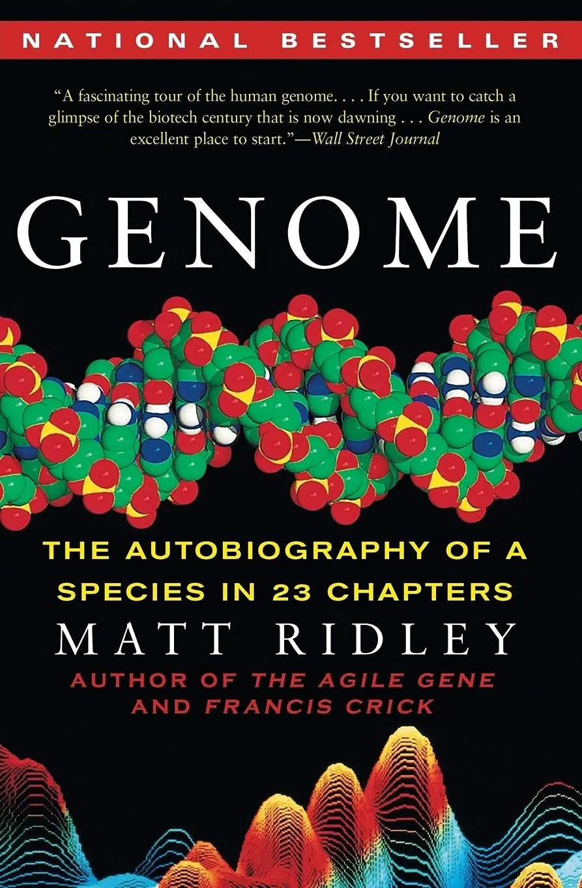

+++
title = "《23 對染色體 Genome》閱讀筆記：從生物的角度認識自己"
date = 2023-11-16
description = "透過《23 對染色體 Genome》，深入理解生命的奧秘，探討基因組與自我認知之間的關聯，解開基因對個性和行為的影響。"

[taxonomies]
categories = [ "閱讀筆記",]
tags = []

[extra]
rating = 9
image = "og-image.webp"

+++

一二三言以蔽之
=======

科學是文明的一環，是人類理解人生、接觸自然、探究生命的一個途徑。作者透過不同的主題切角，如生命、智力、本能、個性、疾病等，投射到 23 對染色體上，讓我們在了解染色體的知識時，用新學到的知識與我們舊有的所知重新做交互的想像。

書籍
==

為什麼我會讀這本書
=========

在拜讀完 [《窮查理的普遍常識 Poor Charlie's Almanack》](@/reading-notes/poor-charlies-almanack/index.md) 和 [《快樂實現自主富有 The Almanack of Naval Ravikant》](@/reading-notes/the-almanack-of-naval-ravikant/index.md) 後，發現兩人都很推薦 Matt Ridley 的這本書，也選做我跨領域知識的第一站。

摘錄觀點與延伸思考
====

解碼生命的奧秘
-------

在 2000/06/26 這天，由美國總統柯林頓在白宮與英國首相 Tony Blair 在唐寧街同時宣布完成人類基因組草圖。這是非常驚人的成就，在生命史上一個物種可以解讀自己的遺傳內涵。

{{ youtube(id="C22JlzHlLJQ") }}

> Today we are learning the language of how God created life. We are again ever more in awe for the complexity and beauty and the wonder of God's divine and sacred gift. With this profound new knowledge mankind is on the verge of gaining immense new power to heal. Genome science will have a real impact on our lives and even more on the lives of our children.
>
> —— Bill Clinton

> With the power of this discovery comes the responsibility to use it wisely. As wilth the greatest scientific achievements the ethical and moral questions raised by this astonishing breakthrough are profound. We all share a duty to ensure that the common prporty of the genome is used freely for the common good of the human race.
>
> —— Tony Blair

為了方便理解，作者將基因組比喻成一本書。

> 其中的二十三章，各稱為染色體（chromosome）。
>
> 每一章都包含好幾千個故事，稱為基因（gene）。
>
> 每一個故事都包含許多段落，稱為表現序列（exon），其間被插入了一些無意義的廣告，稱之為插入序列（intron）。
>
> 每個段落都由稱為密碼（codon）的文字所組成。
>
> 每個文字都由稱為鹼基（base）的字母所拼寫而成。

這樣的一本書，描繪了我們演化的過程，那充滿複製與突變的痕跡。從這本書中也可以探究更多的基礎知識，染色體、基因、DNA、RNA、蛋白質在生物學和遺傳學中的意義。我們可以更瞭解我們每日都在使用的身體——這個機器的設計，同時間我們也必須暸解，基因組雖然定義了整體的設計，但當我們需要修正這個機器的問題時，基因組並不是唯一可以解決的點。

遺傳力非決定論
-------

從這本書中，我們可以理解基因會影響一個人的本能和傾向，像是每個人身上都有被寫好的程式碼。

但是一個基因的作用並不是這麼絕對。有些基因只在部分的時間作用，像是語言本能在童年時期會爆發，而在成人階段後會關閉。Derek Bickerton 研究在外國勞工被帶到夏威夷之後發展出土洋混雜語言，這種語言缺乏一貫的文法規則與形式，但卻在下一代的兒童學會這樣的語言之後，發展出自行變化規則、文字次序和文法，大大提升了語言的使用效率，而形成了「克里奧爾語」（Creole）。

基因定義了腦中與身體裡產生化學反應的傾向，傾向影響我們的個性，例如血清素會影響神經過敏性和衝動、多巴胺會影響積極度與好奇心等。但社會性的階級地位與環境也會影響基因的表現，能藉由啟動或關閉基因來影響身體激素和行為。基因與環境間彼此複雜的關係是一片混亂，而不是單向的決定論。

但了解個體差異性，理解部分個性是天生的，也證明對修正個性是有幫助的。

大腦的神經可塑性是更高速的演化機器
-----------------

> 本能是由基因所決定的行為，學習則是被經驗修正的行為。

相較於基因組數十億的鹼基，大腦擁有百萬兆個突觸。透過演化來修正基因，通常需要好幾代的繁衍才會發生，但人類的大腦是更高速的演化機器，透過經驗的修正，大腦的神經可塑性能帶來比天擇更快的適應性。我們能透過意識的控制，去學習自然遺傳無法傳遞的事物，例如閱讀、存款、購物，讓生活過得更順利。藉由強迫學習，我們將自己置放在一種選擇性的環境中，以期在未來我們可以用我們創造出來的「新本能」解決問題。

精準醫療
----

在閱讀這本書之後也很感興趣近期相關的發展。在人們對於基因定序的需求逐漸增強下，近年也發展了次世代定序 Next Generation Sequence，可以大幅縮短基因定序的時間與成本，甚至 [衛福部也在討論將次世代基因定序在 2024 年納入健保](https://www.mohw.gov.tw/cp-5013-58378-1.html)。未來在對癌症的治療與投藥的選擇上，除了參考家族病史外，可以利用基因的資訊，精準地選擇合適的藥物和治療方法。

但由於基因的多效性與多元性，大部分的遺傳疾病其實都是多基因加上環境飲食等因子交互影響所致，這些複雜度在未來還需要投入更多資訊去分析。

讀後感
===

閱讀不同領域的書籍常常會被大量的新資訊充斥腦袋，需要去篩選與自己有關或是對未來有價值的資訊。在 Generative AI 爆發的 2023 年，可以透過對話的方式與 AI 互動學習、探索知識，感覺是個人學習大爆發的新時代。

另外要怎麼把知識運用到生活之中，建立出自己的多元思維模型也是另一個挑戰，近期會繼續利用 Roam Research 和 Heptabase 等個人知識庫，搭配寫作來繼續嘗試。就讓我們一起用「學習」這個人類的超能力，持續突破自我吧！
