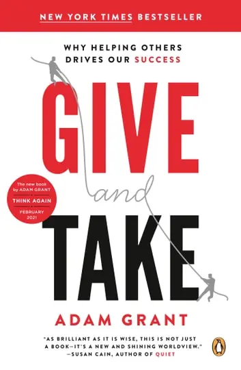

+++
title = "《給予 Give and Take》閱讀筆記：施比受更有福"
date = 2023-11-26
description = "《給予 Give and Take》閱讀筆記：了解如何成為利他者并在長期賽局中獲得成功，探索給予行為對個人和社會的積極影響。"

[taxonomies]
categories = [ "閱讀筆記",]
tags = []

[extra]
rating = 9
image = "og-image.webp"

+++

一二三言以蔽之
=======

給予能帶來長期的雙贏，一起把餅做大、贏得長期賽局。成為利人利己的給予者，從貢獻中獲得回饋與影響力，促進給予，讓世界變得更好。

書籍
==

為什麼我會讀這本書
=========

讀書會選書。

摘錄觀點與延伸思考
====

成功的人的第四個特質
----------

一般相信成功的人都有三項特質：努力、能力和運氣。

作者認為有第四個極為重要但常被忽略的特質––我們與他人互動的方式。

索取者、互利者、給予者
-----------

作者根據與他人互動的方式，將人分成索取者、互利者與給予者。

**索取者**：個人利益至上，善於操縱及利用他人，擅長向上管理。在短期競爭的賽局擁有優勢。

**互利者**：以互相為原則，幫助別人希望獲得回報。會犧牲利益來懲罰自私的索取者，也會獎勵慷慨的給予者。

**給予者**：重視團體利益大於個人，願意犧牲自己成就他人，容易被利用。

根據 [一篇對 Adam Grant 的訪問](https://thinkers50.com/blog/give-take-interview-adam-grant/)，一般而言，組織內的互利者是最多的，大概佔 55~60%，其餘索取者與給予者各佔了一半。可以透過 [這個測試](https://adamgrant.net/quizzes/give-and-take-quiz/) 來知道自己在各個角色的比例各是多少。

如上述各角色的特色，可以得知雖然索取者在短期競爭中有優勢，但長期的索取行為會漸漸地被互利者討厭，讓組織越來越不健康。作者在本書中強調給予者對團隊的重要性，不只能提升團隊的安全感，也能建立起團隊的信任感。除此之外，給予者也是良好的導師，可以帶領團隊一起進步。

最上也最下
-----

在許多的調查中，最成功、最有生產力，金字塔頂端的員工是給予者，但在金字塔最下層的卻也是給予者。

### 如何避免成為索取者的墊腳石，而成為成功的給予者？

整理書中提到的方法：

-   不僅利他，也要想到利己。利己不代表自私，創造雙贏才能持久。

-   避免「影響力真空」——能覺察到他人的痛苦，幫忙但卻不能感覺有解決問題的狀態。

    -   尋找其他能獲得影響力的事物，提供自己持續給予的能量。

    -   增加回饋的來源，納入更多相關的數據與證據證明自己是有助益的。

-   確認自己給予的動機是正向的，說服自己能夠持續給予。

-   當遇到索取者時，要調整給予的品質，讓自己更像個互利者。

-   塊狀給予，把給予的事項集中在一段時間內一起做，可以比較有感給予的強度，也讓其餘的時間可以專注在其他的事物上，不被零散的他人需求給中斷。

給予的好處
-----

紐約大學心理學者 Jonathan Haidt 提出，對給予的獲取者來說，受他人的給予行為感動會產生提升感（Elevation），這種作用能「替心靈按下『重置按鈕』的效果，能清除憤世忌俗的感覺，將其轉換成道德激勵的感受。」會讓人暫時變得不自私，也希望將這種意念化成行動。進而達成讓給予有「傳染」的效果。

除了獲得給予行為的人外，主動給予的人在大腦獎勵中樞活絡的程度其實與獲得給予一樣強烈。光是出現慷慨的想法時，保護性抗體唾液免疫球蛋白 A（Salivary immunoglobulin）就會明顯增加，加強我們的免疫系統。「付出」也被達賴喇嘛列在達成 [喜悅的的八大支柱](@/reading-notes/the-book-of-joy/index.md#eight-pillars) 之一。付出所創造的傳染性漣漪，可以讓彼此互助，讓世界變得更好。

讀後感
===

要促進給予的行為，環境相當重要。讓環境更資訊透明化、讓給予行為得到強化，才有機會讓給予形成正向循環，可以從身旁的小環境慢慢做起。

最後推薦一個網頁遊戲「[信任的演化](https://audreyt.github.io/trust-zh-TW/)」，可以看「互動」對於社會會造成什麼影響，是一個很有趣、能夠稍稍理解人類互動與賽局理論的遊戲。
