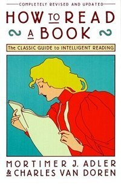

+++
title = "《How to Read A Book》閱讀筆記：四種閱讀層次"
date = 2020-03-15

[taxonomies]
categories = ["閱讀筆記"]
tags = []

[extra]
rating = 6
image = "how-to-read-a-book.jpeg"
+++

# 書籍
## 評分
3.0/5.0

# 前言
在臉書上看到朋友分享這本書，提到了在第一次閱讀時，看不懂到覺得自己智力有問題，但在閱讀很多書後，每每重複翻閱此書時，都覺得發現新大陸。其實我自己一直沒有培養出看書的習慣，總是斷斷續續的，忽然一時興起想看看這本書，看看能否掌握出讀書的要點。

這本書其實很久了，初版甚至已經是發行在 1940 年，而在 1972 編訂出新版，針對當時對於閱讀這件事的改變增加一些內容。目前看了前面幾章，覺得其實在 2020 年的現在還是蠻受用的。

# 摘要

## 看書？在這資訊爆炸的時代？

在當時 1972 年的時空，其實除了書籍外，廣播、電視產業也蓬勃發展，有越來越多的媒介可以用來吸收資訊。在 2020 年的今天更是如此，各種影音串流平台、社群平台、podcast，網際網路的壯大，讓我們更容易吸收資訊，只有時間不夠的問題。但大多數的媒體特性，無法保留給閱聽人太多思考的空間。而書籍提供讀者思考的空間。作者也能利用書籍的結構性，鋪成、設定章節引導讀者了解他想闡述的知識，能更有系統性的傳播一個知識。我覺得其實 MOOC 也能達到類似的效果，而且互動性更強，但目前所涵蓋的廣度還遠低於書籍。

## 四種閱讀的層次

作者將閱讀分成四種層次

* Elementary Reading（基礎閱讀）
  * 閱讀的前置準備，其實比較集中在小學階段，學習認字、語法，至少到達可以自己閱讀的程度。
* Inspection Reading（檢視閱讀）
  * 重點放在速度。其實不只有網路資訊爆炸，光書籍的選擇也五花八門，快速判斷一本書值不值得閱讀，值不值得“認真”的閱讀，是這個層次的重點。所以在埋頭進入一本書之前，從標題、目錄、序言，試著找出作者主要的論點，快速掃瞄過重要的章節，來決定該不該認真地看這本書。
* Analytical Reading（分析閱讀）
  * 完整而全面性的閱讀，目標是為了要充分理解一本書所要傳達的知識。針對不同種類的書籍，作者後續也提供了不同的讀書方法。
* Syntopical Reading（主題閱讀）
  * 當閱讀量累積越來越大時，當我們專研某種主題時，我們會閱讀大量的書籍做比較式閱讀。已經是有點進入做研究的階段了。

# 後記

目前大概看了 1/5，後面幾乎都著重在分析閱讀跟主題閱讀，後續再分享比較細節的部分。
