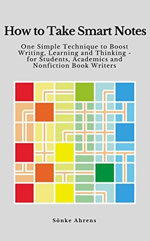

+++
title = "How To Take Smart Notes"
description = """
評分：4.5/5.0
Link-Based Note Taking 關鍵心法
"""
date = "2020-09-13"

[taxonomies]
categories = ["閱讀筆記"]
tags = ["筆記"]

[extra]
rating = 4.5
+++

# 書籍
## 評分
4.5/5.0

# 前言
我看書真的好慢，兩個月才又看完了一本。不過算是第一次把一本英文書完全地讀完。

這次會開始看這本書是因為二月底的時候從 Hacker Newsletter 不小心看了這篇文章：https://fortelabs.co/blog/how-to-take-smart-notes/（不過這次回去看，發現就是推廣這種筆記系統相關的人，原來是業配 (x）

今年年初對於學習忽然有點迷惘，對如何讀書、如何做筆記的書都開始有點興趣。之前其實也看了如何讀書的書，但還沒讀完就退坑就沒寫心得了 XD

# 摘要
## Slip-box
一些書其實也有在提一些做筆記的方法，但這本書比較關鍵的是介紹做筆記的系統。但其實也不是本書新創造的系統，而是上個世紀 Luhamnn 就在使用的 slip-box，他利用這樣子的系統做筆記、思考、發展了很多篇的著作。

不過看起來我還沒有做得很好，連打這篇心得文都有點困難 XDDD。

大概提一下這種新的筆記系統能解決什麼問題。像是過往筆記的方式：1. 寫在很多不同的地方，比如畫重點在書上、寫筆記在書上、有多個筆記本..等等 2. 筆記隨著時間越來越多時，其實就越來越亂，開始難以搜尋。

這個 slip-box 強調的重點是筆記間的 connection，其實每個不同的筆記都可能有概念上的相關，應該讓他成為一個網路，這樣也比較貼近我們腦袋在儲存資訊的樣子。而我們應該把我們感到興趣，平時的想法，都整理丟進這樣的第二大腦。當連結越來越多時，我們就會可以從中探索、發展我們的主題思考。

比較重要的概念是，當你寫下一個筆記時，你應該去思考你下次會怎麼樣把它提取回來、這個筆記跟什麼有關等等的…

那以前的 slip-box 其實他就真的是用一個木盒子儲存所有這些筆記，並手動建出了一個 index 跟 reference 的系統。

## 現代的 Slip-box
在閱讀這本書中，也發現幾個新的筆記工具是用這樣的概念，像是：

Scrapbox: 線上版、日本人開發的、免費、少了 graph view、比較沒人在討論。

Obsidian: 單機電腦版、免費、用 mark down 寫、在不同台電腦需要自己想辦法 sync。

Roam Research: 線上版、一個月試用、有 graph view。

Scrapbox 有用幾天，其實沒感覺到什麼缺點。目前是嘗試 Roam Research，或許會買幾個月繼續試試（就是想花錢，而且 Roam Research 剛拿到下一輪的融資，後續可能可以持續關注。

# 後記
大概用了快一個月，發現做筆記的方式還沒有辦法很成功轉換成關聯的方式，而且目前筆記的數量也還很少。如果之後有什麼突破性的發展的時候再跟大家分享。

