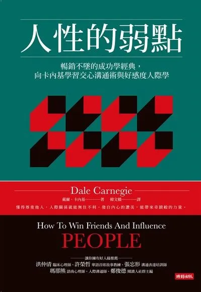

+++
title = "《人性的弱點 How To Win Friends And Influence People》閱讀筆記：以溝通共創雙贏"
date = 2023-01-02
description = "探索《人性的弱點》中的核心溝通技巧，學會以讚美、真誠與同理心共創互贏的關係，讓你在人際關係中如魚得水。"

[taxonomies]
categories = [ "閱讀筆記",]
tags = []

[extra]
rating = 6
image = "how-to-win-friends-and-influence-people.webp"

+++

# 一二三言以蔽之

人類是群居動物，生活上無法避免地充斥著各種的人際關係，人際關係影響著我們的生理與心理健康。這本書雖然是 1936 年就發行的，但書中的人際關係方法在現代社會中仍相當受用。

# 書籍

# 摘錄觀點

## 嘉贊以誠，不吝褒揚

Dale Carnegie 傳授最精華的秘訣，就是在溝通上加入讚美與真誠。在溝通時，我們面對的都是活生生的人，有情感、偏見、驕傲與虛榮，而不是單純理性的個體。讚美能夠強化好行為、降低他人的防衛機制。真誠才能贏來信任，建立更長久的關係

> Teach me neither to proffer nor receive cheap praise.
>
> —— King George V

## 實現雙贏才是溝通的宗旨

單方面的說服並不是溝通達到效益最大化的方式。透過換位思考，暸解對方想要得到什麼，教他們如何得到，試著以對方的角度解決他的問題。

## 把方法實現在生活中

書上提供了「人際關係的三大技巧」、「受人歡迎的六種方法」、「讓人贊同你的十二條法則」與「說服對方又不會引起反感的九種訣竅」提供給讀者根據所需去挑選適合的方法，但最重要的就是要實際運用在生活中。

我簡單總結在這些方法中共同的部分列出以下的工具庫，可以把這個工具庫放在心上，適時地拿出來使用。

**「以溝通共創雙贏」工具庫**
* **讚美**：強化好行為、降低他人的防衛機制。
* **真誠**：促進信任、給予真心有幫助的意見。
* **同理心**：換位思考，理解他人的處境。
* **提問**：以提問替代建議，自己領悟的道理永遠比別人教給你的更深刻。
* **傾聽**：讓對方感到反向魅力，更願意說出想法，更有機會理解他人。

# 觀後感

在 2023 觀看這本書，書裏很多例子其實略顯生硬，有些闡述的邏輯也不是很通順。與其一次整本閱讀，覺得如果把這本書當作遇到溝通問題時的工具書是不錯的選項。很多的概念到今日還是相當實用，雖然人類文明進步了很多，但或許人性的弱點還在一樣的狀態吧。
