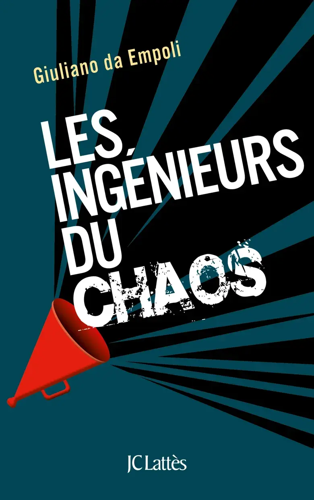
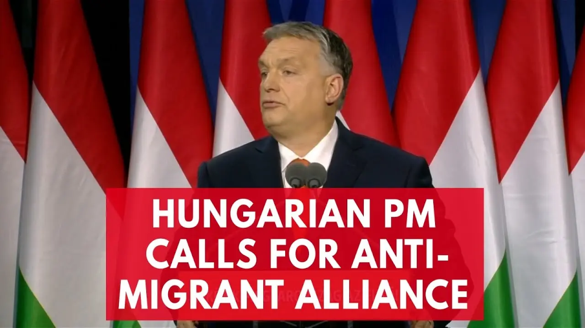
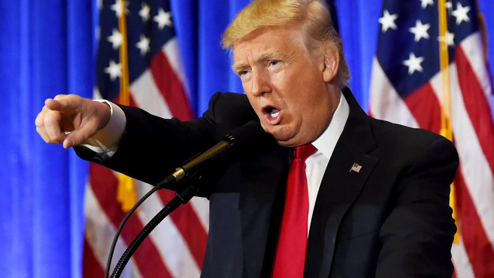
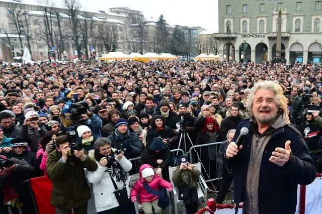

+++
title = "《政客、權謀、小丑 Les ingénieurs du chaos》閱讀筆記：在量子世界茁壯的民粹主義"
date = 2024-04-25
description = "《政客、權謀、小丑：量子時代的民粹主義》閱讀筆記探討量子政治如何引發歐洲民粹主義崛起與川普效應，揭示混亂工程師的驚人影響力。"

[taxonomies]
categories = [ "閱讀筆記",]
tags = [ "politics",]

[extra]
rating = 8
image = "og-image.webp"

+++

一二三言以蔽之
=======

量子時代的政治充滿多元與不確定性，是民粹主義最適合生長的環境，觀察近年歐洲民粹主義的崛起與川普效應，探討混亂工程師如何使民粹主義壯大。

書籍
==

為什麼我會讀這本書
=========

忘記最當初把這個書加入書單的契機是什麼了。

在台灣 2024 的總統大選，柯文哲的崛起也是個很有趣的現象。強力的空戰宣傳和個人魅力都讓我對新政治的書有點興趣，當時就開始閱讀了這本書。

摘錄觀點與延伸思考
====

喜歡這本書最後用量子政治做總結，跟物理一樣，從古典走到了量子。在這篇閱讀筆記裡，我也想從古典時代發生了什麼問題，而為什麼民粹主義可以在量子時代蓬勃發展這個主軸來敘述。

古典政治：權力制衡，相信人人都會憑客觀事實作出理性決定
---------------------------

在古典政治，人們用選舉選出民意代表與行政官員組成政府，分別擁有不同的權力來相互制衡。為了求取民意的最大化，政治人物會傾向往中間靠攏，在不同的議題裡妥協以換取各自的政治利益。

### 不斷升起的怒火

二戰後，在歐洲的共產國家開始學習西方主流的民主自由主義，期盼能解決共產主義的問題，保障對傳統與宗教的尊重。當這些保守主義者逐漸了解西方準則包含多元文化主義以及同性婚姻，再加上近幾年的危機、極端伊斯蘭恐怖主義，以及移民問題，再次加強對西方的幻滅，帶來對古典政治激進的逆轉。

政治菁英不時爆出的腐敗問題也使社會累積更多的憤怒；傳統政治的緩慢在「點擊之間快速就得到滿足」的現代科技面前尤其使人不耐。

社交平台改變了人類的互動，易得的人際互動提供了大量的多巴胺使人上癮，但使用越多越發現社交平台提供廣闊美好生活的可能性，相比自己的生活，讓人感到無力與匱乏，進而轉變成對自己生活不滿的憤怒。

### 怒火沒有出口

流竄在人民中的怒火，在中世紀歐洲能透過狂歡節的形式發洩。人民在狂歡節中可以不分階級地扮演國王、主教、僧侶等上層身份角色，並故意做出一些違背常規、調侃現狀的行為。

在現代只能透過社交平台抒發，不算是個有效的出口。左派政黨曾嘗試接下這個怒火，把能量累積起來，投入更宏偉的計畫之中。但這是股不容易控制的能量，一方面必須不斷地挑起激情和怨恨，但同時又得要控制這些情緒，讓它們不在個人層次的事件上糟蹋，而用於實現總體計畫上。而強調進步與自由的極端左派份子，過度強調政治正確也導致言論審查問題，壓抑的氛圍使得群體的怒火更無處宣洩。

這樣的怒火持續累積在社會之中，而懂得使用這股能量的人出現了...

量子政治：每件事都已暫時的方式，依據與其他事物的關係來定義
-----------------------------

順利承接下人民的怒火的是民粹主義政黨，控訴傳統政治只在乎自己的利益輸送，不服務沈默的大多數。透過創造共有但不一定存在的問題、提出過度簡化但具體的解法，給人一種「若不是權力被只顧自身利益的政客把持著，問題早就解決了」的印象。透過大量煽動個體的怒火，即使整體論述有矛盾也無需在意，以簡單的對立訂立了明確的基礎——庶民對抗菁英。

> 政治呢，首先就是認明敵人是誰。靠著指出敵人此一核心行動，政治路線得以建立，在鬥爭中並肩團結的人組成了社群。
>
> —— Carl Schmitt

以貼近選民、無經驗的新政治人物打破舊有政客的形象，提供溫度與真實感；使用貼近選民的語言而不用在意失言，凸顯他們不受拘束的言論自由與獨立思考。

我們可以從近年來在全球政治出現的民粹主義風潮，理解民粹主義背後的運作原理。

### 2010 以來的匈牙利：創造對立

匈牙利由 Orban Viktor 搭配負面選戰大師 Arthur Finkelstein，透過分眾行銷、精準打擊的手法，精細分析人口組成，在初選投票的投票所對選民進行出口民調，以分辨出不同的群體，對他們傳播不同的訊息。

> 在政治裡，你感覺到的真實才是真的，現實是什麼並不重要。
>
> —— Arthur Finkelstein

選戰中最關鍵的操作是創造了匈牙利不存在但能引起共鳴的移民問題。當時歐盟宣布了一項解決湧入義大利與希臘的難民分攤計畫，匈牙利要接收一千兩百九十四人，算是微不足道的數字。但 Orban 依循著 Machiavelli 所說的「絕對不要放過任何一場危機」，透過宣傳與大型海報張貼運動，將這個事件放大成一個公投事件。2010 年，Orban 勇奪 57.2 的選票，有四分之三的匈牙利選民選擇了右派或極右派政黨。

### 2016 的美國：川普現象

明顯的失言和被拆穿的謊言，在過往的政治裡不是個好策略，但川普現象顛覆了這種假設，這些失言與謊言使支持者更感覺他的真誠。

{{ youtube(id="xzsCuP1ooLI") }}

如壽司坦丁的這個影片所解釋，川普成功創造選民的「正當性危機」——覺得自己所屬的社會群體，正在被當前的政治體制所忽視；自己重視的意識形態與價值觀正在被主流的政治文化給壓抑。

因此，當川普出現失言及謊言時，傳統媒體立即反擊提出質疑，但反而掉進了聲量被運用的陷阱裡。更多的政治評論家、華盛頓的圈內人士和知識分子日復一日的批評，更坐實了川普是能代表邊緣底層群眾怒火的掌旗人，代替他們對抗菁英體制；也使得極端的意見充斥在公共辯論之中，此消彼長的網路論戰使得真正重要的問題被淹沒。

> 永遠別讓人無聊。
>
> —— 川普 Donald Trump

### 2018 的義大利：五星運動（Five Star Movement）的螞蟻窩模式

義大利五星運動政黨的崛起大大展現民粹主義如何利用演算法和魁儡將聲量最大化贏得選戰。五星運動黨最早是由行銷專家 Gianroberto Casaleggio 與喜劇演員 Beppe Grillo 共同創立，藉由網路對政治帶來革命的行銷專家搭配有血有肉、魅力無法擋的魁儡產生的數位政黨。

> 我對政治沒興趣，我感興趣的，是民意。
>
> —— Gianroberto Casaleggio

五星運動從部落格建立群眾的基礎，每天 Gianroberto Casaleggio 的助理會選出十則最值得關注的評論，Casaleggio 會閱讀、重新構思、撰寫每天下午發表的貼文，談論庶民最在意的議題，包括對政治人物貪污腐敗、大企業濫權舞弊、勞動環境脆弱...等等。

在社群逐漸發展後，透過「Meet Up」平台讓群眾能夠輕易組織談話與聚會，只要連上線就能「參與」政治。吸引那些早已遠離傳統政治、心繫環保與勞動議題的左派年輕人，表達對傳統政治貪污腐敗的不滿。

最終 Gianroberto 與他的兒子 Davide 調教出五星運動的組織模式：表象開放、立足於基層，實際上卻完全由高層封鎖與控制的架構——「螞蟻窩模式」

> 螞蟻，遵循著為每隻蟻量身訂做的一套規則。這套規則確立了一個很有組織但缺少中心的結構。每隻螞蟻都對整體情勢、對牠移動的空間，以及對其他螞蟻做出反應。
>
> —— Davide Casaleggio

螞蟻窩模式要行得通，要滿足以下三個基本條件：

1.  參與者必須要多

2.  彼此的邂逅必須不期而遇

3.  必須對整體系統的性質渾然不覺

對基層的參與者而言，網路是公民參與的革命工具，能將權力從政客手上奪回給一般的人民；對五星運動的菁英而言，網路是控制工具，用大數據輔助政治目的，能由上而下發動革命，達成如《一九八四》作者所提出來的「歐威爾式（Orwellian）––控制思想的獨裁政治」。

{{ youtube(id="oe64p-QzhNE") }}

五星運動政黨沒有願景，而是用演算法找尋有搞頭的主題以攫取最多共識，快速滿足政治消費者的需求。檯面上的政治魁儡是由沒有經驗與能力的人組合而成，離庶民很近，富有親切感且容易替換。五星運動黨會要求議員將電子信箱及社群網站的個人密碼都上繳，完全控管議員們的數位生命。五星運動黨在 2018 義大利大選成為國會第一大黨，並與聯盟黨成立聯合政府。

### 2018 的英國：脫歐爆出的劍橋分析事件

2016 的川普當選和同年的英國脫歐都跌破很多人的眼鏡，隨著劍橋分析事件的爆出，隱藏在背後的「混亂工程師」被搬上檯面。

一直以來，科學家都夢想著能將社會管理簡化成數學公式，社會學一開始被定義為研究社會現象的科學，試圖去發現當中的法則。

> 如果你想在政治路途上步步高升，別雇用政治專家或發言人，雇用物理學家。
>
> —— 英國脫歐運動領袖 Dominic Cummings

在 Facebook 有越來越多使用者且功能越來越完整後，使用者的習慣、偏好、意見、甚至情感，都變成可測量的數據。加上 Facebook 提供的相似受眾篩選器（Lookalike Audience Builder）功能，混亂工程師可以利用這個功能找出那些潛在的可能被說服的選民。最後再透過 Facebook 精準投放的功能，以客製化的訊息，慢慢地餵養能觸動情緒、有機會改變選民想法的廣告。

Facebook 原本為這三樣為廣告投放所設計的功能，搖身一變成為最強的政治宣傳工具。精準投放的結果形成了「狗哨政治（Dog-Whistle Politics）」，每個人接收到的資訊都不同，當主人吹口哨時，只有少數個體會察覺並明白這些招喚，而其餘的個體都不會發現。這樣子的宣傳手法不易被他人發現、不容易做事實查核，也很容易否認指使關係。

可以在 Netflix 上觀看 [《個資風暴
：劍橋分析事件 The Great Hack》](https://www.netflix.com/browse?jbv=80117542) 或是透過這個比較短的 TED 分享更了解這個事件。

{{ youtube(id="OQSMr-3GGvQ") }}

政治上的改變
------

傳統政治需要往中間靠攏，透過妥協以取得大多數人的共識，溫和穩健的思想家有機會聚攏數量最多的人；如今，密集的人群被打散成彼此分離的小集合，能以精細的方式去接觸、點燃每個群體的情緒的混亂工程師，搭配上能調起群眾激情的戲劇化領袖就會是最強的吸票機。

人類社會是個複雜系統，只要初始條件有些許不同，就會可能產生極大的變化。在過去，厲害的政治領袖可以嗅出政治上的風向，提出相對應的對策；如今，混亂工程師利用社交平台提供大量數據，透過分析、模擬與操縱，能夠更清楚看見大趨勢的變化。

科技不會停止，由社會帶動也帶動著社會，要了解的更多才能看到更多。

讀後感
===

雖然知道川普當選、脫歐等國際事件，但因為不在自己生活的重心上，當時沒有深入了解是什麼政經因素導致這樣的結果，在閱讀這本書後有了更多的了解。如同更理解科技就能更看清科技能帶來的效果，透過更瞭解民粹主義，也能更了解背後操縱的手法。

科技能帶來更多的可能性與更高的生產力，但同時間，若拿來做不好的事情，也很快就會破壞我們現有的一切。在科技越來越發達、資訊量越來越大的社會，每個人能接收的訊息會愈趨分散。尋找小族群並投放特定資訊的動作越來越難以被發覺，最終我們只會發現每個人對於現實的認知有愈來愈大的差異。

在劍橋事件後，對於社交媒體增加了一些隱私權的限制政策，也有一些廣告的資金披露規則。但新科技同時不斷地再演進，特別是生成式人工智慧在影像及聲音的創造都愈來愈真實，未來客製化的訊息真偽會更難以辨識。

除了不斷宣導媒體識讀的重要性外，將好的、正確的資訊不斷傳播、提高它們的聲量，也是每個公民應該參與的事。

> 邪惡會獲勝，只要好人都不作為。
>
> —— John Stuart Mill
