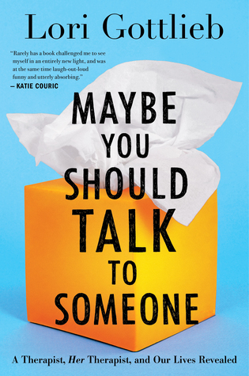

+++
title = "也許你該找人聊聊 Maybe You Should Talk To Someone：心理治療是外掛的覺察機"
description = """
評分：5.0/5.0
當一個心理醫生去看心理醫生的精彩故事。
"""
date = "2021-04-05"

[taxonomies]
categories = ["閱讀筆記"]
tags = ["心理治療"]

[extra]
rating = 5
image = "maybe-you-should-talk-to-someone.jpeg"
+++

# 書籍
## 評分
5.0/5.0

# 前言
好像是在暢銷書 X 本打 X 折之下買了這本書—「也許你該找人聊聊」，同時間也買了「成功的反思」。當時以書名作為選擇，先看了成功的反思，但實在難以咀嚼，就在某一個契機下開始看了這本書。

前面才看沒多少就覺得，「如果滿分是十分的話，我要給這本書十一分。」真的超棒。作者以非常生活化的敘事，塞滿了字字珠璣、含金量高的腦袋重擊。可怕的連譯者都很棒，穿插很鄉民式的用詞，讓閱讀中充滿著驚喜。真的是我近期裡面最喜歡的一本書。

# 摘要
## 作者是好萊塢前編劇
作者本身的經歷也非常跳躍，從好萊塢編劇，接觸到急診室，讀了醫學院，轉成心理治療師，她的經歷應該也是使她能寫出這麼好的作品的一個原因，這樣的敘事方式，根本就是一個超好看的劇集。也似乎真的要拍成劇集了，令人期待。

## 心理治療金礦
故事主軸，一個心理治療師因為突來的分手事件而轉變成需要看心理治療的病人角色，是一個超棒的設定。在治療過程中，心理治療師、病人、甚至是學生的角色切換，各個病人間不同的問題，附帶了一堆心理學的知識，是一座不需要用力地挖掘，金子就自己不斷冒出來的金礦。

## 外掛「覺察」機
在整理筆記的同時，最近剛好在看「僧人心態」，有種兩本書連起來的感覺。要讓自己變好的關鍵要素之一，是要能「覺察」自己，不管是心情、想法、甚至是抗拒的事，要一層一層的挖掘下去，才能找到內心的寶藏。而「心理治療師」就是一個外掛的專業「覺察」大師，你不需要抽離自己，就有人用第三方的角色在看你，而且是充滿心理臨床經驗的高解析顯微鏡。

若你有困擾但沒有持續挖掘自己的勇氣，「也許你該找人聊聊」。
