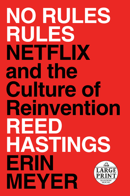

+++
title = "零規則 No Rules Rules – 打造你心中的黃金陣容"
date = "2021-07-03"

[taxonomies]
categories = []
tags = []

[extra]
rating = 4
+++

# 書籍

# 前言

今天看 Netflix，但不看影集，來看書。

# 摘要觀點

## 規則是人才的枷鎖

Netflix 從傳統的光碟出租，躍升到影片串流的強權，高人才密度和零規則是其中的秘訣。在網路泡沫需要裁員才能留住公司一線生機時，意外發現高人才密度組織帶來的好處。工作表現不管好壞都有傳染力，而高人才密度就是不斷加成的超強組織。

在高人才密度的背景下，Netflix 用零規則再將組織靈活度拉升一個層次。當公司成長到越來越大的規模時，通常我們就需要增加規則來防止不預期的狀況。你一定遇過亡羊補牢式的規則——「因為之前發生了 OOO 意外，現在要先經過 XXX 流程才能作這件事。」很多的規則在處理懶散、不專業和不負責任的員工。若你今天要打造的是高人才密度的超強隊伍，或許規則不是你的優先考量。

## Context not Control – 分散決策模式

若你今天擁有一個無敵艦隊，每個位置都有其領域擅長的專業人才，那你應該做的是讓所有人可以獲得足夠的資訊，在其位置可以做出最佳的判斷。這種分散決策模式，給予每個人決策的自由，伴隨著責任，但也代表組織對你的信任，這樣的自由度與成就感，增加了對工作的歸屬感，也提升了工作的產出與正向回饋。

對 Netflix 來說，這樣的零規則狀態，也是一步一步的嘗試來達成的。書中很多來自 Netflix 執行長 Reed Hastings 的觀點，在領導層級給了很多很棒的觀念。推動零規則，對組織成員來講也是有很高的不確定，帶來不安定感。Reed Hastings 強調要從領導階級建立安全圈，以身作則去實踐你想推動的文化。不放過零碎的互動細節也是建立關係中很重要的一部份。

## 高績效團隊不是家庭，是職業球隊

很喜歡 Netflix 把工作團隊比喻成一個職業球隊。在職業球隊中，若你的目標是總冠軍，你就必須去打造一個黃金陣容，湊齊各位置善於合作的好手們。當然也會有本季目標是節省資金展望未來的球隊，甚至是各種不同階級的聯盟。書中有句話跟我現在的想法很像：

> 工作，應該是在某一段時間裡，你是這份工作最適合的人選，也是最適合你的位置。

不一定人人都要去打大聯盟，也不一定每個人都想要加入像 Netflix 這樣的公司，但想清楚你的意圖，找到適合你的位置，發揮你的長才，建立你喜歡的團隊與文化。或許改天你有新的意圖，有新的機會，加入別的球隊也是很棒的選項。

# 後記

工作佔了人生中很大的比例，如何在這段時間過得開心，創造出意義，也是人生中重要的課題。

