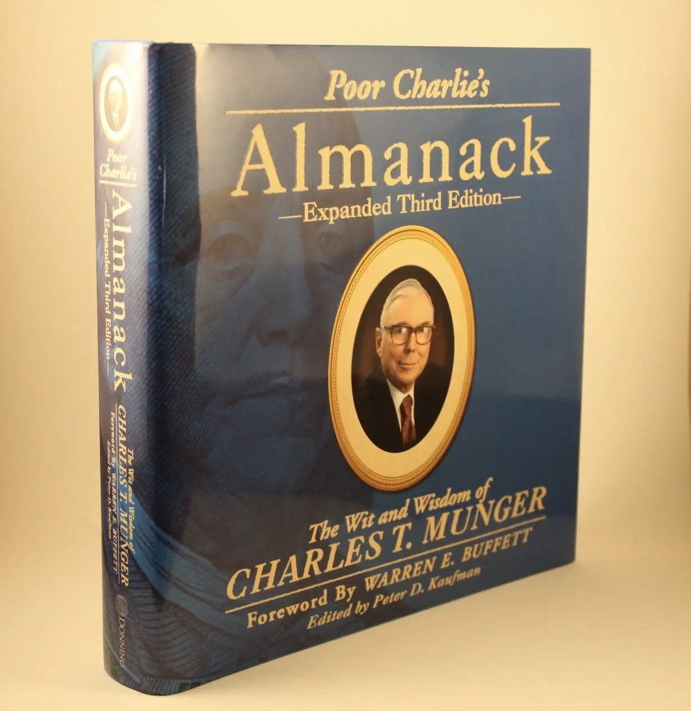

+++
title = "《窮查理的普遍常識 Poor Charlie’s Almanack》閱讀筆記：用多元思維模型認知世界"
date = 2023-10-31
description = "探索《窮查理的普遍常識》中，巴菲特合夥人查理蒙格的多元思維模型與能力圈理論，學習投資智慧，開拓心智視野。"

[taxonomies]
categories = [ "閱讀筆記",]
tags = []

[extra]
rating = 10
image = "og-image.webp"

+++

一二三言以蔽之
=======

本書聚集了巴菲特 Warren Buffett 的合夥人查理蒙格 Charles T. Munger 在投資上的精華思想——蒙格主義，包括**多元思維模型、能力圈理論、投資原則檢查清單**。也透過蒙格對各界的演說實錄坦率的語言中，學習他對各種主題更多的看法。

書籍
==

為什麼我會讀這本書
=========

-   [股癌 Gooaye](https://www.facebook.com/Gooaye?__cft__[0]=AZWv3Uo4G-NIcSm63SA9oupptgTJwC2LJEjYBX0Q2q0gethlOAqMzLF8o26A08XwO--_Ugn_yLf_2FeLQLz7iaqekJq_ZmlzfZXpyxUUl878_zAmsIwwZiIE0pQBGbpGHHA&__tn__=-UC%2CP-R) 曾經說過「[查理蒙格就是高清無碼的巴菲特](https://www.facebook.com/Gooaye/posts/1112933285797237)」，我們可以從在股神巴菲特身旁的查理蒙格旁敲側擊學到更多的智慧。

-   Naval Ravikant 也提到他得到最好的心智模型有一部份是來自查理蒙格。

摘錄觀點與延伸思考
====

能力圈理論
-----

相較於全知全能，查理蒙格相信每個人都有自己的 [能力圈 Circles of Competence](@/wisdom/mental-models/circle-of-competence/index.md)。要清楚知道自己的能力圈的範圍在哪裡，在自己能力圈的範圍內，把握機會、全力出擊。

> 當你發現一記「好球」，卻無法用全部資金打擊出去，長期下來，結果也將和頻頻揮棒一樣糟糕。
>
> —— 李彔

多元思維模型
------

與 [《快樂實現自主富有 The Almanack of Naval Ravikant》閱讀筆記：實踐個人槓桿相同](@/reading-notes/the-almanack-of-naval-ravikant/index.md)，查理蒙格也在這本書提及多元心智模型的重要性。若只懂得少數專業領域的知識，會造成鐵鎚人傾向，做出不理智的決策。

查理蒙格強調要在腦中形成一個由各種思維模式構成的框架，然後將實際經驗和透過閱讀等得來的間接經驗，懸掛在這個強大的思維模式框架上。使用這種方法可以將各種知識融會貫通，加深對現實的認知，產生普世智慧。若我們能夠將多領域的觀點都帶入，就有可能產生「魯拉帕路薩效應 Lollapalooza Effect」，得到大量的回報。

每個人需要的思維模型清單會根據你要解決的問題、情境和需求而不同。但我們可以藉由參照充滿智慧的巨人們的清單來建立自己需要的思維模型：
-   [查理蒙格的多元思維模型清單](@/wisdom/lists/charles-munger-a-latticework-of-mental-models/index.md)
-   [Naval Ravikant 的多元思維模型清單](@/wisdom/lists/naval-ravikant-a-latticework-of-mental-models/index.md)

檢查清單
----

查理蒙格在本書也好幾次提及檢查清單的重要性。人們會有「不用就忘傾向 Use-It-or-Lost-It Tendency」，所以額外多花點心力幫重要的事情建立檢查清單，就可以在後續的使用上省下認知成本。查理蒙格也提供了他的 [投資原則檢查清單](@/wisdom/lists/charles-munger-investing-principle-checklist/index.md)。

人類誤判心理學
-------

查理蒙格總愛在這本書說他對心理學沒有研究，但在本書的第十一講：人類誤判心理學，他豁出去用了極大的篇幅來說明人類認知模式的重要性。人類雖然有了比一般動物更強大的腦力、建立起文明。但人類認知上還是是有很多強烈的認知傾向。這樣固定的認知傾向，正向來說帶來了秩序與相互合作的便利性，在社會中也會用宗教和道德觀強化大眾的認知傾向。但不可避免地，透過心理學的發展，人們對這些認知傾向也有越來越多的理解，也漸漸會有政經行為及科技利用甚至操控人們的傾向，如果對這些都完全不了解，就有可能會受到別人的操控而不自知。

第十一講相當精彩，很難用小篇幅涵括所有的內容，就當個引子讓大家自己去閱讀了。

讀後感
===

這本書的內容真的很多，不管是閱讀或是整理筆記時都相當痛快。整理了能力圈和多元思維模型的過程中，也讓我重新省思和知識的關係，我們必須得誠實面對自己已知和未知的部分，根據自己要解決的問題去補強自己的能力圈，專注在重要的事物上。

我也從這本書得到了更多持續閱讀的力量，本書其中一段查理蒙格用反向寫法寫了如何過「悲慘生活」的四帖藥方，其中一項就是「不理會他人的經驗，只從自己個人經驗獲得知識。」意味著如果放棄了閱讀，你就會少掉大量可以從他人快速得到的間接經驗、少掉了站在巨人肩膀上的機會。

我真的很喜歡這本書，推薦給大家！
