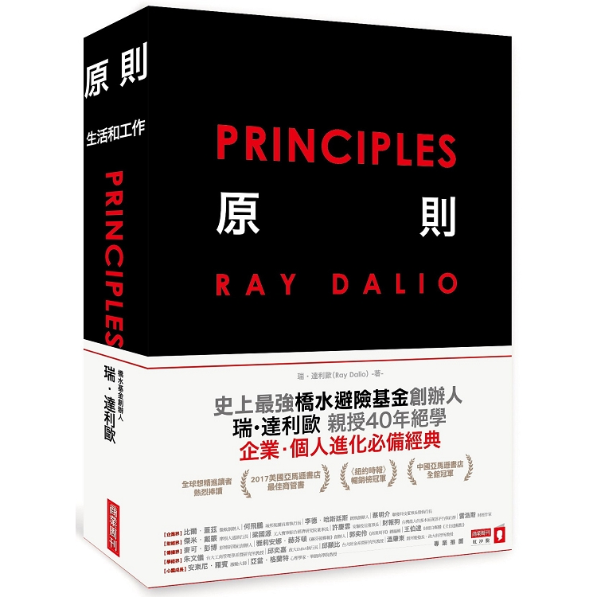
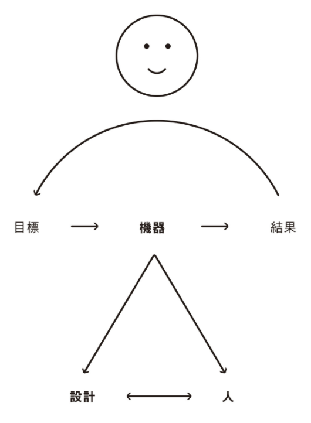

+++
title = "《原則 Principles》閱讀筆記：生活與工作的原則"
date = "2022-01-31"
updated = "2022-02-28"

[taxonomies]
categories = ["閱讀筆記"]
tags = []

[extra]
rating = 4.5
image = "principles.webp"
+++

# 書籍

# 前言
這次閱讀知名避險基金「橋水基金」創辦人 Ray Dalio 所寫的「原則」。我們在日常生活與工作中，每天都根據我們的價值觀、感性跟理性衡量中做大大小小的決策，若我們能為自己建立了一套原則，就能在每次決策後的省思中，累積出最適合我們待人處事的方法；當我們迷茫時，我們也能回顧自己的原則，做出最適合當下情境的判斷。

作者在本書中將生活的原則與工作的原則分為兩個章節，我從中挑出當中比較有共鳴的部分與大家分享，也很推薦大家閱讀這本書瀏覽所有的生活原則。

# 觀點摘要

## 生活的原則

### 把複雜的系統抽象成一台機器

取自書中截圖

Ray Dalio 在此書中，用了超多次「機器」這個字，從小型複雜系統如消化系統，到大型複雜系統如經濟系統，都可以用機器取代。我們藉由與機器互動得到結果，用結果來驗證及調整我們達成目標的方法：定義問題、診斷並查明問題根源、設計解決方案、協調能幫助你達成目標的人們。

從目標、機器、結果的循環，強調了滾動式修正的重要性，所有偉大的目標都不是一蹴可幾，從成功和失敗中的每一小步去省思，克服失敗的痛苦，才能達成偉大的成就。

在設計方面，從歷史和大自然來學習與了解系統是很有幫助的。保持開放且謙虛的姿態，徵求可信度高的人的意見，甚至可以練習以非直覺式的方式思考，幫忙自己突破盲點，找到最佳的方案。

而在人的方面，無論是自己或是能幫助自己的人，要明白每個人的思考方式和做事方法差別很大，要客觀衡量每個人的優缺點，把最適合的人放在最適合的位置。如果團隊中個人的弱點可以被其他人補上，就不算是弱點。

### 善用群體的力量

Ray Dalio 在生活和工作中，為了能客觀理解每個人的特性，用了多種不同的工具輔助分析：
* 十六型人格 Myers-Briggs Type Indicator
* Workplace Personality Inventory
* Team Dimensions Profile
* Stratified Systems Theory
* Big Five

我個人只做過十六型人格，未來有機會再來探索更多。

在了解團隊每個人的特質後，作者會製作每個人的球員卡，用來讓團隊可以很快速了解每個人的強項與弱項。在作者的經驗中，相同類型的人，在面對類似的問題，會有差不多的結果。若能提前了解每個人的特性，就可以避免一些可預見的問題。

了解每個人後，在做決策時實行創意擇優的方式。根據問題的不同，尋求在該領域可信度較高的人的意見，並以可信度加權來做最後的評估。Ray Dalio 也以自己曾被判定為有高度食道癌風險的經驗，最後透過參考多位該領域的專業醫生，從一度需要做高風險的手術，到後來發現其實有簡單療法就能解決的過程，來強調多收集意見做綜合評估的重要性。

### 用慈愛和毅力來訓練低層次的你

在這本書也提到高層次的你與低層次的你，同義於快思慢想中的 System 2 跟 System 1，也可以說成是意識與潛意識。從此書我也擷取了一些對我來說蠻有趣的觀點。

從原子習慣中，大家已經知道習慣的重要性，但在這本書中，強調可以利用習慣去培養低層次的你「自動地」做出可以追求符合「高層次的你」的目標的行為。導入目標的概念，感覺習慣的附加價值又更高了一點。

之前閱讀的很多書也推薦人們去做冥想，我也陸續從各種網路資源學習冥想，但一直還是不清楚冥想能帶來的好處。之前覺得專注於呼吸的目的是利用意識去覺察分心，在生活中如果分心的時候，可以利用覺察力回到專注的狀態。這本書也提供了我一個新的想法，他提到在冥想時，可以讓潛意識自由地湧出想法，再用意識的邏輯思考去檢視，反而在此時讓潛意識和意識搭起了橋樑，可以同時有潛意識擴散的自由和意識的邏輯，迸發出更多更棒的想法。

## 工作的原則

### 共事的原則

工作的原則中，有蠻多是生活的原則的延伸。從個人目標變成了公司的目標，所涉入在機器裡的人數通常也比達成個人目標所需來的多。而這裡所定義的原則，不只是當做個人行為的導引，更在多人合作時，當有不同意見及想法時，所能參考的最高標準。擁有明確定義的原則和方法，在當有歧見、衝突、或意見不同時，能回到大家共知的原則下去檢視、討論、得出解決方法。

### 以文化建立組織

組織在追求目標時，困難點是單體目標與整體目標的不一致，以及每個人價值觀與思考方式的不同。所以以文化為基底來建立組織是相當重要的，也必須要有各個中間層級的管理者或領導者，在大型組織中推動及尋求達成共識。Ray Dalio 提到當你在選擇關鍵員工時，要以價值觀、能力、技能這三者照順序去挑選，價值觀和能力相對來講都是難以培養或改變的，一定要找到適合推動你組織文化的幫手。

最近剛好在閱讀人類大歷史，當中也提及智人這個物種最大的改變是會創造虛擬的信仰，使得可以讓更多數的人為了共識或共同信仰一同合作，協力創造更偉大的事物，也跟這裡的概念相互呼應。

### 眾人的智慧

組織另外帶來的好處是，你有了很多不同想法與思考方式的人，而每種人各有其特長點。若你能在適當的問題徵求到合適的人的意見，相較於威權式的領導者，更有機會從眾人智慧中得到更棒的點子。

為達到這樣的目的，Ray Dalio 在橋水建立了創意擇優的制度。每個員工會先根據評量工具，像是十六型人格，簡單建立員工的棒球卡，並在組織內各個會議或決策中，記錄每個人是否成功解決問題，或是能有邏輯地解釋結論背後的原因，以此計算出每個人的可信度分數。這樣的分數會公開給所有的人，因此每個人在遇到特定的問題時，都可以找到該領域可信度較高的人幫忙。當決策出現歧見時，也能透過可信度加權，以加權後的最高分為決策推動共識。看似有點赤裸，但在高信任度的組織可以帶來槓桿式的效果。

### Be What You Are

在橋水也推動了「極度真實」和「極度透明」，跟之前閱讀的 Netflix 文化有些許類似。以信任和優秀的人才為底，人人就可以以直接和開放的心態交流，接近真實的自己。以此建立有意義的人際關係，這就是 Ray Dalio 定義的幸福。

# 後記

簡單地列出幾項從 Ray Dalio 原則中對我個人有幫助的項目。就如同書中提到的，每個人思考方式不同，甚至生活中面臨的挑戰也大不相同，或許每個人都可以從書中找到一些對自己有助益的原則。
